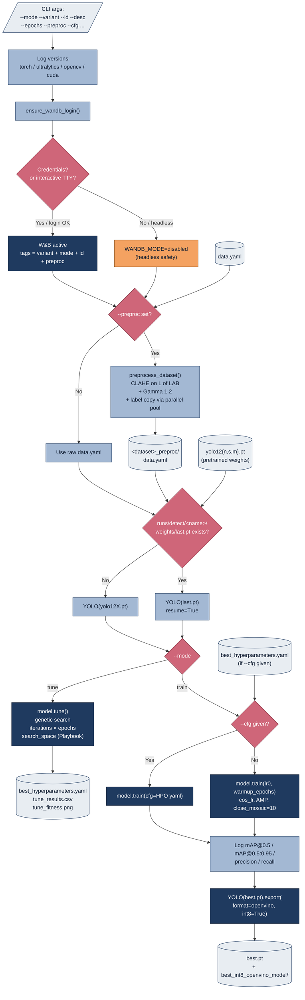

# CIRCA — Training Flow Visualisation

> Two complementary views of the CIRCA training pipeline:
> 1. **Figure A** — End-to-end experiment programme (Phases 0 → 7, the strategic view)
> 2. **Figure B** — Single `train_engine.py` invocation (the tactical view inside one run)
>
> Render in any Mermaid-aware viewer (GitHub, VS Code, Obsidian) or paste into [mermaid.live](https://mermaid.live) to export PNG/SVG for the thesis.

---

## Figure A — Experiment Programme Flow (Phases 0 → 7)

```mermaid
flowchart TD
    classDef phase fill:#1f3a5f,stroke:#0d1a2f,color:#ffffff,stroke-width:2px
    classDef artifact fill:#a3b8d3,stroke:#1f3a5f,color:#0d1a2f
    classDef gate fill:#f4a261,stroke:#7a4a1a,color:#0d1a2f
    classDef decision fill:#cf6679,stroke:#7a2c3a,color:#ffffff

    %% Phase 0
    P0["<b>Phase 0</b><br/>Environment + Dataset Setup<br/>8 sources → unified_pcb_v3<br/>7-class IPC taxonomy, 70/15/15 split"]:::phase
    A0[("data.yaml (nc=7)<br/>CIRCA_CLASS_MAPPING.md")]:::artifact

    %% Phase 1 (vanilla baseline / ablation control)
    P1["<b>Phase 1</b><br/>Vanilla Baseline (YOLOv12-S)<br/>no preprocessing, 50 epochs"]:::phase
    A1[("CIRCA_V12S_001<br/>best.pt + mAP_v")]:::artifact

    %% Phase 2 (CIRCA-aligned baseline)
    P2["<b>Phase 2</b><br/>CIRCA-Aligned Baseline (YOLOv12-S)<br/>--preproc, 100 epochs"]:::phase
    A2[("CIRCA_V12S_002<br/>best.pt + mAP_c")]:::artifact

    %% Ablation gate
    G_ABL{"mAP_c &ge; mAP_v ?<br/>(preproc lift confirmed)"}:::gate

    %% Phase 3 HPO
    P3["<b>Phase 3</b><br/>Hyperparameter Optimisation<br/>--mode tune, 50 iterations"]:::phase
    A3[("CIRCA_V12S_003<br/>best_hyperparameters.yaml")]:::artifact

    %% Phase 4 (three variants final training)
    P4N["<b>Phase 4-N</b><br/>YOLOv12-N final<br/>--cfg HPO yaml, 200 epochs"]:::phase
    P4S["<b>Phase 4-S</b><br/>YOLOv12-S final<br/>--cfg HPO yaml, 200 epochs"]:::phase
    P4M["<b>Phase 4-M</b><br/>YOLOv12-M final<br/>--cfg HPO yaml, 200 epochs"]:::phase
    A4[("Three best.pt files<br/>+ FP32 / FP16 / INT8 IR each")]:::artifact

    %% Phase 5 quantisation validation
    P5["<b>Phase 5</b><br/>Quantisation Validation<br/>FP32 vs FP16 vs INT8 mAP on val"]:::phase
    G_INT8{"INT8 mAP &ge; 90%<br/>and within 1% of FP32?"}:::decision
    A5_INT[("Use INT8 IR")]:::artifact
    A5_FP[("Fallback to FP16 IR")]:::artifact

    %% Phase 6 hardware benchmarking
    P6["<b>Phase 6</b><br/>Hardware Benchmarking<br/>Intel i5 8th-gen CPU + iGPU"]:::phase
    G_AC{"Pass all 4 acceptance criteria?<br/>&gt;90% mAP, &le;5 ms preproc,<br/>&ge;15 FPS, &le;10 s static"}:::decision
    A6[("CIRCA_BENCHMARK_REPORT.md<br/>Variant Selection Matrix")]:::artifact

    %% Phase 7 final test + thresholds
    P7["<b>Phase 7</b><br/>Final Test Evaluation<br/>+ Confidence Threshold Calibration"]:::phase
    A7[("CIRCA_TEST_EVALUATION.md<br/>circa_thresholds.yaml")]:::artifact

    %% Edges
    P0 --> A0 --> P1 --> A1
    A0 --> P2 --> A2
    A1 --> G_ABL
    A2 --> G_ABL
    G_ABL -- "Yes" --> P3
    G_ABL -- "No (debug preproc)" --> P2
    P3 --> A3 --> P4N
    A3 --> P4S
    A3 --> P4M
    P4N --> A4
    P4S --> A4
    P4M --> A4
    A4 --> P5 --> G_INT8
    G_INT8 -- "Yes" --> A5_INT --> P6
    G_INT8 -- "No"  --> A5_FP  --> P6
    P6 --> A6 --> G_AC
    G_AC -- "Yes" --> P7 --> A7
    G_AC -- "No (revisit Phase 4 / variant choice)" --> P4S
```

**Reading the diagram:**
- Blue boxes are project phases (commands you actually run).
- Light-blue cylinders are artifacts produced by each phase.
- Orange diamonds are quality gates (verify before continuing).
- Red diamonds are decision points that branch the flow.

---

## Figure B — Single `train_engine.py` Invocation (Internal Flow)

What happens inside one execution of `python train_engine.py ...`:

**Reading the diagram:**
- Light-grey rectangles are inputs / outputs (files, CLI args).
- Light-blue rectangles are in-process steps in `train_engine.py`.
- Dark-blue rectangles are calls into external libraries (Ultralytics, OpenVINO).
- Red diamonds are branching decisions.
- Orange is a warning/safe-fallback path.

---

## How the Two Views Connect

| Phase (Figure A) | Command (Figure B inputs) |
|---|---|
| Phase 1 | `--mode train --variant s --id 001 --desc Baseline_Vanilla` |
| Phase 2 | `--mode train --variant s --id 002 --desc Baseline_CIRCA --preproc` |
| Phase 3 | `--mode tune --variant s --id 003 --desc HPO --preproc --iterations 50` |
| Phase 4-N | `--mode train --variant n --id 004 --desc Final_HPO --preproc --cfg ...` |
| Phase 4-S | `--mode train --variant s --id 005 --desc Final_HPO --preproc --cfg ...` |
| Phase 4-M | `--mode train --variant m --id 006 --desc Final_HPO --preproc --cfg ...` |

Phases 5, 6, 7 use separate scripts (`evaluate_quantization.py`, `benchmark.py`, `calibrate_thresholds.py`) — they consume the artifacts produced by Figure B but do not invoke `train_engine.py`.

---

## Use in Chapter 3

- **Figure 3.3 — CIRCA Experiment Programme Flow** → use Figure A (above), reference in §3.7 *Experimental Design*.
- **Figure 3.4 — Training Engine Internal Flow** → use Figure B (above), reference in §3.6 *System Development*.

Together with **Figure 3.1 (Research Framework)** and **Figure 3.2 (System Architecture)** from `CIRCA_DIAGRAMS.md`, your Chapter 3 will have the four diagrams the CSP650 guideline expects: research framework, system architecture, experiment programme, and algorithm/training flow.
