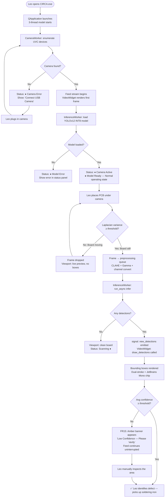
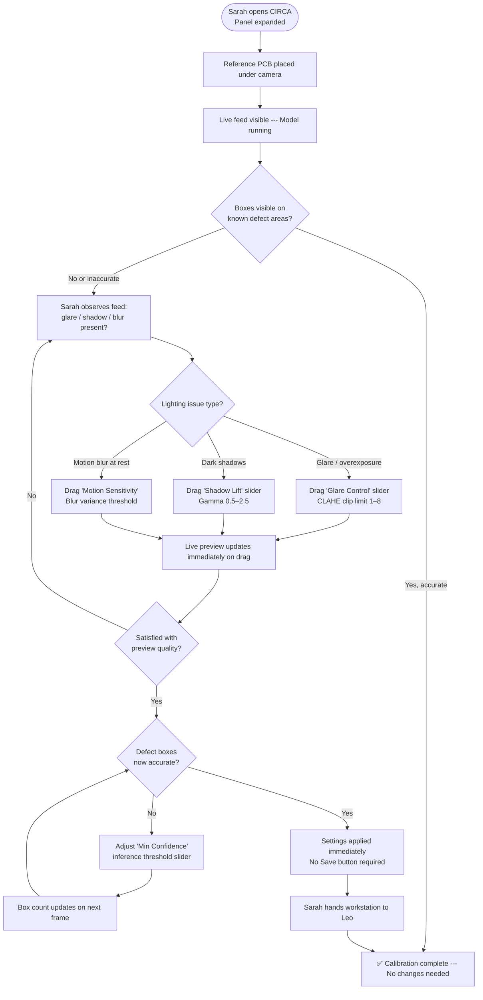
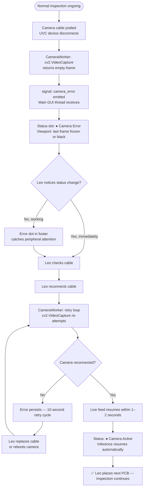

# UX Design Specification - CIRCA

**Author:** Aidil
**Date:** 2026-04-01

---

<!-- UX design content will be appended sequentially through collaborative workflow steps -->

## Executive Summary

### Project Vision

CIRCA is a zero-friction, real-time PCB defect detection interface designed for the brutal physical reality of a repair shop: harsh LED desklamps, cluttered workbenches, a technician whose eyes are already strained, and a stack of 15 boards waiting to be diagnosed. Every UX decision must serve one master — **getting the technician's eyes off the microscope and onto the result in under 10 seconds**, without a single unnecessary click.

The interface is not a dashboard. It is a **live diagnostic instrument** — closer in spirit to a medical imaging monitor than to a typical desktop application.

### Target Users

**Leo — The Repair Technician (Primary, 95% of interactions)**
- Works in a dimly lit shop with bright directional desk lamps; ambient lighting varies wildly
- Hands are often dirty, gloved, or occupied with tools — mouse interaction should be minimised
- Extremely impatient with software that "gets in the way" of the physical repair workflow
- Does not want to read help text or configure advanced settings during a job
- Success metric: spots the defect and picks up the soldering iron within 10 seconds of launching CIRCA

**Sarah — The QA Lead / Setup Admin (Secondary, periodic)**
- Configures the application once per environmental change (new lighting, new camera mount)
- Technical enough to understand what CLAHE and Gamma Correction do, but not a software developer
- Needs the settings labelled in real-world language ("Glare Control", "Shadow Lift")

### Key Design Challenges

1. **Viewport Dominance vs. Control Access:** The live 1080p feed must be as large as physically possible without sacrificing access to critical controls. A collapsible panel pattern resolves this — but the collapse/expand affordance must be instantly discoverable.
2. **Bounding Box Legibility Under Adversarial Conditions:** Colour-coded bounding boxes must remain visible against both pale green PCB substrates AND dark burnt areas. A high-contrast outline + inner label design is required; pure colour alone is not enough.
3. **Low-Confidence Warning — Urgent Without Being Alarming:** The "Manual Inspection Required" state (FR15) must trigger an unmissable visual interrupt without causing panic. A pulsing amber banner pattern, not a red error modal, is the correct register.
4. **Settings Comprehensibility for Non-Engineers:** CLAHE clip limit, Gamma value, and Blur variance threshold must map to shop-floor vocabulary with live-preview feedback so Sarah can tune by eye, not by number.

### Design Opportunities

1. **The "Zero-Click Inspection" Promise:** No "capture" button, no "analyse" action — the pipeline is always running. This zero-click paradigm is a genuine UX differentiator and should be communicated through the UI's behaviour, not text.
2. **Confidence Score as a Trust Layer:** Numerical confidence scores rendered above each bounding box transform an opaque AI decision into a transparent diagnostic signal, building technician trust incrementally and reducing automation bias.
3. **Dark Mode as a Feature, Not a Setting:** The dark theme is not a preference — it is a deliberate ergonomic response to the repair shop environment. The UI should feel like a precision instrument, not a generic app with a dark background.

## Core User Experience

### Defining Experience

**The one core action:** Slide the PCB under the camera and read the bounding box. Nothing else.

The entire application exists to serve a single physical gesture performed dozens of times per shift. Every other interaction — settings adjustment, camera selection, status checking — is support infrastructure around that central act. The UI must make this feel less like "using software" and more like "looking through a smart lens."

The pipeline is always-on. There is no mode-switching, no "press to scan" button, no progress indicator between idle and active states. CIRCA's core UX promise is that the interface is **already working the moment it opens**.

### Platform Strategy

- **Platform:** Windows 10/11 desktop, fixed workstation, non-touch
- **Primary Input:** Mouse for setup/configuration; zero-input during active inspection
- **Layout Mode:** Fixed window targeting 1920×1080 or 1440×900 monitor attached to the repair bench laptop
- **Offline:** 100% offline — no loading spinners waiting for network, no cloud state
- **Hardware Integration:** UVC camera via OS — camera mount is fixed; technician moves the board, not the camera

### Effortless Interactions

| Interaction | Target Behaviour |
|---|---|
| **Starting inspection** | Zero-click — feed is live at application launch |
| **Identifying a defect** | Bounding box appears automatically over the defect region |
| **Reading confidence** | Score text floats above each box — no hover required |
| **Expanding/collapsing panel** | Single click on the `›` / `‹` toggle arrow on the panel edge |
| **Adjusting glare control** | Drag single slider, see live result on the feed — no Apply button |
| **Camera switching** | Single dropdown selection — feed restarts automatically |

### Critical Success Moments

1. **First Launch:** The live feed appears within 2 seconds of application open, with model "Ready" status visible. A black screen with a spinner breaks trust immediately.
2. **First Detection:** The first bounding box snaps onto a real defect with confidence ≥90% — the product's "wow" moment. The box must be visually precise and the label instantly readable.
3. **Recovery from Motion Blur:** When the technician pauses the board, detection reappears within one frame. The Laplacian Variance drop logic must be invisible — the technician perceives the AI as "waking up" the moment they pause, never as "lag."
4. **Low-Confidence State Handling:** The amber "Manual Inspection Required" banner appears clearly, does not disrupt the video feed, and the technician reads it as guidance, not a crash.

### Experience Principles

1. **The Feed is Sacred** — The viewport owns the screen. Controls, status, and warnings exist at its periphery and never obscure it.
2. **Explain Outputs, Not Inputs** — Show confidence scores; never expose raw pipeline debug values in the main UI.
3. **Settings are Shop-Floor Vocabulary** — "Glare Control" not "CLAHE Clip Limit". "Shadow Lift" not "Gamma Correction". "Motion Sensitivity" not "Laplacian Variance Threshold".
4. **State is Always Visible** — System status (Camera Active, Model Ready, Frame Dropped) must be readable in a single glance — never buried in a sub-menu.
5. **Silence is Success** — When everything is working, the UI should be quiet: dark, focused, with only bounding boxes breaking the visual silence. Alerts and colour are reserved for exception states only.

## Desired Emotional Response

### Primary Emotional Goals

**For Leo (Technician) — dominant emotional target: `Competence`**

Leo should feel like the sharpest technician in the room — not "the guy who used an app" but **the guy whose eyes are better than everyone else's**. CIRCA must transfer the AI's detection authority directly into his sense of professional mastery. When a bounding box appears on a solder bridge no one else would catch at this speed, Leo should feel CIRCA is an extension of his own skill, not a crutch.

Secondary feeling: **Relief** — the crushing eye strain of manual microscope inspection is replaced with clear, effortless information.

**For Sarah (Admin) — dominant emotional target: `Control`**

Sarah must feel that she governs the system's behaviour, not the other way around. Sliders with live-preview feedback give her immediate confirmation her input is having the expected effect. The UI must never feel like a black box.

### Emotional Journey Mapping

| Stage | Target Emotion | Anti-Emotion to Avoid |
|---|---|---|
| **Application launch** | Confidence — "It's ready, I can start working" | Anxiety — "Is it loading? Did it crash?" |
| **First bounding box appears** | Delight — "It actually found it" | Scepticism — "Is this accurate?" |
| **Active inspection (normal state)** | Focused calm — "I'm in control of this board" | Distraction — UI noise pulling attention away from the PCB |
| **Motion blur frame-drop** | Seamless continuity — perceptually invisible | Confusion — "Why did it freeze?" |
| **Low-confidence warning** | Informed trust — "The AI is being honest with me" | Alarm — "Is the system broken?" |
| **Settings adjustment** | Empowerment — "I fixed the glare problem myself" | Helplessness — "I don't know what these sliders do" |
| **End of shift (after 8 hours)** | Satisfaction — "I cleared the whole stack" | Fatigue — eye strain from poor contrast choices |

### Micro-Emotions

- **Confidence (not confusion):** Every label and status indicator must be immediately parseable at a glance. Zero cognitive overhead.
- **Trust (not scepticism):** Confidence percentages are deliberately transparent — the AI shows its working. A "94%" score reads honest; a hidden score reads suspicious.
- **Calm (not anxiety):** Dark matte base colour, reduced visual noise, and absence of popups/modals creates instrument-like stillness during the inspection flow.
- **Accomplishment (not frustration):** The detection event itself — the bounding box appearing — is the primary reward signal. No toast notification, no sound effect, no modal.

### Design Implications

| Emotional State | UX Design Approach |
|---|---|
| **Competence** | Full-bleed viewport with zero wasted chrome; technician sees more PCB, less app |
| **Relief** | Dark mode removes harsh white backgrounds; ambient light no longer competes with the screen |
| **Control (Sarah)** | Sliders with immediate live-preview — every drag produces a visible, real-time result on the feed |
| **Trust** | Numerical confidence score on every box; amber warning banner when confidence drops |
| **Focused Calm** | Status indicators as subtle coloured dots, not alert banners; green = nominal, no noise |
| **Informed Trust (low-conf)** | Amber pulsing banner with human-readable text: "Low Confidence — Please Verify Manually" — not red, not a modal, feed continues uninterrupted |

### Emotional Design Principles

1. **Confidence is structural, not decorative** — Wide viewport, precise boxes, and readable scores communicate competence through layout, not marketing copy.
2. **Transparency disarms scepticism** — Every AI output has a visible confidence score. The system never claims certainty it doesn't have.
3. **Anxiety prevention is a first-class design requirement** — Launch states, model loading, and camera reconnection must always show a clear status indicator so Leo never stares at a black screen.
4. **The amber tier is sacred** — Reserve amber/yellow exclusively for the low-confidence warning state. Do not use it for decorative accents. Its meaning must be unambiguous.
5. **Satisfaction needs no celebration** — When detection works, the bounding box is the reward. No confetti, no sound, no animation beyond the box appearing and tracking.

## UX Pattern Analysis & Inspiration

### Inspiring Products Analysis

**1. OBS Studio (Open Broadcaster Software)**
- Real-time video processing desktop app for power users
- **Key strength:** Preview viewport dominates the entire window; all controls live in docked side panels that collapse. The video feed is never sacrificed for chrome.
- **Transferable pattern:** Collapsible side panel with a dominant central video canvas.

**2. Medical Imaging Viewers (3D Slicer, OsiriX)**
- Scientific-grade imaging software where the rendered image IS the product
- **Key strength:** No decorative UI elements. Overlays (measurements, labels, annotations) are rendered directly onto the image; background is always dark.
- **Transferable pattern:** Bounding box labels and confidence scores rendered as canvas overlays, not as sidebar elements.

**3. Bloomberg Terminal / Trading Dashboards**
- Extreme information density on dark backgrounds with high-contrast monospace numerical displays
- **Key strength:** Live-updating numbers in fixed-width monospace fonts that never cause layout reflow. Status indicators as coloured dots, not text banners.
- **Transferable pattern:** Monospace tabular figures for all live numerical readouts; coloured status dots for system health.

### Transferable UX Patterns

**Layout Patterns:**
- **Dominant viewport + collapsible side panel** (from OBS): The video canvas fills the remaining space when the panel is collapsed; the panel is a fixed-width dock when open.
- **Overlay annotations directly on canvas** (from medical imaging): Bounding boxes, confidence scores, and class labels rendered as `QPainter` overlays on the `VideoWidget`, not as separate UI elements.

**Visual Patterns:**
- **Dark matte background `#121212`** (not pure black `#000000`) — prevents text halation for technicians with astigmatism; sourced from Material Design's dark theme specification.
- **Monospace/tabular-figures font for live numbers** (from trading terminals): `JetBrains Mono` or `Roboto Mono` for confidence scores, FPS, and latency — prevents horizontal jitter as digits change at 15+ FPS.
- **Coloured status dots** (from monitoring dashboards): A 10px filled circle (`●`) next to each status label — green for nominal, amber for warning, red for error.

**Interaction Patterns:**
- **No Apply/Save buttons on sliders** (from audio mixing consoles): Every parameter change takes immediate live effect. The preview feed confirms the change. No modal confirmation required.

### Anti-Patterns to Avoid

| Anti-Pattern | Why it Fails for CIRCA |
|---|---|
| **Modal dialogs / pop-up alerts** | Any modal covering the feed destroys the zero-click inspection promise and breaks Leo's physical workflow |
| **Light theme default** | Harsh whites create glare contrast with dark PCB substrates; forces technicians to squint |
| **Proportional-spacing fonts for live numbers** | At 15+ FPS, variable-width digits cause horizontal layout jitter as confidence scores update, creating visual noise |
| **Pure black background (#000000)** | Creates harsh luminance contrast causing text halation and eye fatigue for users with astigmatism during long shifts |
| **Colour-only status indicators** | Colour-blind technicians cannot distinguish red/green dots; must pair with text or icon |
| **Hiding low-confidence state** | Silently continuing with poor detections violates the trust principle; the amber banner is mandatory |
| **Animated transitions on bounding boxes** | Smooth box animation adds latency perception; boxes must snap immediately to new positions each frame |

### Design Inspiration Strategy

**Adopt directly:**
- OBS-style collapsible right panel with `›`/`‹` toggle
- Medical imaging overlay pattern for bounding boxes + labels on canvas
- Bloomberg-style monospace digit rendering for all live numerical outputs

**Adapt:**
- Trading terminal colour density → simplified to 3-tier status system (green/amber/red dots)
- Medical imaging dark backgrounds → humanised with slightly warmer `#1E1E1E` surface tone rather than clinical cold-grey

**Reject entirely:**
- Consumer app navigation paradigms (hamburger menus, tab bars, onboarding flows)
- Any interaction pattern requiring the technician to look away from the viewport to read a status message

## Design System Foundation

### Design System Choice

**Custom Qt Stylesheet (QSS) Design System** — bespoke token-based dark theme applied globally via `QApplication.setStyleSheet()`.

No established framework (Material Design, Ant Design, Tailwind) applies to a native PyQt6 desktop application. The design system is implemented as a set of named **design tokens** (colour constants, typography rules, spacing values) defined in `ui/theme.py` and applied as a QSS stylesheet at application startup.

### Rationale for Selection

- **PyQt6 native:** Only QSS stylesheets and QPainter are available inside the Qt6 rendering pipeline — no CSS frameworks, no HTML, no web rendering.
- **Solo developer:** A small, token-based custom system is faster to maintain than mapping a complex framework to PyQt6's limited QSS subset.
- **Precision control:** The three critical visual constraints (matte background, monospace figures, dual-stroke bounding boxes) require fine-grained control that only a custom system provides.

### Colour Palette Specification

> **Rationale for `#121212` vs `#000000`:** Pure black on high-brightness LCD screens creates an extreme luminance ratio that causes text halation — a smearing artefact around bright text — particularly pronounced for users with astigmatism. A matte `#121212` base reduces this ratio while preserving the dark instrument aesthetic.

| Token | Hex Value | Usage |
|---|---|---|
| `COLOR_BG_BASE` | `#121212` | Main window background, viewport letterbox fill |
| `COLOR_BG_SURFACE` | `#1E1E1E` | Control panel background, card surfaces |
| `COLOR_BG_ELEVATED` | `#2A2A2A` | Slider tracks, input field backgrounds, hover states |
| `COLOR_BORDER` | `#3A3A3A` | Panel dividers, slider borders |
| `COLOR_TEXT_PRIMARY` | `#E8E8E8` | All primary labels, headings |
| `COLOR_TEXT_SECONDARY` | `#9E9E9E` | Slider sub-labels, status descriptions |
| `COLOR_TEXT_DISABLED` | `#4A4A4A` | Inactive controls |
| `COLOR_ACCENT_CYAN` | `#00BCD4` | Primary interactive accent (slider thumb, active states, panel toggle) |
| `COLOR_STATUS_OK` | `#4CAF50` | Status dot — Camera Active, Model Ready |
| `COLOR_STATUS_WARN` | `#FFC107` | Status dot — Low Confidence warning banner **(amber tier — exclusive use only)** |
| `COLOR_STATUS_ERROR` | `#F44336` | Status dot — Camera disconnected, inference error |

**Amber tier rule:** `COLOR_STATUS_WARN (#FFC107)` is **exclusively reserved** for the low-confidence warning state (FR15). It must not appear anywhere else in the UI as a decorative or accent colour.

### Typography Specification

**Two-font system:**

| Token | Font | Fallback | Usage |
|---|---|---|---|
| `FONT_UI` | `Inter` | `Segoe UI` | All labels, headings, panel text, slider names |
| `FONT_MONO` | `JetBrains Mono` | `Roboto Mono`, `Consolas` | **All live-updating numbers exclusively** |

**Critical Monospace Constraint:** `FONT_MONO` with tabular (fixed-width) figures **must** be used for every live-updating numerical readout:
- Confidence score overlays on bounding boxes (e.g., `94%`)
- FPS counter in status panel (e.g., `15 fps`)
- Preprocessing latency readout (e.g., `3.8ms`)

> **Rationale:** At ≥15 FPS update rate, proportional-width fonts cause horizontal layout jitter — the text container resizes as digit widths vary (e.g., `1` is narrower than `9` in `Inter`). Fixed-width monospace fonts eliminate this entirely; each frame redraws text in the same pixel column.

### Bounding Box Visual Specification

**Dual-stroke design** (mandatory for PCB substrate universality):

Every detected defect bounding box must be rendered using **two concentric strokes**:

| Layer | Stroke Width | Colour | Purpose |
|---|---|---|---|
| **Outer stroke (shadow)** | 3px | `#000000` at 70% opacity | Ensures visibility against any bright PCB substrate colour |
| **Inner stroke (signal)** | 2px | Defect class colour (see below) | Carries semantic colour coding |

> **Rationale:** A single-colour stroke fails against PCB substrates that share the same hue (e.g., a red solder mask makes a red bounding box invisible). The `#000000` outer stroke provides a universal dark separator that guarantees legibility against green, red, blue, brown, or black PCBs.

**Defect Class Colour Map:**

| Defect Class | Inner Stroke Colour | Label Chip Background |
|---|---|---|
| `solder_bridge` | `#FF5252` (Red) | `#FF5252` at 80% opacity |
| `missing_component` | `#FF9800` (Orange) | `#FF9800` at 80% opacity |
| `misaligned_component` | `#FFEB3B` (Yellow) | `#FFEB3B` at 80% opacity |
| `burnt_area` | `#9C27B0` (Purple) | `#9C27B0` at 80% opacity |

**Label chip design:** Each box has a filled-background chip at its top-left corner containing `[CLASS_NAME]  [CONFIDENCE%]` rendered in `FONT_MONO`. Chip background uses the class colour at 80% opacity with `#E8E8E8` text.

### Implementation Approach

```python
# ui/theme.py — single source of truth for all design tokens
COLOR_BG_BASE      = "#121212"
COLOR_BG_SURFACE   = "#1E1E1E"
COLOR_BG_ELEVATED  = "#2A2A2A"
COLOR_ACCENT_CYAN  = "#00BCD4"
COLOR_STATUS_WARN  = "#FFC107"   # AMBER TIER — exclusive use: low-confidence warning only

FONT_UI   = "Inter"              # fallback: "Segoe UI"
FONT_MONO = "JetBrains Mono"     # fallback: "Roboto Mono", "Consolas"

# Applied once at startup in main.py
app.setStyleSheet(load_qss("ui/styles.qss"))
```

All QPainter bounding box rendering in `ui/video_widget.py` must reference colour constants from `ui/theme.py` — never hardcode hex values inside `draw_detections()`.

## Defining Core Experience

### 2.1 Defining Experience

**CIRCA: "Hold the board steady, and the defect reveals itself."**

The defining interaction is the **Zero-Click Detection** moment: a technician positions a PCB under the camera, pauses, and within one frame — before a human eye could complete a manual scan — one or more bounding boxes appear, colour-coded, confidence-labelled, and precisely positioned over the defect. No buttons. No wait state. No "scanning..." indicator. The boxes exist or they don't.

### 2.2 User Mental Model

**Current workflow:** Technicians lean over a magnifying lamp or USB microscope, manually tracing solder joints with the naked eye. This takes 30–90 seconds per board and causes progressive eye strain.

**Mental model shift required:** A camera is a passive mirror — it shows what's there. CIRCA transforms this to: *a camera is an active sensor — it tells you what's wrong.* This shift happens automatically the moment the first bounding box appears, with zero user education required.

**Potential confusion points:**
- **No boxes on a clean board:** Technician may think system is broken → **solution:** status panel shows `● Scanning` at all times — absence of boxes is meaningful silence, not system failure.
- **False positive on a clean board:** Permanently damages trust → **solution:** confidence threshold slider lets Sarah calibrate sensitivity per board type.

### 2.3 Success Criteria

| Criterion | Target |
|---|---|
| Time to first detection (from stillness) | ≤1 frame at 15+ FPS = 67ms |
| Defect box spatial accuracy | Box edge within ±5px of true defect boundary |
| Confidence score legibility | Score readable without leaning toward screen |
| Recovery after motion blur | Boxes reappear within 1 frame of stillness |
| Interaction required during active inspection | Zero — no click, scroll, or keypress for 1–8 hours |

### 2.4 Novel vs. Established Patterns

**Established patterns (no user education required):**
- Large central video feed — universal mental model (security camera, webcam preview)
- Collapsible right panel — established in OBS, VS Code, professional desktop tools
- Sliders for parameter adjustment — universal hardware metaphor (audio mixing)
- Coloured status dots — universal dashboard convention

**Novel pattern (self-evident on first use):**
- **Always-on bounding box overlay:** No mode switching between "idle" and "scanning." The system never stops analysing. Users discover this within 5 seconds by observing boxes appear and track in real time. No tutorial required.

### 2.5 Experience Mechanics

**1. Initiation (automatic — no user action)**
- Application launches → camera feed fills viewport → status panel shows `● Camera Active` + `● Model Ready`
- Inference pipeline is already running before the technician touches anything

**2. Interaction — Board Positioning (physical, not digital)**
- Technician positions PCB under camera mount
- While moving: `compute_variance()` detects motion blur → frames dropped → live preview shown without boxes (correct)
- Technician pauses: sharp frame enters queue → inference runs

**3. Feedback — Detection Event**
- Within 1 frame of stillness: bounding box(es) appear on the viewport overlay
- Each box: dual-stroke (3px `#000000` outer + 2px class-colour inner) + top-left chip: `CLASS  94%` in `JetBrains Mono`
- No sound, no animation, no popup — the box is the entire notification

**4. Low-Confidence Path**
- If avg. confidence < threshold: amber pulsing banner above viewport: `⚠ Low Confidence — Please Verify Manually`
- Full-width, 32px height, `COLOR_STATUS_WARN #FFC107` — does not occlude the viewport
- Feed and inference continue uninterrupted; banner is advisory, not blocking

**5. Completion — Board Swapped**
- Technician lifts board → motion blur → bounding boxes disappear
- System returns silently to Scanning state — ready for the next board
- No "save results" prompt (MVP scope)

## Visual Design Foundation

### Color System

| Role | Token | Value | WCAG Contrast vs `#121212` |
|---|---|---|---|
| Background (base) | `COLOR_BG_BASE` | `#121212` | — |
| Background (surface) | `COLOR_BG_SURFACE` | `#1E1E1E` | — |
| Background (elevated) | `COLOR_BG_ELEVATED` | `#2A2A2A` | — |
| Dividers / borders | `COLOR_BORDER` | `#3A3A3A` | — |
| Primary text | `COLOR_TEXT_PRIMARY` | `#E8E8E8` | **15.3:1** ✅ AAA |
| Secondary text | `COLOR_TEXT_SECONDARY` | `#9E9E9E` | **6.0:1** ✅ AA |
| Disabled text | `COLOR_TEXT_DISABLED` | `#4A4A4A` | 2.1:1 ⚠️ (inactive only; not read-critical) |
| Interactive accent | `COLOR_ACCENT_CYAN` | `#00BCD4` | **5.3:1** ✅ AA |
| Status: nominal | `COLOR_STATUS_OK` | `#4CAF50` | **4.6:1** ✅ AA |
| Status: warning | `COLOR_STATUS_WARN` | `#FFC107` | **10.7:1** ✅ AAA |
| Status: error | `COLOR_STATUS_ERROR` | `#F44336` | **4.7:1** ✅ AA |

**Accessibility note:** All interactive and read-critical text pairs meet WCAG 2.1 AA (4.5:1) at minimum. Primary text achieves AAA (15:1). Disabled text is visually suppressed by design and not read-critical.

### Typography System

| Role | Font | Weight | Size | Usage |
|---|---|---|---|---|
| `title` | `Inter` | 600 | 14px | Window title bar, section headings |
| `label` | `Inter` | 500 | 12px | Slider labels, dropdown labels, control group headers |
| `body` | `Inter` | 400 | 11px | Status descriptions, helper text |
| `status` | `Inter` | 500 | 11px | Status dot labels (`Camera Active`, `Model Ready`) |
| `mono-live` | `JetBrains Mono` | 400 | 12px | **Confidence scores, FPS, latency** — all live-updating numbers |
| `mono-chip` | `JetBrains Mono` | 500 | 11px | Bounding box label chips: `CLASS  94%` |

**Font loading (PyQt6):**
```python
# In main.py — load bundled fonts before QApplication.setStyleSheet()
QFontDatabase.addApplicationFont("ui/fonts/Inter-Regular.ttf")
QFontDatabase.addApplicationFont("ui/fonts/Inter-Medium.ttf")
QFontDatabase.addApplicationFont("ui/fonts/JetBrainsMono-Regular.ttf")
QFontDatabase.addApplicationFont("ui/fonts/JetBrainsMono-Medium.ttf")
```
Fonts must be bundled in `ui/fonts/` and included in `circa.spec` `datas` list.

### Spacing & Layout Foundation

**Base unit: 8px** — all spacing values are multiples of 8px.

| Token | Value | Usage |
|---|---|---|
| `SPACING_XS` | 4px | Icon-to-text gap, status dot margin |
| `SPACING_SM` | 8px | Intra-group padding (label to slider) |
| `SPACING_MD` | 16px | Between control groups within panel |
| `SPACING_LG` | 24px | Panel section dividers |
| `SPACING_XL` | 32px | Major layout region separation |

**Layout grid:**
- Window minimum size: `1024 × 600px`
- Window default size: `1280 × 800px`
- Control panel width (expanded): `280px` fixed
- Control panel width (collapsed): `28px` (toggle arrow only)
- Viewport: fills remaining width (`window_width − panel_width`)
- Title bar height: `36px`
- Warning banner height: `32px` (appears above viewport; pushes viewport down by 32px)
- Status panel footer height: `48px`

### Accessibility Considerations

| Concern | Implementation |
|---|---|
| **Colour blindness** | Status indicators combine coloured dot `●` + text label — never colour-only |
| **Astigmatism / halation** | `#121212` base (not `#000000`) reduces luminance contrast halation |
| **Low vision** | Minimum 11px font; primary text at 15.3:1 contrast |
| **Monospace jitter** | `JetBrains Mono` tabular figures prevent horizontal reflow on live updates |
| **Motion sensitivity** | No animated transitions on bounding boxes; amber banner pulses at 1Hz (slow, not flashing) |
| **Long-shift fatigue** | Dark matte palette reduces screen luminance; no saturated blue-spectrum whites |

## Design Direction Decision

### Chosen Direction

**Direction 1 (Panel Expanded) as default state, with Direction 2 (Collapsed) as Leo's zero-distraction inspection mode.** Direction 3 (Warning State) governs FR15 amber banner behaviour.

The interactive visualiser is saved at `_bmad-output/planning-artifacts/ux-design-directions.html` and demonstrates all three states with live slider interactivity, FPS counter simulation with monospace font, collapsing panel toggle, and pixel-accurate bounding box dual-stroke rendering.

### Design Rationale

- **Primary state (panel expanded):** Sarah uses this to configure preprocessing before handing the workstation to Leo. All controls are visible and immediately discoverable.
- **Active inspection state (panel collapsed):** Leo collapses the panel with a single click. The viewport expands to fill the full window width. The `›` toggle remains visible at the panel edge for instant re-expansion.
- **Warning state:** The amber banner (32px, full-width, pulsing 1Hz) appears above the viewport when average confidence falls below threshold. Feed continues uninterrupted.

### Three UI States Fully Specified

| State | Trigger | Visual Change |
|---|---|---|
| **Normal** | Application launch | Panel expanded, green status dots, bounding boxes overlay PCB |
| **Viewport-max** | Leo clicks ‹ | Panel collapses to 28px, viewport fills window |
| **Low-confidence** | Avg. confidence < threshold | Amber `#FFC107` banner (32px) above viewport; amber dot in status panel |

### HTML Visualiser Index

| Tab | Content |
|---|---|
| Direction 1 · Panel Expanded | Primary operating state with interactive sliders and live FPS counter |
| Direction 2 · Panel Collapsed | Split mini-mockup comparison: Sarah config mode vs. Leo inspection mode |
| Direction 3 · Warning State | FR15 amber banner implementation with pulsing animation |
| Design Tokens | Full colour swatch grid with token names and hex values |
| Bounding Box Spec | All 4 defect class boxes with dual-stroke + chip label + QPainter code snippet |
| Typography | Live type scale with JetBrains Mono anti-jitter demonstration |

## User Journey Flows

### Journey 1 — Leo: First PCB Inspection of the Shift

**Narrative (PRD UJ-01):** Leo opens CIRCA at shift start, positions the first board, and receives instant defect detection without configuration.



### Journey 2 — Sarah: Pre-Shift Preprocessing Calibration

**Narrative (PRD UJ-02):** Sarah mounts a reference PCB and adjusts preprocessing sliders until bounding boxes appear correctly under current lighting conditions.



### Journey 3 — Leo: Mid-Shift Camera Disconnect Recovery

**Narrative (PRD UJ-03 / FR10):** During active inspection the USB camera cable is jostled. Leo needs the system to recover and resume without rebooting the application.



### Journey Patterns

| Pattern | Description | Used In |
|---|---|---|
| **Idle-to-Active (automatic)** | System transitions to active detection without user input — triggered by frame quality | UJ-01, UJ-03 |
| **Live-preview feedback loop** | Every slider drag produces immediate visible result with no Apply/OK step | UJ-02 |
| **Advisory warning (amber tier)** | Below-threshold states show amber banner + status dot — advisory only, never blocking | UJ-01, FR15 |
| **Background reconnection** | Camera / model errors handled in worker thread; GUI shows status but never freezes | UJ-03, FR10 |
| **Zero-exit confirmation** | No journey requires a click of OK or Confirm — system self-confirms via visual state change | All |

### Flow Optimisation Principles

1. **Minimum steps to first detection:** UJ-01 achieves first bounding box in ≤3 user actions (launch → plug camera → place PCB), with model loading and camera init happening in parallel worker threads.
2. **Parameter feedback is instantaneous:** In UJ-02, sliders fire `preprocessing_params_changed` on every `valueChanged` tick — no re-apply lag.
3. **Error recovery is ambient, not modal:** In UJ-03, camera disconnect is surfaced via status dot colour change only. Detection resumes the moment hardware reconnects.
4. **Amber warning never blocks:** The FR15 low-confidence path in UJ-01 never stops the feed or demands acknowledgement — it is a parallel advisory channel.

## Component Strategy

### Design System Components (Qt6 Native — Styled via QSS)

These standard PyQt6 widgets require only QSS styling from `ui/styles.qss`. No custom subclassing needed.

| Widget | Qt6 Class | Usage in CIRCA |
|---|---|---|
| Dropdown | `QComboBox` | Camera Source selector |
| Slider | `QSlider` (horizontal) | All 4 preprocessing/inference sliders |
| Label | `QLabel` | Slider names, section headers, status text |
| Status dot | `QLabel` with `border-radius` QSS | System status indicators (●) |
| Footer bar | `QWidget` with `QHBoxLayout` | Status footer |
| Window chrome | `QMainWindow` | Application frame |

### Custom Components

#### 1. `VideoWidget` — The Central Viewport

**Purpose:** Renders the live camera feed as a `QImage` and overlays bounding box detections drawn via `QPainter` each frame.

**PyQt6 Class:** `VideoWidget(QWidget)` — custom subclass with overridden `paintEvent()`

**Anatomy:**
- Background fill: `COLOR_BG_BASE #121212` (letterbox when frame aspect ≠ widget aspect)
- Live `QImage` frame painted to fill widget, maintaining aspect ratio
- Bounding box overlays: drawn by `QPainter` in `paintEvent()` over the frame
- Viewport info chips: drawn as semi-transparent `QPainter` rectangles at bottom-left

**States:**

| State | Visual |
|---|---|
| `Idle` (no camera) | Full `#121212` fill — centered label "Connect USB Camera" |
| `Initialising` | Frame renders, no boxes; status shows `● Initialising` |
| `Active` | Live frame + bounding boxes rendered each frame |
| `Motion-blurred` | Live frame only; boxes suppressed (Laplacian variance below threshold) |
| `Error` | Full `#121212` fill + error label |

**Signals consumed:**
- `new_frame: pyqtSignal(QImage)` — emitted by `CameraWorker` at 15+ FPS
- `new_detections: pyqtSignal(list)` — emitted by `InferenceWorker`

**Critical rule:** `paintEvent()` runs on the **Main GUI Thread only**. Never call `update()` from a worker thread — emit a signal to trigger it.

---

#### 2. `ControlPanel` — Collapsible Right Sidebar

**Purpose:** Houses all user-configurable controls. Collapses to a 28px strip to maximise viewport.

**PyQt6 Class:** `ControlPanel(QWidget)` with `QVBoxLayout`

**Anatomy:**
- Toggle arrow: `QPushButton` (`‹`/`›`) — `COLOR_ACCENT_CYAN` text
- Section headers: `QLabel`, `FONT_UI`, 10px, uppercase, `COLOR_TEXT_SECONDARY`
- Section dividers: `QFrame(QFrame.Shape.HLine)` with `COLOR_BORDER`
- Camera dropdown: `QComboBox` (full width)
- Slider groups: `PreprocessingSlider` instances

**States:**

| State | Width | Content |
|---|---|---|
| Expanded | 280px | All controls visible |
| Collapsed | 28px | Only toggle arrow `›` visible |

**Interaction:** Toggle click → `setFixedWidth()` + `setVisible(False/True)` for children. No animation (snaps for zero-latency feel).

---

#### 3. `PreprocessingSlider` — Labelled Slider Control Group

**Purpose:** Composite widget encapsulating one slider unit: name, shop-floor sub-label, live value readout, and slider thumb. Emits a signal on every drag tick.

**PyQt6 Class:** `PreprocessingSlider(QWidget)` with `QVBoxLayout`

**Anatomy:**
```
[Slider Name]            [Value: 2.0]   ← Inter 500 12px + JetBrains Mono 12px cyan
[Shop-floor sub-label]                  ← Inter 400 11px COLOR_TEXT_SECONDARY
[━━━━━━●━━━━━━━━━━━━━]               ← QSlider, accent-cyan thumb
```

**Live value label must use `FONT_MONO`** to prevent layout reflow on every drag tick.

**Slider instances:**

| Instance | Name | Sub-label | Range | Default |
|---|---|---|---|---|
| CLAHE | `Glare Control` | `CLAHE clip limit` | 1.0–8.0 | 2.0 |
| Gamma | `Shadow Lift` | `Gamma correction` | 0.5–2.5 | 1.0 |
| Blur | `Motion Sensitivity` | `Blur variance threshold` | 20–300 | 100 |
| Confidence | `Min Confidence` | `Detection threshold` | 10–95% | 50% |

---

#### 4. `WarningBanner` — FR15 Low-Confidence Advisory (Dual-Dismissal)

**Purpose:** Full-width amber advisory bar above the viewport when average detection confidence falls below threshold. Supports two independent dismissal paths: automatic (confidence recovers) and manual (technician explicitly closes it for the current board).

**PyQt6 Class:** `WarningBanner(QWidget)`

**Anatomy:**
```
[⚠  Low Confidence — Please Verify Manually         ×]
 ←────── full width, 32px height ────────────────→
```
- Height: 32px, full window width
- Background: `rgba(255, 193, 7, 30)` pulsing 8%→18%→8% at 1Hz
- Border-bottom: 1px `rgba(255, 193, 7, 90)`
- Text: `⚠  Low Confidence — Please Verify Manually` — `Inter 500 12px`, `COLOR_STATUS_WARN`
- Dismiss button: `×` — small `QPushButton` right-aligned, 20×20px, `COLOR_TEXT_SECONDARY` on hover `COLOR_TEXT_PRIMARY`

**Internal State Machine:**

```
                  avg_conf >= threshold
                  for 2+ seconds
   HIDDEN ◄────────────────────── VISIBLE (pulsing)
     │                                     ▲
     │  avg_conf < threshold                │ avg_conf < threshold
     │  AND NOT dismissed                   │ (flag is reset)
     └────────────────────────────► DISMISSED (hidden)
                                             │
                           Leo clicks × ───┘
```

**Dismissal Path 1 — Manual (`×` button):**
- Leo clicks `×` while banner is visible
- Sets internal flag `_dismissed_for_current_board = True`
- Banner: `setVisible(False)`
- Flag persists as long as average confidence remains below threshold
- Use case: Leo has already seen the warning, noted it, and wants to clear it from view while he manually inspects

**Dismissal Path 2 — Auto-Reset (confidence recovery):**
- `InferenceWorker` emits `new_detections` each frame with current average confidence
- `WarningBanner` tracks a 2-second cool-down timer (`QTimer`, 2000ms)
- On each frame:
  - If `avg_conf >= threshold` → start/continue cool-down timer
  - If `avg_conf < threshold` → cancel cool-down timer
- When cool-down timer fires (2 seconds of sustained confidence above threshold):
  - Clears `_dismissed_for_current_board = False`
  - `setVisible(False)` (already hidden or now hidden)
  - System is ready to show the banner again if confidence drops on the next board
- Use case: Leo slides the defective board away; the next board has clean high-confidence detections; the banner state resets automatically ready for the next low-confidence event

**Signal interface:**
```python
# Called by MainWindow on each new_detections signal
def update_confidence(self, avg_confidence: float) -> None:
    if avg_confidence < self._threshold:
        self._cool_down_timer.stop()
        if not self._dismissed_for_current_board:
            self.setVisible(True)
    else:
        # Start 2-second cool-down before auto-reset
        if not self._cool_down_timer.isActive():
            self._cool_down_timer.start(2000)

def _on_dismiss_clicked(self) -> None:
    self._dismissed_for_current_board = True
    self.setVisible(False)

def _on_cool_down_elapsed(self) -> None:
    """Fired after 2s of sustained high confidence."""
    self._dismissed_for_current_board = False
    self.setVisible(False)
```

**Layout impact:** `WarningBanner` sits in a `QVBoxLayout` above `VideoWidget`. When visible it occupies 32px; `VideoWidget` shrinks by 32px. Banner never overlaps the video feed.

---

#### 5. `StatusFooter` — System Health Bar

**Purpose:** Persistent 48px footer bar showing live system status and key numerical readouts. Never collapses.

**PyQt6 Class:** `StatusFooter(QWidget)` with `QHBoxLayout`

**Anatomy (left to right):**
```
● Camera Active   ● Model Ready   ● 2 defects          [spacer]    fps  15
```
- Status dots: 8px `QLabel` with `border-radius: 4px` QSS
- Status labels: `Inter 500 11px`
- FPS + latency: `JetBrains Mono 11px`, right-aligned, updates every second
- All live-updating numerical values use `FONT_MONO` to prevent jitter

### Component Implementation Roadmap

| Phase | Components | Sprint |
|---|---|---|
| **Phase 1 — Core render** | `VideoWidget` (live feed + QPainter overlay) | Sprint 1 |
| **Phase 2 — Control surface** | `ControlPanel`, `PreprocessingSlider` ×4, `StatusFooter` | Sprint 2 |
| **Phase 3 — State overlays** | `WarningBanner` (dual-dismissal), error state overlays in `VideoWidget` | Sprint 3 |

## UX Consistency Patterns

### Feedback Tiers

CIRCA has **three and only three feedback tiers**. Any new feature must map to one of these tiers.

| Tier | Colour | Component | User Action Required |
|---|---|---|---|
| **Nominal (silent)** | `#4CAF50` green dot | `StatusFooter` status dot | None — silence is the signal |
| **Advisory (amber)** | `#FFC107` amber | `WarningBanner` + amber dot | Optional `×` to manually dismiss |
| **Error (red)** | `#F44336` red dot | `StatusFooter` red dot + viewport overlay label | None — system recovers automatically |

**Rule:** Never use a modal dialog, `QMessageBox`, or blocking popup for any condition that does not require a binary user decision. Errors and warnings are displayed in-situ on persistent UI regions.

### Slider Interaction Pattern

All four `PreprocessingSlider` instances share an identical interaction contract:

| Moment | System Response |
|---|---|
| `mousePress` on thumb | Thumb highlights in `COLOR_ACCENT_CYAN` |
| `drag` (continuous) | Value label updates every tick; preprocessing applied to next frame |
| `mouseRelease` | Thumb returns to normal; last value retained in memory |
| No Apply button | Never — changes are always live |

**Value label rule:** The `QLabel` value display must have a **fixed minimum width** calculated for the maximum value string at `FONT_MONO` metrics. This prevents the slider row from reflowing as digit widths change.

### Status Indicator Pattern

All system state is communicated via the **dot + label** pattern in `StatusFooter`.

| Dot Colour | Meaning | Example |
|---|---|---|
| `●` `#4CAF50` green | Subsystem nominal | `● Camera Active`, `● Model Ready` |
| `●` `#FFC107` amber | Advisory condition | `● Low Confidence` |
| `●` `#F44336` red | Subsystem failed, retrying | `● Camera Error` |
| `●` `#3A3A3A` grey | Subsystem not applicable | `● No Device` |

**Colour-blindness safeguard:** Dot colour is always paired with a text label. Colour reinforces but never solely carries meaning.

### Empty / Loading State Pattern

| State | Trigger | VideoWidget renders |
|---|---|---|
| **No camera** | No UVC device enumerated | `#121212` fill + centred: `"Connect USB Camera"` |
| **Camera initialising** | First frame not yet received | `#121212` fill + centred: `"Initialising Camera…"` |
| **Model loading** | `InferenceWorker` loading model | Video feed can show; status dot: `● Loading Model…` |
| **Motion blur (frame drop)** | Laplacian variance below threshold | **Live video continues** — only inference suppressed. Viewport never goes black. |

**Anti-pattern prevented:** The viewport must **never show a spinner or progress bar** during normal operation. Motion blur is transparent to Leo.

### Navigation Pattern

CIRCA has **no navigation**. No pages, tabs, routes, or back buttons. Single persistent view.

The only layout state transitions are:
1. `ControlPanel` expanded ↔ collapsed (`‹`/`›` click)
2. `WarningBanner` visible ↔ hidden (automatic or `×` click)

**Rule:** Any future feature requiring a second view **must be implemented as a panel section** within `ControlPanel` — never as a separate window, tab, or navigation route.

### Error Recovery Pattern

All error recovery is automatic and backgrounded. No user action is required to trigger retry logic.

| Error | Recovery Behaviour | UI Expression |
|---|---|---|
| Camera disconnect | `CameraWorker` retry loop — 10-second cycle | Red dot in footer; auto-recovers on reconnect |
| Inference engine error | `InferenceWorker` logs, emits `inference_error`, retries next frame | Red dot `● Inference Error`; video feed continues |
| No detections (clean board) | Not an error — valid expected state | Silence. Green dots. No boxes. |

**Rule:** `QMessageBox.critical()` is **never used** in the main inspection loop. Only permitted at application startup for fatal configuration errors (e.g. model file missing) where the application cannot proceed.

### Keyboard & Accessibility Patterns

| Shortcut | Action |
|---|---|
| `Space` | Toggle `ControlPanel` expand/collapse |
| `Esc` | Dismiss `WarningBanner` (same as `×` click) |
| `Tab` | Cycle focus through slider controls in `ControlPanel` |
| `←` / `→` | Adjust focused slider by one step |

All interactive elements must have `setToolTip()` set with their shop-floor vocabulary name (e.g., `"Glare Control — adjusts CLAHE clip limit"`).

## Responsive Design & Accessibility

### Responsive Strategy

CIRCA is a **fixed-workstation, single-screen, Windows desktop application**. Standard web responsive concerns (mobile breakpoints, touch gestures) are out of scope. The responsive challenge is **graceful window resize behaviour** on the technician's repair bench monitor.

**Target display environments:**

| Monitor | Resolution | Notes |
|---|---|---|
| Bench laptop | 1366×768 | Minimum viable — most constrained |
| External monitor | 1920×1080 | Optimal — designed around this |
| Large workspace monitor | 2560×1440 | Must not feel wasted/oversized |

**Resize behaviour:**
- `VideoWidget` absorbs all available horizontal space (elastic region, `stretch=1`)
- `ControlPanel` is fixed-width (280px expanded / 28px collapsed) — `stretch=0`
- `StatusFooter` and `WarningBanner` are fixed-height — never resize
- Letterboxing fills unused aspect-ratio space with `COLOR_BG_BASE #121212`

### Window Constraint Strategy

| Constraint | Value | Rationale |
|---|---|---|
| Minimum window width | `1024px` | Below this, viewport is too narrow to read bounding box chips |
| Minimum window height | `600px` | Below this, footer and banner occlude the viewport |
| Maximum window | Unconstrained | Letterboxing handles 4K+ displays gracefully |
| Default launch size | `1280×800px` | Fits 1366×768 monitors with taskbar; safe universal default |

```python
# In MainWindow.__init__()
self.setMinimumSize(1024, 600)
self.resize(1280, 800)
```

### Accessibility Strategy

CIRCA targets **WCAG 2.1 Level AA** for all read-critical elements.

| Criterion | WCAG Level | Status |
|---|---|---|
| 1.4.3 Contrast (Normal Text) | AA — 4.5:1 | ✅ All primary text: 15.3:1 |
| 1.4.3 Contrast (Large Text) | AA — 3:1 | ✅ All heading text: >10:1 |
| 1.4.11 Non-text Contrast | AA — 3:1 | ✅ Slider thumb, status dots, borders: verified |
| 1.4.12 Text Spacing | AA | ✅ 8px base unit; line heights specified |
| 1.3.3 Sensory Characteristics | A | ✅ Status never expressed by colour alone; always + text |
| 2.1.1 Keyboard | A | ✅ Space / Esc / Tab / ←→ shortcuts defined |
| 2.4.7 Focus Visible | AA | ✅ Focused sliders show `accent-cyan` outline via QSS |
| 2.3.1 Three Flashes | A | ✅ Amber banner pulses at 1Hz — well below 3Hz flash threshold |

### Testing Strategy

**Automated (during development):**
- Qt Accessibility Inspector — verify `accessibleName()` on all interactive widgets
- Colour contrast checker against all `theme.py` colour pairs before each sprint

**Manual (pre-submission):**
- Keyboard-only navigation: all 4 sliders, dropdown, and panel toggle reachable via Tab
- Windows High Contrast Mode: verify QSS degrades gracefully
- Protanopia/deuteranopia simulation: status dot text labels remain parseable without colour

### Implementation Guidelines

**PyQt6 accessibility hooks:**
```python
clahe_slider.setAccessibleName("Glare Control — CLAHE clip limit")
clahe_slider.setAccessibleDescription("Range: 1.0 to 8.0. Controls highlight suppression.")
gamma_slider.setAccessibleName("Shadow Lift — Gamma correction")
panel_toggle.setAccessibleName("Collapse control panel")
dismiss_btn.setAccessibleName("Dismiss low confidence warning")
```

**QSS focus indicators (`ui/styles.qss`):**
```css
QSlider::handle:horizontal:focus {
    border: 2px solid #00BCD4;
    outline: 2px solid rgba(0, 188, 212, 0.4);
}
QPushButton:focus {
    border: 1px solid #00BCD4;
}
```

**Font bundle verification:** Before PyInstaller packaging, verify `QFontDatabase.families()` includes `"Inter"` and `"JetBrains Mono"`. If bundled fonts fail to load, `FONT_MONO` silently falls back to `Consolas` — acceptable but must be confirmed in CI.
