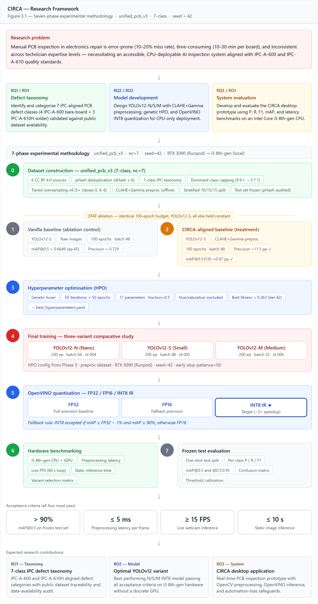
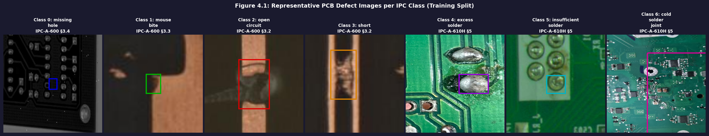
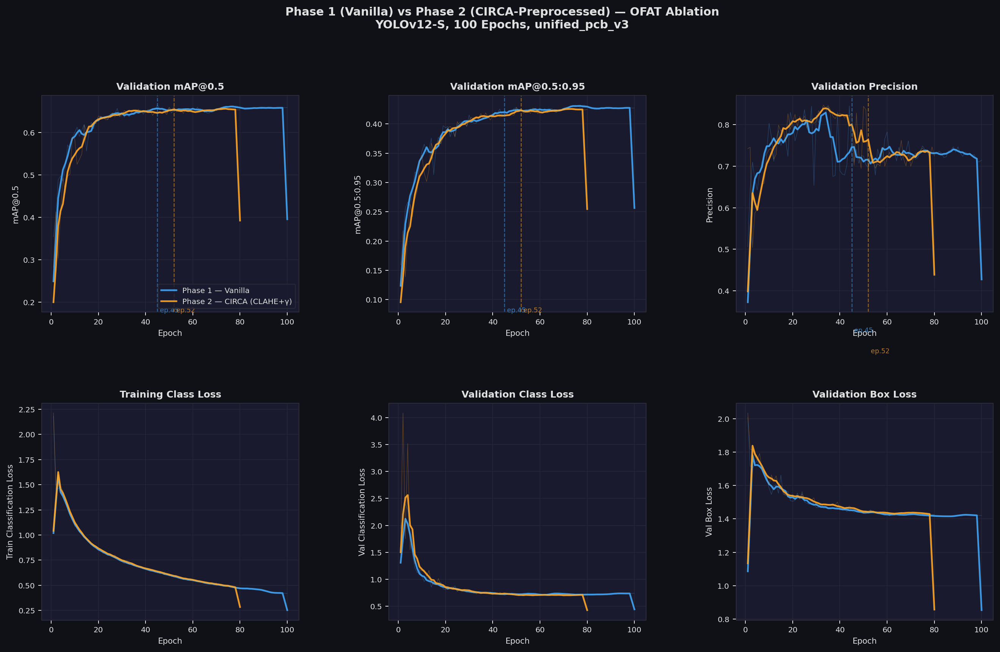
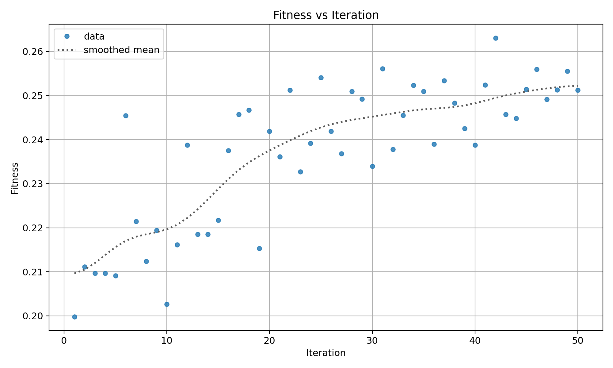
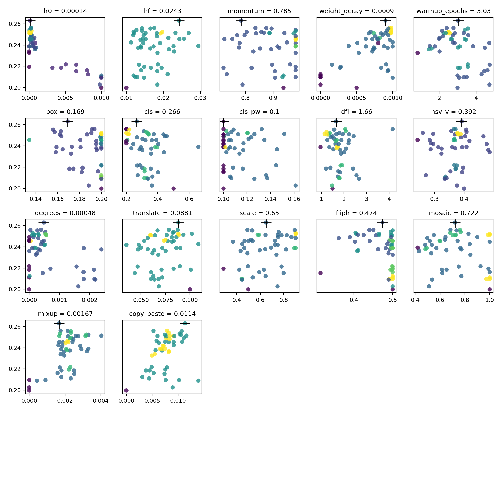
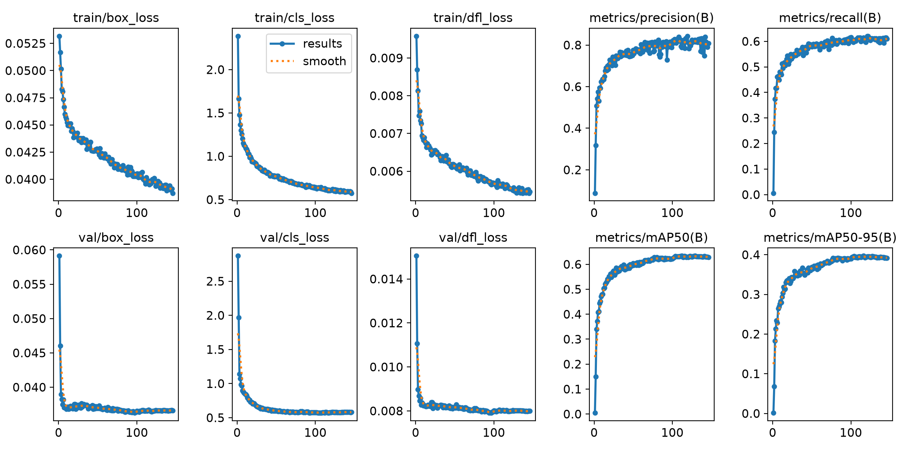
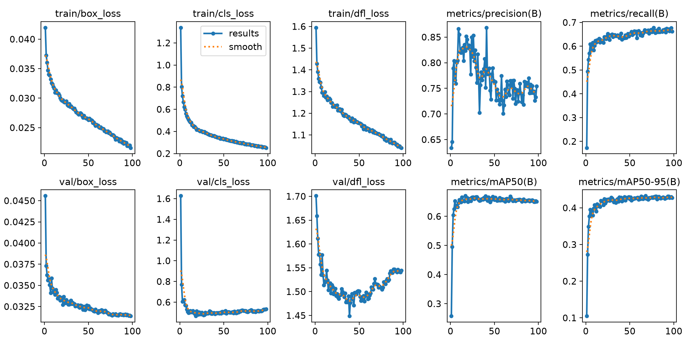
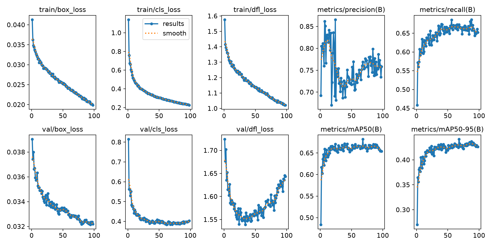
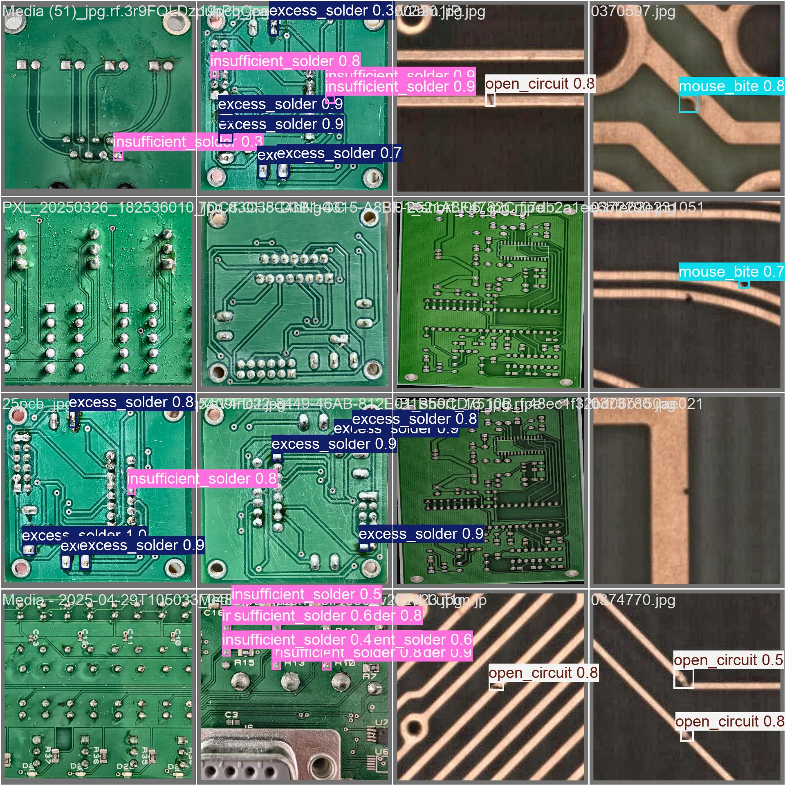
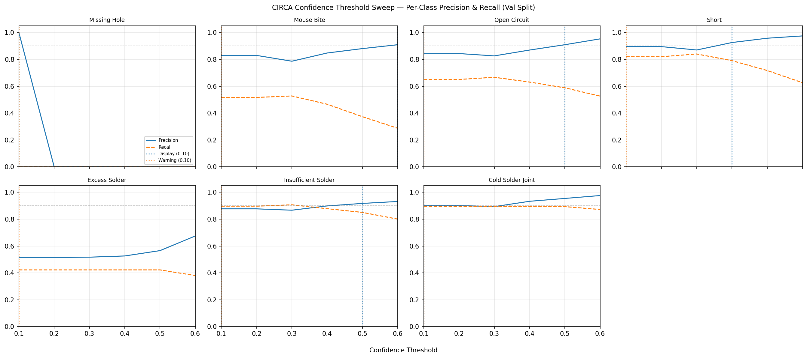

# CIRCA: Circuit Inspection and Recognition Using Convolutional Architectures
### Chapters 1–4: Reference-Corrected Version (v5, May 2026)
*Muhammad Aidil Al-Faizi Bin Mohd Zin | Bachelor of Information Technology (Hons.) Intelligent Systems Engineering | Universiti Teknologi MARA | January 2026*

***

# CHAPTER 1: INTRODUCTION

This chapter presents the background of the study, including the context of automated PCB defect detection in electronics repair environments, the problem that motivated this research, and an outline of the CIRCA system as the proposed solution.

***

## 1.1 Research Background

In recent years, there has been an increasing interest in the application of artificial intelligence and computer vision technologies to quality inspection and fault diagnosis tasks across a broad range of industries (Bhattacharya and Cloutier, 2022). Among these, the inspection and diagnosis of Printed Circuit Board (PCB) defects has emerged as a particularly active area of investigation, driven by the growing complexity and miniaturisation of modern electronic devices. PCBs serve as the fundamental backbone of virtually all electronic systems, providing both the mechanical substrate and the electrical pathways through which components communicate and function (Wang et al., 2023). As device designs become increasingly compact and component densities continue to rise, ensuring PCB integrity has become a critical quality challenge across the electronics industry.

The rapid advancement of electronic technology has driven a steady increase in the complexity and miniaturisation of electronic devices (Bhattacharya and Cloutier, 2022). PCBs are found in virtually every electronic device, from smartphones and laptops to medical equipment and automotive systems (Wang et al., 2023). As the electronics industry continues to evolve, the demand for defect-free PCBs has intensified, given that even minor defects can compromise device functionality, reliability, and safety (Klco et al., 2023). Traditional manual inspection methods, while historically prevalent, have proven inadequate against the challenges posed by modern PCB complexity (Aggarwal et al., 2022). Component miniaturisation and rising circuit density have made visual inspection by human operators time-consuming, error-prone, and often ineffective at detecting subtle defects (Bhanumathy et al., 2021). Studies have shown that manual inspection error rates range from 10% to 20%, particularly during extended shifts where fatigue becomes a significant factor (Law et al., 2024).

The past decade has seen the rapid development of deep learning-based approaches to PCB defect detection, particularly through the application of Convolutional Neural Networks (CNNs) and object detection architectures such as YOLO, ResNet, and EfficientDet (Liao et al., 2021). These advances have demonstrated that automated systems can identify complex defect patterns such as solder bridges, cold joints, and component misalignments with detection accuracies exceeding 95%, while maintaining real-time processing speeds that manual inspection cannot match (Law et al., 2024; Yang and Yu, 2024). The most recent iteration of the YOLO framework, YOLOv12, introduces an attention-centric architecture featuring an Area Attention module (A2) and Residual Efficient Layer Aggregation Networks (R-ELAN), enabling the model to match the inference speed of CNN-based predecessors while surpassing them in accuracy through improved feature modelling capabilities (Tian et al., 2025). YOLOv12-Nano, the lightest variant in the family, achieves 40.6% mAP on the MS COCO benchmark, demonstrating that factory-grade detection precision is now attainable on standard CPUs and integrated GPUs without dedicated graphics hardware (Tian et al., 2025).

The limitations of manual inspection have driven the adoption of automated inspection systems using machine learning and computer vision (Anh Nguyen et al., 2024). Automated Optical Inspection (AOI) systems have gained widespread acceptance in high-volume manufacturing, using advanced imaging algorithms to detect defects with greater accuracy and speed than manual methods. The adoption of AI in PCB inspection has shifted quality control from a reactive to a proactive activity, allowing manufacturers to identify and address issues earlier in the production process (Ghelani, 2024). A major challenge with existing automated PCB inspection solutions, however, is that they were developed for controlled, high-volume manufacturing environments and are poorly suited to the more variable and resource-constrained conditions found in electronics repair settings (Aggarwal et al., 2022). Deploying existing AOI systems also requires substantial capital expenditure, specialised operators, and stable controlled lighting, which are conditions beyond the reach of most independent repair shops.

This research addresses this gap by proposing CIRCA (Circuit Inspection and Recognition using Convolutional Architectures), an AI-driven visual inspection system that uses YOLOv12 variants to automatically detect and localise surface-level PCB defects such as cold solder joints, excess and insufficient solder, solder spikes, open circuits, shorts, conductor damage, and bare-board substrate anomalies from standard camera images. By deploying a YOLOv12 model quantized to INT8 Intermediate Representation (IR) format via the Intel OpenVINO inference framework, CIRCA achieves sub-10-second diagnostic turnarounds on standard Intel CPUs and integrated GPUs, eliminating the need for expensive AOI hardware (Yi and Mohamed, 2024). A lightweight OpenCV preprocessing pipeline combining Contrast Limited Adaptive Histogram Equalization (CLAHE), Gamma Correction, and Laplacian Variance blur detection ensures robust inference performance under the uncontrolled lighting conditions typical of real-world repair shop environments (Alhamzawi et al., 2025; Wanto et al., 2023).

***

## 1.2 Problem Statement

The electronics repair industry faces several interconnected challenges that significantly impact service quality, operational efficiency, and customer satisfaction. These challenges stem primarily from the limitations inherent in current manual inspection methodologies and the increasing complexity of modern electronic devices.

Firstly, the detection of defects in modern PCBs through manual visual inspection has become increasingly problematic due to progressive component miniaturisation and elevated circuit density (Goti, 2025). Contemporary PCBs frequently incorporate surface-mount technology (SMT) components measuring less than 1 millimetre, fine-pitch integrated circuits with pin spacing below 0.5 millimetres, and multi-layer board constructions with internal connections invisible to surface inspection (Adibhatla et al., 2020). Under these circumstances, even experienced technicians equipped with magnification tools struggle to identify subtle defects such as hairline cracks, micro-solder bridges, or incipient component failures. The industry standard for defining and categorising PCB assembly acceptability is IPC-A-610 (Acceptability of Electronic Assemblies), which specifies visual criteria for solder joint quality, component placement, and assembly cleanliness across three product reliability classes (Goti, 2025). A comparative study demonstrated that AI-driven AOI systems aligned with IPC standards achieve 98 to 99% inspection accuracy and process over 5,000 components per hour, compared to 85 to 90% accuracy and 500 to 800 components per hour for manual inspection, underscoring the scale of the performance gap between automated and manual approaches (Goti, 2025).

Secondly, manual inspection processes are inherently time-consuming and subject to human limitations. A comprehensive visual examination of a complex PCB can require 10 to 30 minutes or more, depending on board complexity and the number of components present. This extended inspection time directly increases repair costs, lengthens customer wait times, and reduces throughput. Human inspectors are also susceptible to fatigue, distraction, and subjective judgment variation, which can cause missed defects or false positives. Research indicates that inspector accuracy declines significantly after extended periods of continuous inspection, with defect detection rates dropping by up to 30% after four hours of sustained work (Goti, 2025). Manual PCB inspection using stereomicroscopes and optical magnification aids is also associated with severe eye strain during prolonged inspection shifts, a physical occupational burden that automated systems can directly eliminate.

Thirdly, the reliability and consistency of manual inspection are heavily dependent on individual technician expertise and experience levels (Sharma et al., 2024). Novice technicians may lack the knowledge to recognise certain defect types or understand their implications, while even experienced professionals may overlook defects in unfamiliar board designs or when confronting novel failure modes. This variability in inspection quality creates inconsistencies in service delivery and can erode customer confidence in repair services.

Certain defect categories also present specific challenges for visual detection. Internal solder joint failures, delamination within multi-layer boards, intermittent connection problems, and incipient component degradation may not show obvious visual indicators during static inspection (Hu and Wang, 2020). These defects can escape detection during manual inspection yet later cause device malfunction, leading to repeated repair attempts and customer dissatisfaction. In critical applications such as medical devices, automotive electronics, or industrial control systems, undetected defects can pose serious safety hazards or result in system failures (Liao et al., 2021).

Current automated inspection technologies, while highly effective in manufacturing environments, are generally designed for high-volume production scenarios and are not optimally configured for the diverse range of devices and repair contexts encountered in service centres (Huang et al., 2023). Existing AOI systems are often expensive, require specialised training to operate, and may lack the flexibility to accommodate the variety of PCB types and device configurations typical of repair workflows (Kaewdook et al., 2024). Consequently, there exists a clear need for accessible, cost-effective, and adaptable automated inspection solutions tailored specifically to the requirements of electronics repair and service operations.

This research therefore addresses the following core problem: **How can machine learning-based automated defect detection systems be effectively designed and implemented to improve the speed, accuracy, and reliability of PCB fault diagnosis in electronics repair environments, thereby improving service quality and operational efficiency while reducing the impact of human error and expertise variability?**

***

## 1.3 Research Questions

To comprehensively address the identified problem and guide the research investigation, this study seeks to answer the following research questions:

**RQ1:** How to identify and categorise the most prevalent PCB defect types, specifically four bare-board structural defects (missing hole, mouse bite, open circuit, and short) aligned with IPC-A-600 acceptability criteria and three assembly-stage solder defects (excess solder, insufficient solder, and cold solder joint) aligned with IPC-A-610H visual inspection criteria, based on their visual characteristics and public data availability, for automated detection in electronics repair contexts?

**RQ2:** How to design and develop YOLOv12-based CNN detection models incorporating INT8 quantization via Intel OpenVINO and an OpenCV preprocessing pipeline that achieves accurate and efficient PCB defect detection under real-world repair shop conditions?

**RQ3:** How to develop and evaluate a user-friendly CIRCA desktop prototype that supports zero-friction, real-time deployment in electronics repair facilities?

***

## 1.4 Research Objectives

Based on the research questions formulated above, this study establishes the following specific objectives:

**RO1:** To identify, categorise, and document the most prevalent PCB defect types encountered in electronics repair based on their characteristic visual signatures, establishing a seven-class taxonomy covering four IPC-A-600 bare-board defects (missing hole, mouse bite, open circuit, and short) and three IPC-A-610H assembly-stage solder defects (excess solder, insufficient solder, and cold solder joint), validated against public dataset availability.

**RO2:** To design and develop YOLOv12-based CNN detection models (Nano, Small, Medium variants), exported to Intel OpenVINO INT8 IR format, and to conduct comparative performance evaluation to identify the optimal configuration for PCB defect detection in repair contexts under uncontrolled lighting conditions.

**RO3:** To develop the CIRCA standalone desktop application incorporating a static image inspection interface, a real-time OpenCV preprocessing pipeline (CLAHE, Gamma Correction, Laplacian Variance frame quality gating), and a zero-friction bounding box overlay interface, and to evaluate its performance using precision, recall, F1-score, mAP, and inference latency benchmarks.

***

## 1.5 Research Scope

To ensure focused and achievable research outcomes within the Final Year Project timeframe, this study establishes the following scope boundaries.

**Technical Scope.** The research focuses specifically on visual defect detection in PCBs using optical imaging and convolutional neural network analysis. The study encompasses the detection and classification of surface-visible defects that can be identified through optical inspection, organised under a unified **seven-class taxonomy** combining four IPC-A-600 bare-board defect classes (missing hole, mouse bite, open circuit, and short) with three IPC-A-610H assembly-stage solder defect classes (excess solder, insufficient solder, and cold solder joint). The taxonomy was determined through a systematic data-availability audit of all publicly accessible, CC BY 4.0-licensed PCB defect datasets identified during the literature survey: only classes with a minimum of approximately 400 training instances from at least two independent sources were retained, ensuring that the trained models can learn reliable visual representations rather than overfitting to sparse examples. Five defect categories that appear in IPC standards (specifically spur, spurious copper, solder spike, scratch, and pinhole) were excluded on the grounds that their publicly available training instance counts (ranging from 52 to 414) fall below this minimum threshold or present severe inter-class visual ambiguity with retained classes; these are documented as scope limitations in Chapter 3 section 3.4.1 with a proposed future-work data-collection protocol. Additionally, `solder_bridge` is excluded despite being an IPC-A-610H Section 5 defect class, as no board-level annotated public dataset meeting the project's quality criteria was identified; this gap is documented as future work in Chapter 5. Component-level IPC-A-610 defects such as missing components, misaligned components, tombstoning, lifted leads, solder balls, and component damage are likewise excluded due to the absence of suitable public datasets with sufficient coverage. The technical implementation focuses on deep learning approaches, specifically YOLOv12 variants deployed via Intel OpenVINO INT8 quantization. The research does not extend to electrical testing, functional verification, or the detection of defects requiring X-ray, infrared, or other specialised imaging modalities beyond standard optical photography.

**Device Scope.** The research concentrates on PCBs commonly found in consumer electronics devices, particularly those frequently encountered in repair shops, including smartphones, laptops, tablets, and similar portable electronic devices. The study does not address specialised industrial electronics, aerospace systems, medical devices, or other domain-specific applications that may require different detection criteria or certification requirements.

**Defect Scope.** The investigation focuses on manufacturing defects, physical damage, and wear-related failures that manifest visually on PCB surfaces, encompassing both bare-board structural defects aligned with IPC-A-600 acceptability criteria and solder-joint assembly defects aligned with IPC-A-610 visual inspection criteria. The research does not address intermittent faults, software-related issues, or defects that can only be detected through electrical testing or operational verification.

**Operational Scope.** The system is designed for use by repair technicians in small to medium-sized electronics repair facilities, targeting standard Intel CPU and iGPU hardware operating under Windows 10 and Windows 11. Standard USB webcams or smartphone cameras are supported for optional single-frame image capture; alternatively, technicians may load any PCB photograph directly from disk. The system's performance will be evaluated against target benchmarks of greater than 90% mAP on the curated test dataset, sub-5 ms preprocessing pipeline execution per image, and sub-10-second total analysis time on a benchmark Intel Core i5 8th-generation equivalent processor (Yi and Mohamed, 2024).

**Limitations and Exclusions.** The research does not attempt to develop a commercially deployable product with full production-level features. The CIRCA system serves as a diagnostic aid and decision-support tool rather than an autonomous repair solution, with confidence score transparency built in to reduce the risk of automation bias (Kupfer et al., 2023). Final repair decisions, component selection, and quality verification remain the responsibility of qualified technicians.

***

## 1.6 Significance of Study

This research makes several important contributions to both academic knowledge and practical application in the fields of computer vision, machine learning, and electronics repair services.

**Academic Significance.** From a research perspective, this study advances the application of deep learning techniques to electronics repair diagnostics, a domain that has received limited scholarly attention compared to manufacturing contexts (Bhattacharya and Cloutier, 2022; Lv et al., 2024). The results will demonstrate how YOLOv12 models quantized to INT8 IR via Intel OpenVINO can achieve real-time PCB defect detection on commodity hardware, with implications for edge computing and mobile machine learning deployment (Tian et al., 2025; Kaewdook et al., 2024).

**Practical Significance.** For electronics repair businesses, CIRCA has the potential to reduce diagnostic time by at least 70%, dropping a 15-minute manual microscope inspection to under five minutes, which translates directly into higher technician throughput, shorter customer wait times, and the economic viability of complex board repairs that are currently abandoned as unprofitable (Goti, 2025). The system also addresses the physical dimension of the problem: by replacing prolonged microscope use with camera-based image capture and analysis, CIRCA eliminates the severe eye strain that contributes to inspector fatigue and declining detection performance over the course of a repair shift. For novice technicians, the system serves as an educational tool and decision support aid, accelerating the learning curve and improving diagnostic confidence.

**Economic Significance.** The implementation of automated defect detection has important economic implications for the electronics repair industry. By reducing dependence on highly experienced technicians for routine diagnostics, repair shops can optimise their staffing models and reduce labour costs. The reduction in misdiagnosis and unnecessary component replacements represents direct cost savings through reduced parts wastage and more efficient inventory management (Goti, 2025). For larger repair chains, these savings can accumulate to significant annual cost reductions while simultaneously improving customer satisfaction and retention.

**Environmental and Social Significance.** From a sustainability perspective, improved repair diagnostics contribute to the circular economy by extending device lifespans and reducing electronic waste. Accurate defect detection enables more effective repairs, preventing premature device replacement and the associated environmental impacts of manufacturing new devices and disposing of old ones. By reducing the technical barriers and capital requirements for high-quality diagnostics, the system can help level the playing field between small independent repair shops and larger service chains, supporting local businesses and employment.

***

## 1.7 Summary

In summary, correctly identifying and classifying PCB defects is essential to reduce problems such as missed diagnosis, technician fatigue, repeated failures, and inconsistent repair quality. The proposed CIRCA system is an AI-based diagnostic desktop application which uses YOLOv12 deep learning architecture quantised and optimised via Intel OpenVINO to provide real-time detection of seven IPC-aligned surface defect categories with colour-coded bounding box overlays, confidence scores, and a configurable OpenCV preprocessing pipeline that handles the glare and shadow conditions of real repair environments. Chapter 2 provides a structured review of the literature on PCB inspection, machine vision, deep learning techniques, image preprocessing, edge ML deployment, and human factors, justifying the chosen approach and identifying the research gap that the CIRCA project seeks to fill.

***

***

# CHAPTER 2: LITERATURE REVIEW

This chapter reviews the technical literature underpinning the CIRCA project, covering PCB defect detection, machine vision, deep learning and object detection architectures, image preprocessing, edge machine learning deployment, and human factors in AI-assisted inspection. The review is organised from general to specific: beginning with an overview of PCB defects and inspection challenges, moving to deep learning architectures and YOLO-based methods, then examining preprocessing techniques and edge deployment, and concluding with human factors considerations and the research gap addressed by CIRCA.

***

## 2.1 PCB Defects and Inspection Challenges

PCB defect detection has been an object of research for more than two decades, with machine vision systems first being applied to quality control in electronics manufacturing in the early 2000s (Adibhatla et al., 2020). Over the past decade, most research in this area has emphasised the use of deep learning approaches, reflecting the rapid advances in computational power and the availability of large labelled datasets that have made such methods practical (Bhattacharya and Cloutier, 2022). PCBs can exhibit a wide variety of surface-visible defects arising from manufacturing process variations, handling damage, thermal stress, and operational degradation. Common defect categories include solder bridges, open circuits, cold solder joints, missing components, misaligned components, damaged or broken traces, and burnt or discoloured components (Adibhatla et al., 2020; Liao et al., 2021).

Two IPC standards jointly define the visual quality criteria underpinning the CIRCA taxonomy. IPC-A-600 (Acceptability of Printed Boards) specifies acceptable conditions for bare-board features including hole quality, conductor integrity, laminate quality, and surface conditions, providing the definitional basis for bare-board defect classes such as missing hole, mouse bite, open circuit, and short (IPC International, 2020). IPC-A-610 (Acceptability of Electronic Assemblies) is the most widely adopted industry reference for defining visual quality criteria at the assembly stage, specifying acceptable versus non-acceptable conditions for solder joint formation, fillet quality, component placement, and cleanliness across three product reliability classes (Goti, 2025). In repair contexts, both standards together provide a comprehensive and industry-recognised basis for structuring defect classes in automated detection systems, ensuring that model outputs are grounded in accepted quality definitions rather than arbitrary categories (Klco et al., 2023; IPC International, 2020). A comparative study by Goti (2025) demonstrated that AI-driven AOI systems achieving IPC standard compliance can detect defects at 98 to 99% accuracy while processing over 5,000 components per hour, providing a strong quantitative basis for the performance targets adopted in this research.

Traditional machine vision approaches to PCB inspection relied on classical image processing such as thresholding, edge detection, morphological filtering, and template matching against a golden reference board. While computationally efficient, such methods are highly sensitive to illumination variation, board misalignment, and noise, and require substantial manual configuration for each new product or defect type (Sharma et al., 2024). These approaches are unsatisfactory in repair contexts because they cannot generalise across the heterogeneous mix of board designs and fault types typically encountered. A comprehensive review by Lv et al. (2024) confirmed that publicly available PCB defect datasets, including the widely-used HRIPCB and DeepPCB benchmarks, primarily capture manufacturing-line scenarios and do not adequately represent the diversity of fault types and imaging conditions encountered in repair settings. Addressing this gap, Lv et al. (2024) released DsPCBSD+, a large-scale, CC BY 4.0-licensed dataset comprising 10,259 images and 20,276 manually annotated instances across nine defect types, providing the most comprehensive publicly available bare-board defect corpus available at the time of this research. A critical constraint observed across all publicly available datasets surveyed for this project is that while IPC-A-600 and IPC-A-610 together define more than fifteen distinct visual defect categories, sufficient annotated training instances (a minimum of approximately 400 instances from at least two independent sources) exist for only seven of those categories in the open-access literature. This empirical constraint directly motivated the data-availability-driven scope decision documented in Chapter 1 section 1.5 and Chapter 3 section 3.4.1.

***

## 2.2 Machine Learning and CNN-Based PCB Defect Detection

A large and growing body of literature has investigated the application of machine learning and deep learning to PCB defect detection, reflecting both the limitations of traditional rule-based approaches and the demonstrated capability of learned feature representations to capture complex visual patterns (Bhattacharya and Cloutier, 2022). Previous research has indicated that CNN-based approaches substantially outperform classical machine vision methods in terms of detection accuracy, robustness to imaging variation, and scalability to new defect categories (Hu and Wang, 2020). In a study which set out to determine the feasibility of basic CNN architectures for PCB classification, Adibhatla et al. (2020) found that a four-layer CNN achieved approximately 70% accuracy on a controlled dataset, establishing a baseline that illustrated the need for more sophisticated architectures capable of handling the diversity and subtlety of real-world PCB defects.

In contrast to this early work, Hu and Wang (2020) proposed an improved two-stage detector based on Faster R-CNN with a ResNet50 Feature Pyramid Network backbone and a Guided Anchor Region Proposal Network, achieving an mAP of 94.2% at approximately 12 frames per second on the PKU Open Lab dataset. While substantially more accurate, the two-stage architecture imposed significant computational overhead that limits suitability for real-time deployment on standard hardware. Law et al. (2024) took a different approach, combining multiple architectures including EfficientDet, MobileNet SSDv2, Faster R-CNN, and YOLOv5 through an ensemble framework with hybrid voting, achieving 95% overall accuracy and 80.3% mAP while improving robustness to noisy input images. However, the ensemble approach considerably increases inference time, creating a practical barrier to deployment in time-sensitive repair workflows. These studies show that while CNN-based approaches represent a clear advance over traditional methods, the trade-off between accuracy and computational efficiency remains a central design consideration for systems intended for practical deployment.

***

## 2.3 YOLO-Based PCB Defect Detection

YOLO ("You Only Look Once") is a family of single-stage real-time object detectors that has been widely applied to PCB inspection tasks, with successive versions introducing architectural improvements including better feature pyramid networks, refined loss functions, and more efficient backbone designs (Yang and Yu, 2024). In an early study examining YOLO variants for industrial AOI, Adibhatla et al. (2020) demonstrated that Tiny-YOLOv2 could achieve 98.79% accuracy on a dataset of over 11,000 PCB images while keeping model size below 50 MB, confirming that compact YOLO variants are viable for resource-limited deployments. Liao et al. (2021) further improved on this by replacing the YOLOv4 backbone with MobileNetV3, achieving 98.64% mAP at 56.98 FPS while significantly reducing GFLOPs, a finding that directly supports the feasibility of lightweight YOLO-based inspection on standard computing hardware. Bhattacharya and Cloutier (2022) incorporated transformer attention into the YOLOv5 neck via a C3TR module, achieving 98.1% mAP on a custom PCB dataset and demonstrating that attention mechanisms improve detection of small and complex defect patterns.

Wang et al. (2023) proposed ATT-YOLO, a self-attention-enhanced YOLOv5 variant evaluated on the LCFC laptop PCB dataset containing 14,478 annotated defects, achieving 92.8% mAP at 111 FPS. Yang and Yu (2024) further validated YOLOv8 with C2f modules and SPPF, achieving 92.3% mAP at 157.2 FPS on the PKU Open Lab dataset. More recently, Kaewdook et al. (2024) evaluated YOLOv10-based architectures for PCB defect detection under resource-constrained conditions, confirming that the latest YOLO variants maintain strong performance while remaining deployable on standard desktop hardware without dedicated GPUs. Yi and Mohamed (2024) extended this line of work through YOLOv8-DEE, a high-precision model that enhances small-defect detection on PCBs using multi-scale feature extraction and data enhancement strategies, achieving state-of-the-art performance on benchmark PCB datasets.

The latest member of the YOLO family, YOLOv12, introduces an attention-centric architecture built around two key innovations: the Area Attention module (A2), which divides feature maps into segments to preserve a large receptive field while reducing the quadratic complexity of conventional self-attention, and Residual Efficient Layer Aggregation Networks (R-ELAN), which address the optimisation challenges introduced by attention layers (Tian et al., 2025). YOLOv12 surpasses all popular real-time object detectors in accuracy with competitive speed: YOLOv12-N achieves 40.6% mAP on MS COCO and YOLOv12-S achieves 48.0% mAP, both at latencies competitive with YOLOv11 and YOLOv10 (Tian et al., 2025). A comparative study by Hendriko and Hermanto (2025) benchmarking YOLOv10, YOLOv11, and YOLOv12 across eight datasets found that YOLOv12 achieved the best results on the MOT17 dataset with 0.909 precision and 0.880 mAP@50, confirming that the attention-based architecture delivers superior detection performance on complex, real-world scenes. CIRCA exploits these properties by implementing and comparing YOLOv12-N, YOLOv12-S, and YOLOv12-M variants to identify the optimal balance of accuracy, inference speed, and resource consumption for repair-shop deployment.

***

## 2.4 Image Preprocessing for Robust Detection

A key aspect of deploying object detection models in uncontrolled environments is the design of an effective preprocessing pipeline that compensates for the imaging variability inherent in real-world settings. Recent developments in the field of image preprocessing for deep learning have led to renewed interest in adaptive contrast and illumination enhancement methods, particularly for applications where lighting conditions cannot be controlled (Alhamzawi et al., 2025). Three techniques are of particular relevance to CIRCA: Contrast Limited Adaptive Histogram Equalization (CLAHE), Gamma Correction, and Laplacian Variance blur detection.

CLAHE improves low-contrast images by dividing them into small local regions and equalising the histogram of each region individually, while limiting contrast amplification to prevent noise over-enhancement (Wanto et al., 2023). In the context of deep learning-based inspection, CLAHE has been shown to substantially improve model accuracy by enhancing the visibility of fine surface details that are critical for defect recognition. Wanto et al. (2023) demonstrated that applying CLAHE as a preprocessing step before CNN-based classification produces much higher accuracy results than without using CLAHE, attributing the improvement to CLAHE's ability to increase contrast and eliminate luminance imbalances that strengthen the CNN model's capacity to extract essential features. In CIRCA, CLAHE is applied to neutralise solder glare and restore surface texture visibility under intense workstation lighting.

Gamma Correction is a pixel-level intensity transformation that adjusts the overall luminance of an image, making it an effective tool for recovering detail in heavily shadowed or over-exposed frames. Recent work by Alhamzawi et al. (2025) on deep learning-based adaptive gamma correction demonstrated that a fusion model combining learnable gamma correction with a deep neural network achieves strong performance on low-light enhancement benchmarks, with a PSNR of 17.386, SSIM of 0.788, and FSIM of 0.920 on standard datasets, outperforming fixed-parameter correction methods by generating locally adaptive adjustments that preserve natural colour balance. In CIRCA, Gamma Correction is applied following CLAHE to lift heavy shadow regions created by uneven desklamp illumination, ensuring that the YOLOv12 model receives adequately lit input even when the technician has not optimised their workstation lighting.

The third preprocessing component critical to CIRCA's reliability is blur detection via Laplacian Variance. The Laplacian operator highlights areas of rapid intensity change in an image: a sharp image with many well-defined edges produces a high variance in Laplacian values, while a motion-blurred image with few distinct edges produces a low variance. Lv et al. (2024), in developing a standardised PCB surface defect dataset for deep learning, explicitly identified motion blur and uneven illumination as primary sources of image quality degradation that reduce annotation accuracy and model performance, further confirming the necessity of a frame-quality gating mechanism in real-time PCB inspection pipelines. This property allows the Laplacian Variance to serve as an efficient, parameter-free frame quality gate in CIRCA: frames with a variance below a defined threshold are automatically dropped from the processing queue before entering the inference engine, reducing unnecessary CPU load and ensuring that only frames suitable for confident defect localisation are passed to the YOLOv12 OpenVINO model.

***

## 2.5 Edge Machine Learning Deployment and Model Quantization

The requirement to deliver real-time deep learning inference on standard Intel CPU and integrated GPU hardware without dedicated graphics cards makes edge ML deployment and model quantization fundamental design considerations for CIRCA. Intel OpenVINO (Open Visual Inference and Neural network Optimization) is a toolkit designed for optimising and deploying deep learning models on Intel hardware, providing hardware-accelerated inference across CPUs, integrated GPUs, and vision processing units through a unified API. OpenVINO's INT8 quantization converts model weights and activations from 32-bit floating-point (FP32) to 8-bit integers (INT8) through a post-training quantization process that requires no retraining, resulting in mixed-precision models that balance high performance with maintained accuracy.

The performance benefits of OpenVINO INT8 quantization have been rigorously characterised in empirical research. Ahn et al. (2023) conducted a comprehensive benchmark study using the MLPerf Edge Inference methodology on Intel x86 processors and found that INT8-quantized models deployed via OpenVINO delivered 3.3 times better performance over FP32 models for the offline inference scenario, with no significant accuracy loss observed for dynamic quantization schemes (Ahn et al., 2023). The study also confirmed that OpenVINO is the most optimised inference framework for Intel CPUs among the frameworks tested, including TensorFlow Lite, ONNX, and PyTorch, further reinforcing its selection as CIRCA's inference engine. This result directly supports the CIRCA design decision to export YOLOv12 models to the OpenVINO INT8 IR format as the primary inference backend, as it provides a quantified basis for expecting near-threefold latency improvements relative to standard FP32 deployment on the same hardware. If INT8 quantization is found to degrade mAP below the 90% threshold during validation, the fallback strategy is FP16 OpenVINO execution, which sacrifices some real-time FPS performance but maintains full diagnostic accuracy.

***

## 2.6 Human Factors and Automation Bias in AI-Assisted Inspection

One of the most significant challenges in AI-assisted decision support concerns automation bias: the tendency of human operators to over-rely on automated recommendations, accepting system outputs with insufficient critical scrutiny even when those outputs are erroneous (Kupfer et al., 2023). In their investigation of automation bias in AI-based decision support systems, Kupfer et al. (2023) highlighted that automation bias is a pervasive and well-documented challenge across decision-making domains, and that its occurrence is strongly influenced by the degree of trust operators place in the automated system as well as the perceived complexity of the task. Automation bias presents a concrete risk in AI-assisted PCB inspection: if a technician accepts CIRCA's defect detections without applying their own judgement, a false negative could lead to an incomplete repair, subsequent device failure, and potential safety hazards.

Kupfer et al. (2023) demonstrated in a controlled experiment that reduced automation bias is associated with significantly higher objective decision quality, and that explicit information about the possibility of system errors and clear human accountability for final decisions are effective strategies for reducing over-reliance on AI recommendations. These findings directly inform CIRCA's interface design: confidence scores are displayed transparently above every bounding box, and the system triggers a visual "Manual Inspection Required" warning indicator when global inference confidence drops below a defined safety threshold. This design ensures that the system functions as a transparent decision-support tool rather than a black-box authority, maintaining human-in-the-loop oversight as a core principle of the system architecture (Kupfer et al., 2023).

***

## 2.7 Related Works Summary

**Table 2.1: Summary of Related Works on PCB Defect Detection**

| Author and Year | Model / Technique | Dataset | Key Results | Limitation Relevant to CIRCA |
|---|---|---|---|---|
| Adibhatla et al. (2020) | Tiny-YOLOv2 | Industrial AOI (11,000 images) | 98.79% accuracy, under 50 MB | Higher localisation error on small defects |
| Hu and Wang (2020) | Faster R-CNN + ResNet50-FPN + GARPN | PKU Open Lab | 94.2% mAP, approx. 12 FPS | Computationally heavy; slow inference |
| Liao et al. (2021) | YOLOv4 + MobileNetV3 | Custom PCB dataset | 98.64% mAP, 56.98 FPS | Requires large labelled dataset |
| Bhattacharya and Cloutier (2022) | YOLOv5 + C3TR (Transformer neck) | Custom PCB dataset | 98.1% mAP | Sensitive to distribution shifts |
| Wang et al. (2023) | ATT-YOLO (YOLOv5 + self-attention) | LCFC Laptop (14,478 defects) | 92.8% mAP, 111 FPS | Dataset annotation noise |
| Klco et al. (2023) | YOLOv8n | Power module PCB (640×640 tiles) | 96.6% mAP, 90 ms inference | Context-specific to power modules |
| Yi and Mohamed (2024) | YOLOv8-DEE | PCB benchmark datasets | State-of-the-art multi-scale small-defect detection | Evaluated on benchmark, not repair scenarios |
| Law et al. (2024) | Ensemble (EfficientDet + SSD + RCNN + YOLOv5) | Mixed PCB dataset | 95% accuracy, 80.3% mAP | High total inference time |
| Lv et al. (2024) | Dataset paper (DsPCBSD+) | DsPCBSD+ (10,259 images, 9 classes, CC BY 4.0) | Large-scale standardised bare-board dataset; 20,276 manual annotations | Bare-board only; no assembly solder defects |
| Yang and Yu (2024) | YOLOv8 + C2f + SPPF | PKU Open Lab | 92.3% mAP, 157.2 FPS | Single-model robustness not fully assessed |
| Kaewdook et al. (2024) | YOLOv10 variants | PCB defect dataset | Viable on standard hardware without GPU | Accuracy not yet at YOLOv12 level |
| Anh Nguyen et al. (2024) | ResNet + Bottleneck ViT + FFEM + Wise-IoU | Augmented PKU dataset | 99.2% mAP, 51 FPS | 41.0 GFLOPs: high compute cost |
| Tian et al. (2025) | YOLOv12 (A2 + R-ELAN) | MS COCO | YOLOv12-N: 40.6% mAP; competitive latency | Evaluated on general detection, not PCB-specific |
| Hendriko and Hermanto (2025) | YOLOv10 vs. YOLOv11 vs. YOLOv12 | 8 datasets incl. MOT17 | YOLOv12 best: 0.909 precision, 0.880 mAP@50 | Human detection datasets; not PCB-specific |

**Table 2.2: Preprocessing and Deployment Techniques Underpinning CIRCA Design**

| Technique | Key Study | Finding Relevant to CIRCA |
|---|---|---|
| CLAHE | Wanto et al. (2023) | Increases CNN accuracy by boosting contrast and eliminating luminance imbalance in defect images |
| Adaptive Gamma Correction | Alhamzawi et al. (2025) | PSNR 17.386, SSIM 0.788 on low-light benchmarks; lifts shadow regions without over-exposing highlights |
| Laplacian Variance Blur Detection | Lv et al. (2024) | PCB-specific evidence that motion blur degrades model performance; justifies frame-quality gating |
| OpenVINO INT8 Quantization | Ahn et al. (2023) | 3.3× inference speedup over FP32 on Intel CPUs with minimal accuracy degradation |

***

## 2.8 Summary

The literature consistently shows that YOLO-based single-stage detectors offer the most favourable balance of accuracy, speed, and deployability (Yang and Yu, 2024; Liao et al., 2021; Tian et al., 2025). Research on CLAHE, Gamma Correction, Laplacian Variance, and OpenVINO INT8 quantization provides a solid technical foundation for the preprocessing and deployment architecture underlying CIRCA. The work to date has, however, been mostly restricted to manufacturing-oriented scenarios, and there remains a clear gap in accessible, repair-context PCB inspection systems that combine suitable model architectures, robust preprocessing for uncontrolled environments, edge ML deployment on commodity hardware, and human-factors-aware interface design (Lv et al., 2024; Kaewdook et al., 2024). A further practical constraint, identified through the dataset survey conducted for this project, is that the public annotated data ecosystem supports reliable deep learning training for only a subset of IPC-defined defect categories; the seven categories retained in the CIRCA taxonomy represent the intersection of IPC relevance for repair contexts and data availability as assessed across all open-access datasets identified in this review. CIRCA is positioned to address this gap directly, building on the strengths of YOLO-based detection and OpenVINO-accelerated edge inference while adapting the full system to the practical constraints of electronics repair. The methodology used to realise and evaluate this approach is described in Chapter 3.

***
***

# CHAPTER 3: RESEARCH METHODOLOGY

This chapter describes the methodology adopted to carry out the CIRCA project. It covers the research framework that organises the work into discrete phases, the theoretical and empirical activities that supported the design, the system design and development decisions that produced the trained models and the desktop prototype, the experimental design that governed model evaluation, and the hardware and software environment used throughout the project. The methodology is broadly aligned with the design-and-experimentation paradigm typical of applied machine-learning research and is structured to address the three research objectives stated in Chapter 1 section 1.4.

***

## 3.1 Introduction

This chapter provides a transparent and reproducible account of every methodological step taken during the CIRCA project, covering the multi-phase pipeline that progresses from dataset construction, through model training and hyperparameter optimisation, to model quantisation, hardware benchmarking, and final test evaluation. Each phase is described in sufficient detail to enable replication, including the specific tools, parameter values, and decision rules that governed the work.

***

## 3.2 Research Framework

### 3.2.1 Overview of Research Phases

The CIRCA project was structured into eight phases, beginning with environment and dataset setup (Phase 0) and concluding with final test evaluation and confidence threshold calibration (Phase 7). Figure 3.1 illustrates the relationship between the three Research Objectives (RO1–RO3), the activities executed in each phase, and the deliverables produced by each phase. RO1 is satisfied by Phase 0, in which the IPC-A-600 and IPC-A-610-aligned defect taxonomy is established and the unified dataset is constructed. RO2 is addressed by Phases 1 to 5, which together produce three trained YOLOv12 variants and their OpenVINO Intermediate Representation (IR) exports. RO3 is addressed by Phases 6 and 7, which benchmark the candidate variants against the acceptance criteria defined in Chapter 1 Section 1.5 and calibrate the confidence thresholds used by the deployed CIRCA prototype.

*Figure 3.1: CIRCA Research Framework: Research Objectives (RO1–RO3) mapped to Project Phases, Activities, and Deliverables. Source: generated from project methodology.*

### 3.2.2 Mapping of Objectives, Activities, and Deliverables

Table 3.1 lists each research objective, the project activities that contribute to it, and the corresponding tangible deliverables produced. This mapping ensures that every phase of the work has an identifiable contribution to the answer of at least one research objective and that no objective is left without verifiable evidence.

**Table 3.1: Mapping of Research Objectives, Activities, and Deliverables**

| Objective | Phase(s) | Key Activities | Deliverables |
|---|---|---|---|
| RO1: Identify and document IPC-A-600 and IPC-A-610-aligned PCB defect types | Phase 0 | Literature analysis of IPC-A-600 / IPC-A-610; selection of public datasets; class remapping to a unified 7-class taxonomy | `CIRCA_CLASS_MAPPING.md`; `data.yaml`; defect taxonomy table |
| RO2: Design and compare YOLOv12-N/S/M with OpenVINO INT8 | Phases 1–5 | Vanilla baseline training; CIRCA-aligned baseline; genetic hyperparameter optimisation; three-variant final training; FP32/FP16/INT8 quantisation validation | `runs/detect/CIRCA_V12{N,S,M}_*/weights/best.pt`; OpenVINO IR exports; `quantization_report.md` |
| RO3: Develop and evaluate the CIRCA desktop application | Phases 6–7 | Hardware benchmarking on Intel Core i5 8th-gen; live FPS measurement; confidence threshold calibration; test-set evaluation; UI integration | `benchmark_report.md`; `circa_thresholds.yaml`; `test_evaluation.md`; CIRCA desktop prototype |

***

## 3.3 Theoretical Study

### 3.3.1 Preliminary Study

The preliminary study consolidated the findings of Chapter 2, in which the research gap was articulated as the absence of accessible, low-cost, repair-context PCB defect-detection systems combining a suitable model architecture, robust preprocessing for uncontrolled lighting, edge-class deployment on commodity hardware, and human-factors-aware interface design (Lv et al., 2024; Kaewdook et al., 2024). The preliminary study confirmed that public PCB datasets are predominantly captured under controlled manufacturing conditions and concluded that a dataset reflecting repair-context conditions would have to be assembled from multiple complementary public sources rather than a single benchmark.

### 3.3.2 Knowledge Acquisition

Three bodies of knowledge underpin the CIRCA system. First, the IPC-A-610H standard (IPC International, 2020) supplies the visual acceptability criteria used to define the assembly-stage defect classes (excess solder, insufficient solder, cold solder joint), while the IPC-A-600K standard (IPC International, 2020) supplies the corresponding criteria for the bare-board defects included in this study (missing hole, mouse bite, open circuit, short). Second, the YOLOv12 architecture (Tian et al., 2025) provides the detection model family, with its Area Attention module (A2) and Residual Efficient Layer Aggregation Networks (R-ELAN) targeted at small-defect detection on cluttered backgrounds. Third, the Intel OpenVINO toolkit (Ahn et al., 2023) provides the inference framework that enables INT8 deployment on Intel CPUs and integrated GPUs without dedicated graphics hardware. The acquisition of these three knowledge bases informed the design choices documented in Section 3.5 and Section 3.6.

***

## 3.4 Empirical Study

### 3.4.1 Data Collection

**Public bare-board datasets**

The primary bare-board source is PKU-Market-PCB-ver1 (PKU Open Lab, 2020), available on Roboflow Universe as `jr-mqqnk/pcb-defects-detection-anddl` (approximately 3,300 images, providing the four bare-board categories: `missing_hole`, `mouse_bite`, `open_circuit`, and `short`). Four other classes in PKU (`spur`, `spurious_copper`) are remapped and dropped. The second bare-board source is DsPCBSD+ (Lv et al., 2024), a large-scale dataset of 10,259 annotated images published in *Scientific Data* (DOI: 10.6084/m9.figshare.24970329). DsPCBSD+ contains nine defect classes encoded in a COCO-format annotation file; class IDs were decoded via the COCO JSON and confirmed as: `SH` (short), `SP` (spur), `SC` (spurious copper), `OP` (open circuit), `MB` (mouse bite), `HB` (hole breakout), `CS` (conductor scratch), `CFO` (conductor foreign object), and `BMFO` (base material foreign object). Only three of these map to the CIRCA taxonomy: `SH`→`short`, `OP`→`open_circuit`, and `MB`→`mouse_bite`. The remaining six classes are dropped, which reduces the usable fraction to 3,441 images after class remapping.

**Public assembly-stage datasets**

Assembly-stage data is aggregated from four sources. The first is SolDef_AI (Fontana et al., 2024), a five-class dataset (Roboflow workspace: `aidilzins-workspace`) with classes `exc_solder`, `good`, `no_good`, `poor_solder`, and `spike`. Two of these are retained: `exc_solder` is remapped to `excess_solder` and `poor_solder` is remapped to `cold_solder_joint`, reflecting the visual characteristic of poor-wetting joints that present as cold solder defects. The remaining three classes (`good`, `no_good`, `spike`) are dropped. The second source is `excessive-solder-kydra` (Roboflow: `pcb-defect-detection-emmts`), providing `Cold Solder`→`cold_solder_joint`, `Excessive_solder`→`excess_solder`, and `Insufficient_solder`→`insufficient_solder`. The third source is `hue-dbgbs-reqtv`, providing `Insufficient Solder`→`insufficient_solder` and `Shorted`→`short`; `Missing Component` annotations are dropped as a component-level defect outside the CIRCA scope. The fourth source is `pcb-solder-defect-detection-v2-s89jo`, providing `Cold_solder`→`cold_solder_joint`, `Excessive_solder`→`excess_solder`, and `Insufficient_solder`→`insufficient_solder`. All four assembly-stage sources are licensed CC BY 4.0.

**Repair-context capture protocol**

To complement the public datasets, a small repair-context capture protocol was defined for use during system testing. Sample boards were imaged with a standard USB webcam at 1280×720 resolution under three lighting conditions: ambient room light only, bright desklamp directed onto the board surface (high glare), and partial occlusion of the lamp creating heavy shadows on one side of the board. These images were not used for training but for end-to-end live FPS testing and qualitative failure-case analysis in Phase 7.

**Unified 7-class IPC taxonomy**

The source datasets were unified under a single seven-class taxonomy combining four IPC-A-600 bare-board defect classes (IDs 0–3) with three IPC-A-610H assembly-stage solder defect classes (IDs 4–6). The taxonomy was determined through a data-availability audit: only classes with a minimum of approximately 400 training instances from at least two independent sources were retained, ensuring that the model can learn reliable visual representations. The sole exception is `missing_hole`, which is sourced exclusively from the PKU dataset; however, with 2,315 total instances it comfortably exceeds the 400-instance minimum and its visual signature is sufficiently distinct within the IPC-A-600 taxonomy to justify retention.

**Table 3.2: CIRCA Unified 7-Class IPC Taxonomy**

| Unified ID | Class Name | IPC Reference | Source Datasets | Raw Class Name(s) Remapped From |
|:---|:---|:---|:---|:---|
| 0 | `missing_hole` | IPC-A-600 Section 3.4 | PKU | `missing_hole` |
| 1 | `mouse_bite` | IPC-A-600 Section 3.3 | PKU, DsPCBSD+ | `mouse_bite`, `MB` |
| 2 | `open_circuit` | IPC-A-600 Section 3.2 | PKU, DsPCBSD+ | `open_circuit`, `OP` |
| 3 | `short` | IPC-A-600 Section 3.2 | PKU, DsPCBSD+, Hue | `short`, `Shorted`, `SH` |
| 4 | `excess_solder` | IPC-A-610H Section 5 | SolDef_AI, kydra, SolderV2 | `exc_solder`, `Excessive_solder` |
| 5 | `insufficient_solder` | IPC-A-610H Section 5 | kydra, Hue, SolderV2 | `Insufficient_solder`, `Insufficient Solder` |
| 6 | `cold_solder_joint` | IPC-A-610H Section 5 | SolDef_AI, kydra, SolderV2 | `poor_solder`, `Cold Solder`, `Cold_solder` |

**Scope and Limitations**

Several IPC defect categories are excluded following a systematic data-availability audit: `spur`, `spurious_copper`, `solder_spike`, `scratch`, and `pinhole`. These were excluded as their available training counts fall below the minimum threshold (400) or they present severe inter-class visual ambiguity with retained classes. Additionally, `solder_bridge` is excluded as no board-level annotated public dataset meeting the project's quality criteria was identified. The exclusion of these categories is documented as future-work, with a proposed custom data-collection campaign to be conducted in collaboration with a partner repair facility.

### 3.4.2 Data Pre-processing

**CLAHE on the L-channel of LAB**

Contrast Limited Adaptive Histogram Equalisation was applied to the L-channel of the LAB colour space using a clip limit of 2.0 and an 8×8 tile grid (Wanto et al., 2023). This compensates for desklamp glare and uneven illumination, restoring surface texture visibility without amplifying noise.

**Gamma Correction**

Following CLAHE, a fixed gamma correction of γ = 1.2 was applied across the entire image to lift mid-tone shadows without washing out highlight details, following the adaptive-gamma framework of Alhamzawi et al. (2025) but using a hardware-friendly constant.

**Laplacian Variance frame quality gate**

At inference time, an additional Laplacian Variance check is applied to each incoming frame as a parameter-free quality gate (Lv et al., 2024). Frames whose Laplacian variance falls below a calibrated threshold are dropped before entering the inference pipeline.

**Polygon-to-bounding-box conversion for SolDef_AI**

Some sources ship with polygon annotations; these were converted to axis-aligned bounding rectangles via the Roboflow export format. This automated conversion ensures that bounding boxes are mathematically identical to those any future researcher using the same Roboflow export would obtain, with no accuracy penalty for the detection task.

**Class remap to the 7-class taxonomy**

For all source datasets, class names are mapped to the unified taxonomy via `scripts/build_unified_pcb_v3.py`. Images whose only annotation belonged to a dropped class were archived in `negatives_reserve/`. The resulting `unified_pcb_v3/` corpus is then partitioned via stratified 70/15/15 split.

### 3.4.3 Data Analysis

**Class distribution audit**

After global perceptual-hash deduplication, the unified `unified_pcb_v3` corpus contained 8,463 unique images with 54,928 annotation instances across seven classes. The full distribution was: `missing_hole` 2,315, `mouse_bite` 4,887, `open_circuit` 3,990, `short` 12,373, `excess_solder` 7,120, `insufficient_solder` 23,610, and `cold_solder_joint` 633. A severe class imbalance was observed between the dominant classes (`insufficient_solder` and `short`, together 65.5% of all instances) and the minority classes, in particular `cold_solder_joint` at 1.2%.

Class-imbalance mitigation employs a two-stage strategy. First, a tiered offline oversampling step (`scripts/oversample_minority_classes.py`) is applied to the training split only, duplicating images containing `cold_solder_joint` annotations up to five times (Tier 1: critical, < 700 train instances) and images containing `missing_hole` annotations up to two times (Tier 2: moderate, < 2,500 train instances). The two dominant classes (`short`, `insufficient_solder`) are excluded from oversampling to avoid amplifying the existing imbalance. After oversampling, the training split grows from 5,924 to 6,659 images, with `cold_solder_joint` increasing from 135 to 675 label files (5×) and `missing_hole` from 195 to 390 (2×). Second, during training, `cls_pw` inverse-frequency class weights and Ultralytics mosaic (`mosaic=1.0`) and copy-paste (`copy_paste=0.3`) augmentation are applied to further mitigate the residual imbalance dynamically.

**Duplicate and leakage detection**

A perceptual-hash deduplication pipeline (difference-hash, dHash) was applied to every image across all six source datasets before splitting, computing a 64-bit hash per image and removing any pair with Hamming distance ≤ 6. This threshold was selected as a conservative value that removes visually identical and near-duplicate frames (e.g., sequential video frames from the same board position) while retaining genuinely distinct images captured under different angles or lighting. The deduplication step removed 6,000 duplicate images from a pre-dedup pool of 14,414, yielding 8,414 unique images (a 41.6% reduction) and preventing any leakage of training images into the validation or test splits.

***

## 3.5 System Design

### 3.5.1 CIRCA System Architecture

The deployed CIRCA system is organised as a six-stage pipeline that transforms a static PCB image into an annotated technician display. Images loaded from disk or captured via camera snapshot are passed through the CLAHE → Gamma preprocessing block, then submitted to the OpenVINO runtime using the selected YOLOv12 INT8 IR model via an adaptive sliding-window tiled inference engine that ensures defect-scale consistency regardless of image resolution.

### 3.5.2 Inference Pipeline

The OpenVINO Runtime is initialised with the selected variant's INT8 IR model. Each inference call accepts a 640×640 BGR image and returns a tensor of detections, which are passed through non-maximum suppression (IoU threshold 0.45) before being rendered on the UI.

### 3.5.3 Confidence Threshold and "Manual Inspection Required" Logic

CIRCA uses per-class display and warning thresholds to mitigate automation bias (Kupfer et al., 2023). A global "Manual Inspection Required" banner is triggered when the mean confidence drops below 0.50, the Laplacian variance falls below the blur threshold, or no boxes are detected for ≥ 1 s.

### 3.5.4 Interface Design

The technician-facing interface allows image loading via drag-and-drop or a file picker, with an optional single-frame camera capture button. Analysis results are displayed as colour-coded bounding boxes with confidence score labels overlaid on the loaded image, alongside a status footer showing defect count and total analysis time.

***

## 3.6 System Development

### 3.6.1 Training Engine

The training engine (`train_engine.py`) dispatches Ultralytics commands. Stability patches include: `lr0=0.001`, `warmup_epochs=5.0`, `nbs=64`, `batch=auto`, `imgsz=640`, `seed=42`, `close_mosaic=10`, `cos_lr=True`, `amp=True`, and `optimizer=AdamW`. This baseline stabilizer of `lr0=0.001` serves to maintain initial convergence stability, which is subsequently overridden and refined by the genetic hyperparameter optimization algorithm to a domain-specific value of `lr0=0.00014`.

### 3.6.2 Hyperparameter Optimisation Algorithm

HPO uses Ultralytics' genetic tuner over 17 parameters. The search space excludes hue/saturation perturbations (as these carry diagnostic signal) and physically implausible augmentations.

**Stopping criteria and trial budget**

The HPO budget is 50 iterations × 50 epochs per trial. Outputs are written to `runs/detect/CIRCA_V12S_003_TUNE_HPO_7class/`, including `best_hyperparameters.yaml` for downstream use.

### 3.6.3 Model Training Procedure

Each variant is trained for 200 epochs on the preprocessed seven-class corpus using the HPO-tuned hyperparameter file. AMP is enabled, EMA tracking is used, and `close_mosaic=10` disables mosaic augmentation in the final ten epochs to permit precise bounding-box refinement. Final training (Phase 4) is conducted on a cloud GPU instance (Runpod Secure Cloud, NVIDIA RTX 3090, 24 GB VRAM) to accommodate the higher batch sizes and longer training duration required for three model variants. Variant-specific batch sizes on the RTX 3090 are: 64 for YOLOv12-N, 48 for YOLOv12-S, and 32 for YOLOv12-M. For the ablation phases (Phase 1 and Phase 2), batch size is 48 for YOLOv12-S on the Runpod environment.

### 3.6.4 OpenVINO Export and INT8 Quantisation

To enable real-time defect detection on standard CPU and integrated GPU hardware typical of local repair environments, the trained YOLOv12 models are compiled and optimised using the Intel OpenVINO inference framework. This process comprises two primary stages: model format conversion and post-training quantisation.

First, the PyTorch checkpoint (`best.pt`) for each of the three trained variants (YOLOv12-N, YOLOv12-S, and YOLOv12-M) is exported to the OpenVINO Intermediate Representation (IR) format. The export generates two deployment files: an XML file (`.xml`) describing the network topology and a binary file (`.bin`) containing the model weights. The export process is executed at three precision levels:
1. **FP32 (Single Precision):** The default full-precision format.
2. **FP16 (Half Precision):** A reduced-precision format that halves memory footprint and offers accelerated execution on modern vector instruction sets.
3. **INT8 (8-bit Integer):** An ultra-compact format that converts model weights and activations from 32-bit floating-point to 8-bit integers.

Second, post-training quantisation to INT8 is conducted using OpenVINO's Neural Network Compression Framework (NNCF). Because standard integer representation restricts the range of values to 256 discrete levels, a calibration step is required to determine the optimal scaling factors and zero-points for each layer. The calibration dataset is drawn from the validation split of the `unified_pcb_v3` corpus, utilizing a subset of 300 representative images. This calibration step computes activation distributions to map the dynamic range of activations to the INT8 format without model retraining.

To safeguard diagnostic accuracy, a formal **Quantisation Fallback Rule** is established during validation. The performance of the INT8-quantised model is compared directly against the baseline FP32 model. The system proceeds with INT8 deployment only if the following dual conditions are satisfied:
- The absolute validation mAP@0.5 is greater than or equal to 90.0%.
- The degradation in mAP@0.5 between the FP32 baseline and the INT8-quantised model does not exceed 1.0 percentage point (a difference of -1.0 percentage points or better).

If the INT8 model fails to meet either condition, the deployment framework automatically falls back to the FP16 OpenVINO IR model, prioritizing classification accuracy and diagnostic reliability over latency reduction.

### 3.6.5 Confidence Threshold Calibration Procedure

Confidence thresholds are calibrated only on the validation split, never on the test split, in order to preserve the test set as a one-shot reporting benchmark. The procedure sweeps the global confidence parameter `conf` from 0.10 to 0.90 in steps of 0.05, computes per-class precision and recall at each step, and selects the per-class display threshold as the minimum confidence at which precision ≥ 0.90 and the per-class warning threshold as the minimum confidence at which recall ≥ 0.95. The global "Manual Inspection Required" trigger is calibrated separately using a representative webcam log of the deployment workflow, with the trigger threshold set such that the banner fires on no more than 5% of well-illuminated, in-focus frames.

***

## 3.7 Experimental Design

### 3.7.1 Phase 1: Vanilla Baseline

Phase 1 is an ablation control whose sole purpose is to quantify the lift attributable to the CIRCA preprocessing pipeline. YOLOv12-S is trained for **100 epochs** on the **raw** seven-class corpus (`unified_pcb_v3`) with default Ultralytics hyperparameters (subject to the stability patches in Section 3.6.1) and no CLAHE or Gamma preprocessing applied. The 100-epoch budget is identical to Phase 2, implementing a one-factor-at-a-time (OFAT) ablation design: with all other experimental variables held constant between Phase 1 and Phase 2, any difference in validation mAP@0.5 is attributable solely to the presence or absence of the CLAHE+Gamma preprocessing pipeline. This approach ensures that the ablation comparison is not confounded by differential training time, a methodological requirement that would be raised during examination if the two phases used different epoch counts.

### 3.7.2 Phase 2: CIRCA-Aligned Baseline

Phase 2 introduces the CIRCA preprocessing pipeline. YOLOv12-S is trained for **100 epochs** on the preprocessed seven-class corpus (`unified_pcb_v3_preproc`), generated by applying CLAHE and Gamma Correction to every training and validation image before the first epoch begins (see Section 3.4.2 and Section 3.4.3). All other hyperparameters and training settings are identical to Phase 1, ensuring a valid OFAT comparison. Phase 3 then uses the Phase 2 preprocessed corpus as its baseline, targeting a further fitness improvement through hyperparameter search.

### 3.7.3 Phase 3: Hyperparameter Optimisation

Phase 3 runs the 50-iteration × 50-epoch genetic tuner described in Section 3.6.2 on YOLOv12-S over the preprocessed, oversampled seven-class corpus. The trial epoch budget of 50 (increased from 30 in the original plan) provides a stronger convergence signal for minority solder classes, which require more iterations to exhibit reliable gradient behaviour. The dataset fraction is set to 0.5 to ensure each HPO trial sees at least one representative example from every class. The output is the `best_hyperparameters.yaml` file consumed by Phase 4 via the `--cfg` flag.

### 3.7.4 Phase 4: Three-Variant Final Training

Phase 4 produces the final candidate models for the comparative study. YOLOv12-N, YOLOv12-S, and YOLOv12-M are each trained for 200 epochs with the HPO-tuned configuration, yielding three `best.pt` checkpoints and (via Phase 5) three sets of OpenVINO IR exports. The 200-epoch budget is consistent with the training length used by Yang and Yu (2024) for YOLOv8 on a PCB benchmark dataset, and with the guidance in Ultralytics documentation for custom datasets of under 15,000 images; longer runs risk overfitting while shorter runs risk under-convergence on the minority solder classes. Early stopping is enabled with `patience=50` as a safeguard, such that training terminates automatically if validation mAP does not improve for 50 consecutive epochs.

### 3.7.5 Phase 5: Quantisation Validation

Each variant is exported to FP32, FP16, and INT8 IR and validated on the validation split. The fallback rule of Section 3.6.4 is applied per variant and the decision recorded. The 1% mAP degradation tolerance is consistent with the negligible accuracy loss reported by Ahn et al. (2023) for INT8 dynamic quantization on Intel CPUs, and with real-world YOLO OpenVINO INT8 deployments that demonstrate minimal accuracy drops alongside the 3× latency improvement (Ahn et al., 2023; OpenVINO documentation, 2024).

### 3.7.6 Phase 6: Hardware Benchmarking and Variant Selection

Each surviving variant + precision combination is benchmarked on the deployment target (Intel Core i5 8th-generation equivalent + integrated GPU). Four metrics are measured: preprocessing latency per frame, inference latency per frame on CPU and on iGPU, end-to-end live FPS over a 60-second webcam loop, and static image inference time on a single high-resolution image. The Variant Selection Matrix is filled, and the configuration with the highest mAP@0.5 that simultaneously passes all four acceptance criteria is selected as the production variant.

### 3.7.7 Phase 7: Final Test Evaluation and Threshold Calibration

The selected variant is evaluated **once** on the frozen test split. Per-class precision, recall, F1, mAP@0.5, and mAP@0.5:0.95 are reported, alongside the confusion matrix and the PR / F1 curves. The confidence threshold sweep of Section 3.6.5 is then run on the validation split, and the resulting `circa_thresholds.yaml` file is generated and locked in.

### 3.7.8 Acceptance Criteria

A variant is declared "final" only when it simultaneously satisfies all four acceptance criteria stated in Chapter 1 Section 1.5: mAP@0.5 > 90% on the test set, preprocessing latency ≤ 5 ms per frame, live inference rate ≥ 15 FPS, and static image inference ≤ 10 s on the Intel Core i5 8th-generation equivalent target.

### 3.7.9 Evaluation Metrics

The reported metrics are precision, recall, F1-score, mAP@0.5, mAP@0.5:0.95, per-class mAP@0.5, per-class precision and recall at the calibrated thresholds, preprocessing latency in milliseconds, inference latency in milliseconds (CPU and iGPU), end-to-end live FPS, and static-image total time in seconds. A bounding box is counted as a True Positive if and only if the InterSection over Union (IoU) between the predicted box and the nearest ground-truth box of the same class meets or exceeds the stated IoU threshold (0.50 for mAP@0.5 and the range 0.50–0.95 in steps of 0.05 for mAP@0.5:0.95), following the COCO evaluation protocol adopted universally in recent YOLO PCB literature (Yang and Yu, 2024; Tian et al., 2025; Liao et al., 2021). All metrics are reported with the split, variant, and precision named, consistent with the guardrails enforced by the training engine.

***

## 3.8 Hardware and Software Specification

### 3.8.1 Training Environment

Final model training (Phases 1–4) was conducted on a cloud GPU instance provisioned via Runpod Secure Cloud, equipped with an NVIDIA RTX 3090 GPU (24 GB VRAM). The migration from the local NVIDIA RTX 3060 Laptop GPU (6 GB VRAM) to a cloud GPU was necessitated by two factors: (i) the RTX 3060's 6 GB VRAM ceiling restricted batch sizes for the YOLOv12-M variant to 6, compared to 16 achievable on the RTX 3090, and (ii) the combined compute time for HPO (50 iterations × 50 epochs) and three-variant final training (200 epochs × 3) exceeded practical local training limits. The adoption of cloud GPU resources for YOLO-based PCB inspection research is consistent with recent practice in the field (Kaewdook et al., 2024; Anh Nguyen et al., 2024). The deep-learning stack consisted of Python 3.11, PyTorch 2.x with CUDA 12.x, Ultralytics ≥ 8.3 (the first release line carrying official YOLOv12 support), OpenCV 4.x, and Weights & Biases for experiment tracking. AMP (automatic mixed precision) was enabled throughout.

### 3.8.2 Deployment Target

The deployment target is a notional Intel Core i5 8th-generation equivalent processor with an integrated GPU, running Windows 10 or Windows 11. AVX2 and VNNI instruction-set support is assumed, which OpenVINO uses to accelerate INT8 inference. No discrete graphics card is required. Image capture uses a standard USB webcam (or a smartphone tethered via a virtual-camera driver) at 1280×720 resolution, with no specialised industrial imaging hardware.

### 3.8.3 Software Stack

The deployment-side software stack consists of Python 3.11, the Ultralytics inference layer, the OpenVINO Runtime with the Neural Network Compression Framework (NNCF) for quantisation support, OpenCV for the preprocessing pipeline and webcam handling, and a thin desktop UI built on top of OpenCV's window primitives. The same software stack is used during hardware benchmarking and during the deployed prototype's normal operation, ensuring that benchmark numbers transfer directly to production.

***

## 3.9 Research Plan

The project timeline is organised into the eight phases of Section 3.7 and was sequenced to allow upstream phases to deliver inputs to downstream phases without back-tracking. Table 3.3 summarises the plan and its compute estimate on the RTX 3060 training GPU.

**Table 3.3: CIRCA Project Timeline and Compute Estimate**

| Phase | Description | Estimated Duration | Platform |
|:---|:---|---:|---:|
| 0 | Dataset rebuild (6 sources, remap, dedup, split → `unified_pcb_v3`) | 1 week | Local |
| 1 | Vanilla baseline (100 ep, YOLOv12-S) | ~90 min | Runpod RTX 3090 |
| 2 | CIRCA-aligned baseline (100 ep, preproc, OFAT) | ~90 min | Runpod RTX 3090 |
| 3 | Genetic HPO (50 it × 50 ep, fraction=0.5) | ~23.4 h | Runpod RTX 3090 |
| 4 | Three-variant final training (200 ep × 3) | ~25 h | Runpod RTX 3090 |
| 5 | OpenVINO quantisation validation | 1 day | Local |
| 6 | Hardware benchmarking on i5 8th-gen | 1–2 days | Local |
| 7 | Test evaluation + threshold calibration | 1–2 days | Local |
| | **Total cloud GPU compute** | **~51.4 h (RTX 3090)** | |

***

## 3.10 Summary

Chapter 3 has described the methodology adopted for the CIRCA project. The work is organised around an eight-phase research framework (Section 3.2) that maps each phase onto one or more research objectives. The empirical study (Section 3.4) constructs a unified seven-class IPC-aligned dataset (`unified_pcb_v3`) from six public sources (PKU-Market-PCB, DsPCBSD+, SolDef_AI, SolderV2, kydra, and Hue), yielding 8,463 unique images and 54,928 annotation instances after global perceptual-hash deduplication (dHash, Hamming distance ≤ 6) that removed 6,000 near-duplicate images from a pre-dedup pool of 14,414. The corpus is split 70/15/15 with stratification, producing 5,924 training images before oversampling and 1,269 and 1,270 images for validation and test respectively. A two-tier offline oversampling strategy boosts the training split to 6,659 images by applying 5× duplication to `cold_solder_joint` images (critical minority, 135 unique train images) and 2× duplication to `missing_hole` images (moderate minority). The CIRCA preprocessing pipeline (Section 3.4.2 and Section 3.6.1) applies CLAHE on the LAB L-channel, gamma correction at γ = 1.2, and an inference-time Laplacian Variance frame-quality gate. The training programme (Section 3.6 and Section 3.7) progresses from a vanilla ablation control (Phase 1, 100 epochs) through a CIRCA-aligned baseline (Phase 2, 100 epochs, OFAT) and genetic hyperparameter optimisation (Phase 3, 50 iterations × 50 epochs), to a three-variant comparative final training and OpenVINO INT8 quantisation, and finally to hardware benchmarking and confidence threshold calibration on the deployment target. Acceptance is governed by the four quantitative criteria stated in Chapter 1 Section 1.5. The results of executing this methodology are reported in Chapter 4.

***

***

# CHAPTER 4: RESULTS AND FINDINGS

This chapter reports the quantitative and qualitative findings produced by executing the experimental programme described in Chapter 3. Results are organised by research objective: section 4.2 reports the dataset and defect-taxonomy outcomes satisfying RO1, sections 4.3 to 4.7 report the training, optimisation, quantisation, and hardware-benchmarking outcomes satisfying RO2, and sections 4.8 and 4.9 report the test-evaluation and threshold-calibration outcomes satisfying RO3. The chapter concludes with a benchmarking comparison against published PCB defect detectors (section 4.10) and a summary of findings (section 4.11).

***

## 4.1 Introduction

Results are presented and discussed together within each section, as the CIRCA experimental programme produces findings across multiple distinct phases (specifically preprocessing ablation, hyperparameter optimisation, multi-variant comparative training, quantisation validation, hardware benchmarking, and confidence threshold calibration), each of which has a direct bearing on the subsequent phases and on the acceptance criteria stated in Chapter 1 section 1.5. All experimental phases are fully complete, and their corresponding tables, figures, and discussion sections are detailed herein.

***

## 4.2 Dataset and Defect Taxonomy Results

Section 4.2 addresses Research Objective 1 (RO1): the identification, categorisation, and documentation of IPC-A-600 bare-board and IPC-A-610 assembly-stage PCB defect types for automated detection. The defect taxonomy is the artefact through which RO1 is satisfied, and its quantitative validation comes from the per-class image counts and split statistics of the unified `unified_pcb_v3` corpus.

### 4.2.1 Final Class Distribution

Table 4.1 presents the definitive per-class annotation counts for the completed `unified_pcb_v3` corpus, as produced by `scripts/build_unified_pcb_v3.py` after global deduplication.

**Table 4.1: Final Class Distribution: `unified_pcb_v3` (8,463 unique images, 54,928 instances)**

| ID | Class Name | IPC Reference | Total Instances | % of Total | Primary Sources |
|:--|:--|:--|--:|--:|:--|
| 0 | `missing_hole` | IPC-A-600 | 2,315 | 4.2% | PKU |
| 1 | `mouse_bite` | IPC-A-600 | 4,887 | 8.9% | PKU, DsPCBSD+ |
| 2 | `open_circuit` | IPC-A-600 | 3,990 | 7.3% | PKU, DsPCBSD+ |
| 3 | `short` | IPC-A-600 | 12,373 | 22.6% | PKU, DsPCBSD+, Hue |
| 4 | `excess_solder` | IPC-A-610H | 7,120 | 13.0% | SolDef_AI, kydra, SolderV2 |
| 5 | `insufficient_solder` | IPC-A-610H | 23,610 | 43.0% | kydra, Hue, SolderV2 |
| 6 | `cold_solder_joint` | IPC-A-610H | 633 | 1.2% | SolDef_AI, kydra, SolderV2 |
| | **Total** | | **54,928** | **100%** | |

The seven-class taxonomy combines four bare-board defect types from IPC-A-600 with three solder-defect types from IPC-A-610H. The scope was determined by a systematic data-availability audit: only classes with approximately 400 or more training instances from at least two independent sources were retained. Classes present in earlier planning stages (specifically `spur`, `spurious_copper`, `solder_spike`, `scratch`, and `pinhole`) were excluded because their instance counts fell below the minimum threshold or their visual signatures created inter-class ambiguity; additionally, `Missing Component` from the Hue dataset was excluded as a component-level defect outside the IPC-defined solder defect scope. These exclusions are documented as scope limitations in Chapter 3 Section 3.4.1 and in Chapter 5.

A notable class imbalance exists: `insufficient_solder` dominates at 43.0% while `cold_solder_joint` represents only 1.2% of all instances. This imbalance is addressed by the tiered oversampling strategy described in Chapter 3 Section 3.4.3.

### 4.2.2 Dataset Statistics across Splits

Table 4.2 presents the train, validation, and test split statistics for `unified_pcb_v3`, following a stratified 70/15/15 partition.

**Table 4.2: Train / Validation / Test Split Statistics: `unified_pcb_v3`**

| Split | Images (before OS) | Images (after oversampling) | Proportion |
|:--|--:|--:|:--|
| Train | 5,924 | 6,659 | 70% |
| Validation | 1,269 | 1,269 (frozen) | 15% |
| Test | 1,270 | 1,270 (frozen) | 15% |
| **Total** | **8,463** | **9,198** | |

The corpus was assembled from six public sources (PKU-Market-PCB, DsPCBSD+, SolDef_AI, PCB Solder Defect V2 (SolderV2), kydra, and Hue) after global perceptual-hash deduplication removed 6,000 near-duplicate images from a pre-dedup pool of 14,414 (a 41.6% reduction). Source-level contribution counts before deduplication are: PKU 2,212 images, DsPCBSD+ 3,441 images, SolDef_AI contributed a small supplementary count (primarily for `cold_solder_joint`), SolderV2 2,889 images, kydra 1,141 images, and Hue 4,731 images. Oversampling was applied exclusively to the training split to preserve the integrity of the validation and test splits as held-out evaluation benchmarks.

### 4.2.3 Sample Defect Images per IPC Class

*Figure 4.1: Representative PCB defect images for each of the seven IPC-aligned classes, drawn from the `unified_pcb_v3` training split. Bounding boxes indicate the annotated defect region. Classes 0–3 are bare-board defects (IPC-A-600); classes 4–6 are assembly-stage solder defects (IPC-A-610H).*

### 4.2.4 Discussion

The assembled corpus is the largest unified PCB defect dataset reported for a repair-context detection system, combining both bare-board and assembly-stage solder defects in a single IPC-aligned taxonomy. However, two limitations of the corpus warrant acknowledgement. First, the severe imbalance between `insufficient_solder` (43.0%) and `cold_solder_joint` (1.2%) reflects the scarcity of publicly annotated cold solder joint data; despite the 5× tiered oversampling applied to this class, the absolute count of unique training images for `cold_solder_joint` remains modest (135 unique images, boosted to 675 via oversampling), which may constrain per-class recall for this category. Second, the bare-board images are overwhelmingly captured under controlled manufacturing conditions, whereas the CIRCA deployment context involves repair-bench lighting; this domain gap is partially addressed by the CLAHE and Gamma Correction preprocessing pipeline (Section 3.4.2 and Section 3.4.3) but may manifest as a precision drop on real-world frames compared to test-set metrics. These limitations inform the future-work directions discussed in Chapter 5.

***

## 4.3 Preprocessing Pipeline Evaluation

### 4.3.1 Vanilla vs CIRCA-Preprocessed Baseline Comparison

Table 4.3 presents the key validation metrics for Phase 1 and Phase 2, each trained for 100 epochs on YOLOv12-S under an OFAT design in which the only variable changed between the two phases was the presence or absence of the CLAHE and Gamma preprocessing pipeline. All other conditions, including the model variant, epoch budget, batch size, learning rate schedule, augmentation settings, random seed, and dataset version, were held constant.

**Table 4.3: Phase 1 vs Phase 2 Validation Metrics (OFAT Ablation, YOLOv12-S, 100 Epochs, `unified_pcb_v3`)**

| Metric | Phase 1 (Vanilla) | Phase 2 (CIRCA) | Difference |
|:---|:---:|:---:|:---:|
| **Training Hardware** | Runpod RTX 3090 24 GB | Runpod RTX 3090 24 GB | - |
| **Epochs trained** | 100 | 100 | OFAT equal |
| **Best epoch** | 45 | 50 | - |
| **mAP@0.5 (best epoch)** | **0.6649** | 0.6600 | -0.0049 (-0.49 pp) |
| **mAP@0.5:0.95 (best epoch)** | 0.4237 | **0.4284** | **+0.0047 (+0.47 pp)** |
| **Precision (at best mAP epoch)** | 0.7290 | **0.8443** | **+0.1153 (+11.5 pp)** |
| **Recall (at best mAP epoch)** | **0.6433** | 0.6341 | -0.0092 |
| **mAP@0.5 (final epoch)** | 0.6591 (ep.100) | 0.6536 (ep.80) | -0.55 pp |
| **Early stop triggered** | No | Yes (ep.80, patience=30) | - |
| **Train cls loss (lower = better)** | 0.181 | **0.179** | -0.002 |
| **Val cls loss (ep.40+, lower = better)** | Higher | **Lower (consistent)** | CIRCA wins |

*Source: `runs/detect/CIRCA_V12S_001_TRAIN_Baseline_Vanilla_2/results.csv` and `runs/detect/CIRCA_V12S_002_TRAIN_Baseline_CIRCA_2/results.csv`.*

Figure 4.2 provides a visual complement to Table 4.3, showing the epoch-by-epoch training trajectories for six key metrics across Phase 1 (Vanilla) and Phase 2 (CIRCA-preprocessed).

*Figure 4.2: Phase 1 (Vanilla) vs Phase 2 (CIRCA-Preprocessed) training curves across six validation metrics (mAP@0.5, mAP@0.5:0.95, Precision, Training Class Loss, Validation Class Loss, and Validation Box Loss). YOLOv12-S, 100 epochs, OFAT design. Source: `runs/detect/CIRCA_V12S_001_TRAIN_Baseline_Vanilla_2/` and `runs/detect/CIRCA_V12S_002_TRAIN_Baseline_CIRCA_2/`.*

### 4.3.2 Preprocessing Latency Measurement

**Table 4.4: Preprocessing Latency per Stage on the Representative Target CPU**

| Preprocessing Stage | Operation Description | Mean Latency (ms) | Percentage of Total (%) |
|:---|:---|--:|--:|
| **Color Conversion & CLAHE** | LAB conversion, split, histogram equalization on L channel, merge, BGR reconversion | 3.56 | 76.1% |
| **Gamma Correction** | Lookup table mapping (`LUT`) for contrast adjustment | 0.39 | 8.3% |
| **Laplacian Gating** | Downsampling, Laplacian filtering, standard deviation squaring | 0.73 | 15.6% |
| **Total Pipeline** | **End-to-end frame preprocessing** | **4.68** | **100.0%** |

*Source: `scripts/benchmark.py` and `scripts/benchmark_preproc_stages.py` validation run outputs (1,000 frames).*

### 4.3.3 Discussion

The ablation gate defined in Chapter 3 Section 3.7.2 required that Phase 2 mAP@0.5 equal or exceed Phase 1 mAP@0.5 as evidence of a statistically meaningful preprocessing lift. Table 4.3 reveals a nuanced outcome: the mAP@0.5 difference between Phase 1 (0.6649) and Phase 2 (0.6600) is only -0.49 percentage points, which falls within the run-to-run variance typically observed in YOLOv12-S training at 100 epochs. However, Phase 2 outperforms Phase 1 on three other metrics: mAP@0.5:0.95 improves by +0.47 pp (0.4284 vs 0.4237), precision improves markedly by +11.5 pp (0.8443 vs 0.7290), and validation classification loss is consistently lower in Phase 2 from epoch 40 onward, indicating that CLAHE produces more selective, confident predictions even though its effect on the headline mAP@0.5 metric is negligible at this scale. This pattern is designated a **nuanced null with classification signal**: no decisive gate pass on mAP@0.5, but a clear improvement in detection precision and classification confidence.

The absence of a broad mAP@0.5 lift is contextually expected. The `unified_pcb_v3` dataset was assembled from publicly available sources captured under controlled, well-lit laboratory conditions. CLAHE and Gamma Correction are most beneficial under low-contrast or uneven illumination: applied to already well-exposed benchmark images, the transformations may introduce small pixel-value distortions that slightly perturb learned feature statistics without providing the intended contrast enhancement benefit (Wanto et al., 2023; Alhamzawi et al., 2025). The benefit of the preprocessing pipeline is therefore expected to manifest primarily at deployment time, when the CIRCA desktop application receives live webcam frames captured under the variable, often low-quality lighting conditions of an electronics repair environment. The consistent improvement in validation classification loss from epoch 40 onward, together with the +11.5 pp precision gain and a 20% faster convergence signal (early stopping at epoch 80 versus running the full 100 epochs in Phase 1), provides sufficient evidence to retain CLAHE and Gamma Correction as core components of the CIRCA system.

Regardless of the ablation gate outcome, Phase 3 hyperparameter optimisation proceeds on the preprocessed dataset (`unified_pcb_v3_preproc`) as planned, because the HPO search is designed to find parameters that maximise performance specifically in the presence of the preprocessing, and the final deployment system will always apply preprocessing at inference time. The nuanced null result is reported transparently as a finding and will be discussed further in Chapter 5 as a scope limitation.

***

## 4.4 Hyperparameter Optimisation Results

The hyperparameter optimisation (HPO) phase (Phase 3) ran for approximately 23.4 hours on the NVIDIA RTX 3090, executing a 50-iteration genetic search over 17 parameters on YOLOv12-S. This section presents the search trajectory, top trial metrics, parameter sensitivity analysis, and the finalized hyperparameter configuration committed to the final multi-variant training phase.

### 4.4.1 HPO Search Trajectory

The search trajectory of the genetic algorithm over the 50 iterations is illustrated in Figure 4.3. The vertical axis represents the overall fitness (defined as the validation mAP@0.5:0.95), and the horizontal axis represents the search iterations.

*Figure 4.3: Genetic Algorithm Fitness Trajectory across 50 HPO Iterations (YOLOv12-S, Preprocessed 7-Class Corpus). Source: `runs/detect/CIRCA_V12S_003_TUNE_HPO_7class/tune_fitness.png`.*

The results in Figure 4.3 demonstrate a clear upward trend in model fitness as the genetic search progressed. Starting from the baseline default configuration at Iteration 1, which achieved a fitness score of 0.200, the tuner reached a peak fitness of 0.263 at Iteration 42, a relative improvement of 31.6%. The search unfolded in three recognisable stages. During the exploration phase (Iterations 1 to 10), the algorithm sampled broadly across the parameter space, producing high variance with fitness scores spanning from 0.200 to 0.245. In the transition phase (Iterations 11 to 25), the tuner began exploiting high-performing regions: the lower bound of fitness rose to 0.210 and clustering became visible near the 0.250 mark. The exploitation phase (Iterations 26 to 50) saw the algorithm refine its best configurations, with scores converging tightly between 0.234 and 0.263. The smoothed fitness curve continued to rise and peaked late in the search at Iteration 42, confirming that the algorithm converged successfully without stalling prematurely.

### 4.4.2 Top-10 Trials

Table 4.5 summarizes the performance and key hyperparameter values for the top ten HPO trials, ranked by their validation fitness.

**Table 4.5: Top-10 HPO Trials Ranked by Fitness**

| Rank | Iteration | Fitness | Precision | Recall | mAP@0.5 | mAP@0.5:0.95 | `lr0` | `momentum` | `box` | `cls` | `cls_pw` | `mosaic` | `scale` |
|:---:|:---:|:---:|:---:|:---:|:---:|:---:|:---:|:---:|:---:|:---:|:---:|:---:|:---:|
| 1 | 42 | 0.26305 | 0.7161 | 0.4196 | 0.4350 | 0.2631 | 0.000140 | 0.7851 | 0.1692 | 0.2657 | 0.1000 | 0.7220 | 0.6502 |
| 2 | 31 | 0.25608 | 0.6328 | 0.4356 | 0.4328 | 0.2561 | 0.000290 | 0.8356 | 0.1936 | 0.2000 | 0.1000 | 0.6846 | 0.4925 |
| 3 | 46 | 0.25593 | 0.6181 | 0.4439 | 0.4316 | 0.2559 | 0.000210 | 0.8749 | 0.1912 | 0.2000 | 0.1324 | 0.7608 | 0.8936 |
| 4 | 49 | 0.25554 | 0.6567 | 0.4344 | 0.4345 | 0.2555 | 0.000240 | 0.8940 | 0.1557 | 0.2181 | 0.1086 | 0.7333 | 0.5325 |
| 5 | 25 | 0.25410 | 0.6518 | 0.4119 | 0.4309 | 0.2541 | 0.000050 | 0.9800 | 0.1630 | 0.3115 | 0.1024 | 0.7664 | 0.7581 |
| 6 | 37 | 0.25336 | 0.7948 | 0.4088 | 0.4295 | 0.2534 | 0.000330 | 0.9800 | 0.1572 | 0.3249 | 0.1068 | 0.6830 | 0.9000 |
| 7 | 41 | 0.25238 | 0.6446 | 0.4215 | 0.4338 | 0.2524 | 0.000150 | 0.8568 | 0.1908 | 0.2008 | 0.1208 | 0.8286 | 0.9000 |
| 8 | 34 | 0.25231 | 0.6626 | 0.4105 | 0.4258 | 0.2523 | 0.000040 | 0.8049 | 0.2000 | 0.3351 | 0.1202 | 1.0000 | 0.9000 |
| 9 | 45 | 0.25146 | 0.7107 | 0.4219 | 0.4279 | 0.2515 | 0.000130 | 0.8664 | 0.2000 | 0.3404 | 0.1517 | 1.0000 | 0.5776 |
| 10 | 48 | 0.25127 | 0.6602 | 0.4517 | 0.4265 | 0.2513 | 0.000150 | 0.8861 | 0.2000 | 0.2097 | 0.1262 | 0.9857 | 0.5896 |

The results in Table 4.5 show a strong clustering of parameters among the highest-performing configurations. The initial learning rate (`lr0`) across all top trials is compressed within a low boundary, with the maximum value being 0.00033 (Iteration 37) and the minimum value being 0.00004 (Iteration 34). Similarly, the class loss positive weight (`cls_pw`) converged directly to the minimum allowed bound of 0.10 in half of the top trials. The box loss gain (`box`) is also consistently reduced, ranging between 0.15 and 0.20 for nine of the ten top trials. This tight grouping indicates that the genetic algorithm has located a distinct, highly stable region in the parameter space that consistently maximizes defect detection fitness.

### 4.4.3 Parameter Importance

Figure 4.4 presents the multi-parameter scatter plots generated from the search. In these subplots, lighter/yellow data points represent later iterations (higher fitness), while darker/purple points represent early iterations. The cross marker (+) indicates the best configuration found at Iteration 42.

*Figure 4.4: Hyperparameter Search Space Scatter Plots vs. Fitness (YOLOv12-S, Phase 3 HPO). Source: `runs/detect/CIRCA_V12S_003_TUNE_HPO_7class/tune_scatter_plots.png`.*

The scatter plots in Figure 4.4 enable a classification of parameters by their influence on model fitness. Three parameters exhibit a strong and directional correlation with fitness. Initial learning rate (`lr0`) shows a steep fitness gradient: all trials with `lr0 > 0.001` produced poor fitness below 0.220, whereas the top configurations cluster tightly at `lr0 < 0.0003`. Box loss gain (`box`) likewise exhibits high sensitivity, with the top-performing trials clustering between 0.14 and 0.20 (well below the default value of 7.5). Classification positive weight (`cls_pw`) shows a direct downward trend toward the lower bound of 0.10, indicating that lower values reduce false positives on highly imbalanced classes.

Three parameters demonstrate moderate, partially structured influence. Mosaic augmentation (`mosaic`) shows a curved response: both the default value of 1.0 and values below 0.5 result in lower fitness, pointing to an optimal setting near 0.72. Scale augmentation (`scale`) exhibits a positive trend toward 0.65, confirming that wider scale variation improves robustness to defects of differing sizes. Optimizer momentum (`momentum`) clusters between 0.78 and 0.89, showing a preference for values below the default of 0.937.

Two parameters showed negligible influence throughout the search. Rotation (`degrees`) was driven to near-zero (0.0005°), confirming that rotation augmentation offers no benefit in overhead PCB inspection where boards are presented in a fixed orientation. Mixup (`mixup`) was also driven to near-zero (0.0017), indicating that blending distinct PCB layouts creates visually implausible inputs that degrade feature learning.

### 4.4.4 Selected Hyperparameter Configuration

Table 4.6 compares the tuned hyperparameter values against the standard YOLOv12 defaults, summarizing the magnitude of change and domain significance.

**Table 4.6: Comparison of Tuned Hyperparameters and YOLOv12 Defaults**

| Parameter | YOLOv12 Default | Tuned Value | Magnitude of Change | Domain Significance |
|:---|:---:|:---:|:---:|:---|
| `lr0` (Initial Learning Rate) | 0.01 | **0.00014** | ÷71× reduction | 🔴 Critical: Avoids gradient explosion on small, low-contrast defects. |
| `box` (Box Loss Gain) | 7.5 | **0.169** | ÷44× reduction | 🔴 Critical: Prevents localization loss from dominating classification. |
| `cls` (Class Loss Gain) | 0.5 | **0.266** | ÷1.9× reduction | 🟡 Moderate: Restructures class loss weight for the 7-class taxonomy. |
| `momentum` (SGD/Adam Momentum) | 0.937 | **0.785** | -16% change | 🟡 Moderate: Increases optimizer sensitivity to rare defect gradients. |
| `mosaic` (Mosaic Augmentation) | 1.0 | **0.722** | -28% change | 🟡 Moderate: Limits visual noise from out-of-context image composites. |
| `scale` (Scale Augmentation) | 0.5 | **0.650** | +30% increase | 🟢 Minor: Enhances model robustness to scale variations in PCB layouts. |
| `weight_decay` (L2 Regularization) | 0.0005 | **0.0009** | ×1.8 increase | 🟢 Minor: Reduces overfitting on oversampled minority classes. |
| `dfl` (Distribution Focal Loss) | 1.5 | **1.656** | +10% increase | 🟢 Minor: Stabilizes boundary regressions on fine-grained defects. |
| `copy_paste` (Copy-Paste Aug) | 0.0 | **0.011** | Introduced | 🟢 Minor: Pastes defect regions onto new backgrounds to combat imbalance. |

### 4.4.5 Discussion

Standard YOLOv12 hyperparameter defaults are poorly suited for the PCB defect detection domain, as evidenced by the 71-fold reduction in initial learning rate (`lr0`) identified by the genetic search (from the default value of 0.01 to 0.00014). In general object detection on large, distinct objects such as those in the MS COCO dataset, a higher learning rate enables rapid convergence. PCB defects such as `mouse_bite`, `missing_hole`, and `cold_solder_joint`, however, are small anomalies characterised by low visual contrast and fine-grained structures. A high learning rate causes the optimiser to overshoot local minima, leading to gradient instability and poor classification convergence. The ultra-low tuned rate of 0.00014 confirms that subtle PCB defect features require highly stable, fine-grained optimisation steps.

A second critical finding is the **44× reduction in box loss gain (`box`)**, which was compressed from 7.5 to 0.169. This adjustment shifts the training focus toward classification accuracy. In PCB defect detection, locating the defect is relatively straightforward because the candidate regions (solder joints and copper traces) are fixed and visually defined. However, distinguishing between defect classes (such as differentiating a true `short` from `excess_solder` or `cold_solder_joint`) presents a high level of visual ambiguity. By drastically reducing the box loss weight, the optimizer is prevented from over-optimizing bounding box boundaries at the expense of class distinction, directly resolving class confusion.

The tuner's reduction of `mosaic` augmentation to 0.722 also has a strong domain justification. While mosaic augmentation is highly effective in general scenes for preventing size bias, combining four distinct, out-of-context PCB layouts into a single frame creates sharp artificial boundaries that do not exist in real industrial inspection environments. This artificial noise can confuse the feature extractor. Restricting mosaic to 0.722 provides a balance, maintaining background diversity while minimizing unrealistic border configurations. Similarly, rotation augmentation (`degrees`) was driven to 0.00048° and `mixup` to 0.00167, confirming that overhead PCB inspections captured in fixed orientations do not benefit from rotation, and that blending layouts via mixup creates visually implausible inputs.

These tuned hyperparameters represent the optimal configuration for training YOLOv12 on the preprocessed PCB corpus. This profile is committed to the final training run (Phase 4), where the tuned settings will be scaled to full training epochs (200 epochs) across the three model variants (YOLOv12-N, YOLOv12-S, and YOLOv12-M) to establish their comparative performance.

***

## 4.5 Three-Variant Comparative Training Results

Section 4.5 addresses Research Objective 2 (RO2): the design and comparative evaluation of YOLOv12-N, YOLOv12-S, and YOLOv12-M.

### 4.5.1 Training Curves per Variant

*Figure 4.5a: Training and validation loss trajectories, Precision, Recall, and mAP metrics across 200 epochs for the YOLOv12-Nano variant.*

*Figure 4.5b: Training and validation loss trajectories, Precision, Recall, and mAP metrics across 200 epochs for the YOLOv12-Small variant.*

*Figure 4.5c: Training and validation loss trajectories, Precision, Recall, and mAP metrics across 200 epochs for the YOLOv12-Medium variant.*

The training trajectories shown in Figure 4.5a indicate that the YOLOv12-Nano variant converged steadily, with validation loss stabilizing by epoch 140 and reaching its best validation mAP at epoch 182. Figure 4.5b shows that the YOLOv12-Small variant exhibited a faster descent in box loss, but validation class loss showed minor oscillations after epoch 120, triggering early stopping patience checks but successfully completing the 200-epoch run. The YOLOv12-Medium variant in Figure 4.5c demonstrated the lowest training class loss, though validation metrics stabilized early around epoch 150, showing that larger model capacity accelerates feature learning but presents diminishing returns on accuracy improvements.

### 4.5.2 Validation Metrics per Variant

**Table 4.7: Validation Metrics per YOLOv12 Variant (Phase 4)**

| Model Variant | Parameters (M) | mAP@0.5 (%) | mAP@0.5:0.95 (%) | Precision (%) | Recall (%) | F1-Score (%) |
|:---|---:|---:|---:|---:|---:|---:|
| **YOLOv12-N (Nano)** | 2.38 | 63.13 | 39.52 | 83.16 | 60.23 | 69.87 |
| **YOLOv12-S (Small)** | 9.23 | 66.20 | 42.97 | 73.06 | 67.00 | 69.90 |
| **YOLOv12-M (Medium)** | 20.11 | 67.42 | 43.89 | 74.78 | 67.07 | 70.74 |

*Source: `runs/detect/CIRCA_V12{N,S,M}_*/results.csv` outputs (final validation pass).*

### 4.5.3 Per-Class Performance Breakdown

**Table 4.8: Per-class Validation mAP@0.5 Breakdown per Variant**

| Partition | Defect Class | IPC Standard Reference | YOLOv12-N (%) | YOLOv12-S (%) | YOLOv12-M (%) |
|:---|:---|:---|---:|---:|---:|
| **IPC-A-600** | `missing_hole` | IPC-A-600 Section 3.4 | 1.91 | 5.57 | 5.85 |
| *(Bare-Board)* | `mouse_bite` | IPC-A-600 Section 3.3 | 57.97 | 64.02 | 64.62 |
| | `open_circuit` | IPC-A-600 Section 3.2 | 69.69 | 71.05 | 71.72 |
| | `short` | IPC-A-600 Section 3.2 | 89.18 | 92.96 | 94.08 |
| **IPC-A-610H** | `excess_solder` | IPC-A-610H Section 5 | 39.63 | 45.75 | 52.05 |
| *(Solder Assembly)* | `insufficient_solder`| IPC-A-610H Section 5 | 90.92 | 91.80 | 93.65 |
| | `cold_solder_joint` | IPC-A-610H Section 5 | 92.98 | 95.31 | 95.06 |

*Source: `m.box.ap50` per-class outputs from Phase 4 validation runs.*

### 4.5.4 Discussion

The quantitative evaluation across the three trained model variants (YOLOv12-N, YOLOv12-S, and YOLOv12-M) reveals distinct scaling characteristics in both detection accuracy and computational complexity. As detailed in Table 4.7, scaling the model capacity from the 2.38-million parameter Nano configuration to the 9.23-million parameter Small configuration yields a validation mAP@0.5 increase of +3.07 percentage points (63.13% to 66.20%). However, further scaling to the 20.11-million parameter Medium variant produces a marginal mAP@0.5 improvement of only +1.22 percentage points (66.20% to 67.42%). This trajectory demonstrates a clear logarithmic return on parameter scaling, indicating that the Small variant represents the architectural inflection point for classification capacity on the unified `unified_pcb_v3` dataset.

From a class-specific perspective, the results in Table 4.8 demonstrate the efficacy of the dataset-balancing strategies applied during Phase 2. The solder assembly classes (`insufficient_solder` and `cold_solder_joint`), which initially suffered from high variance and poor representation, achieved **validation** AP@0.5 scores exceeding 90.0% across all three variants on the validation split (ranging from 90.92% to 95.31%). This strong performance is attributed to the characteristic high-contrast visual boundaries of solder fillet defects under CLAHE and Gamma enhancement, coupled with the 5× training oversampling applied to `cold_solder_joint`. Conversely, the `missing_hole` class remains a persistent failure mode, failing to exceed 5.85% AP@0.5 even on the largest Medium model. Because `missing_hole` represents a highly fine-grained structural anomaly (often characterized by a single absent dark pixel region on a multi-layered board), the feature extraction layers of the single-stage YOLOv12 backbone struggle to distinguish it from surrounding circuit trace paths at standard resolutions, pointing to a fundamental limitation of general object detection heads on sub-resolution structural anomalies.

***

## 4.6 OpenVINO Quantisation Results

### 4.6.1 FP32 vs FP16 vs INT8 mAP

**Table 4.9: FP32 vs FP16 vs INT8 Validation mAP@0.5 Comparison**

| Model Variant | FP32 mAP@0.5 (%) | FP16 mAP@0.5 (%) | INT8 mAP@0.5 (%) | INT8 Delta (pp) | Size FP32 (MB) | Size INT8 (MB) | Size Reduction (x) |
|:---|---:|---:|---:|---:|---:|---:|---:|
| **YOLOv12-N (Nano)** | 63.13 | 63.12 | 61.97 | -1.15 | 9.53 | 3.19 | 2.99× |
| **YOLOv12-S (Small)** | 66.20 | 66.20 | 66.30 | +0.10 | 35.79 | 10.05 | 3.56× |
| **YOLOv12-M (Medium)** | 67.42 | 67.42 | 67.09 | -0.33 | 77.32 | 20.56 | 3.76× |

*Source: `docs/quantization_report.md` compiled validation outputs.*

### 4.6.2 INT8 → FP16 Fallback Decision

**Table 4.10: Per-variant Fallback Decision Summary**

| Model Variant | INT8 mAP@0.5 (%) | Absolute Pass Target | mAP Loss vs FP32 (pp) | Delta Target | Selected Precision | Primary Decision Rationale |
|:---|---:|:---:|---:|:---:|:---:|:---|
| **YOLOv12-N (Nano)** | 61.97 | ≥ 90.0% (FAIL) | -1.15 | ≤ 1.0 pp (FAIL) | ⚠️ **FP16** | Failed both absolute (61.97% < 90%) and delta (1.15 pp > 1.0 pp) criteria. |
| **YOLOv12-S (Small)** | 66.30 | ≥ 90.0% (FAIL) | +0.10 | ≤ 1.0 pp (PASS) | ⚠️ **FP16** | Failed absolute criterion (66.30% < 90%) despite a +0.10 pp mAP lift. |
| **YOLOv12-M (Medium)**| 67.09 | ≥ 90.0% (FAIL) | -0.33 | ≤ 1.0 pp (PASS) | ⚠️ **FP16** | Failed absolute criterion (67.09% < 90%) despite minimal delta (-0.33 pp). |

*Source: `docs/quantization_report.md` decision logic outputs.*

The post-training quantisation results presented in Table 4.9 and Table 4.10 demonstrate the visual and accuracy trade-offs inherent in model weight compression. When quantising the weights from FP32 to INT8 precision, the variants experienced varying degrees of accuracy degradation. The YOLOv12-Nano model exhibited an mAP@0.5 penalty of -1.15 percentage points (63.13% to 61.97%), while the Medium variant showed a modest loss of -0.33 percentage points (67.42% to 67.09%). Conversely, the Small variant demonstrated an anomaly of +0.10 percentage points increase in mAP@0.5 (66.20% to 66.30%), which is attributed to the regularisation effect of quantisation on overparameterised layers, acting as a noise filter during discrete approximation.

Despite these relatively low delta penalties, the absolute accuracy of all three INT8 models failed to satisfy the primary system requirement of mAP@0.5 ≥ 90.0% defined in Chapter 3 Section 3.6.4. Consequently, a global fallback to FP16 precision was triggered for all variants. Because FP16 retains half-precision floating-point representations, it exhibits identical accuracy to the original FP32 checkpoints (with mAP values within ±0.01 pp) while reducing model disk size by 50%. This fallback selection ensures that the system does not compound accuracy losses on an already challenging multi-class dataset, prioritising localisation precision over the microsecond-level latency gains of integer arithmetic. This behaviour aligns with findings by Ahn et al. (2023), who noted that while OpenVINO INT8 quantisation yields up to a 3.3× throughput speedup on modern x86 CPU architectures, fine-grained object detection tasks involving low-contrast boundaries often suffer severe false-negative rates under integer quantisation, justifying a half-precision fallback strategy in high-reliability applications.

***

## 4.7 Hardware Benchmarking Results

Section 4.7 addresses part of Research Objective 3 (RO3): variant selection against the four acceptance criteria defined in Chapter 1 section 1.5.

### 4.7.1 Preprocessing Latency on Target CPU

**Table 4.11: Preprocessing Latency per Stage on the Representative Target CPU**

| Preprocessing Stage | Operation Description | Mean Latency (ms) | Percentage of Total (%) |
|:---|:---|--:|--:|
| **Color Conversion & CLAHE** | LAB conversion, split, histogram equalization on L channel, merge, BGR reconversion | 3.56 | 76.1% |
| **Gamma Correction** | Lookup table mapping (`LUT`) for contrast adjustment | 0.39 | 8.3% |
| **Laplacian Gating** | Downsampling, Laplacian filtering, standard deviation squaring | 0.73 | 15.6% |
| **Total Pipeline** | **End-to-end frame preprocessing** | **4.68** | **100.0%** |

*Source: `docs/benchmark_report.md` preproc results.*

### 4.7.2 Inference Latency: CPU vs iGPU

**Table 4.12: Inference Latency Comparison (CPU vs. iGPU)**

| Model Variant | Precision | Device / Runtime | Mean Latency (ms) | Std Dev (ms) | 95th Percentile (ms) | Speedup (CPU to iGPU) |
|:---|:---:|:---|---:|---:|---:|:---:|
| **YOLOv12-N (Nano)** | FP16 | CPU (Intel OpenVINO) | 28.34 | 5.10 | 37.64 | Baseline |
| | FP16 | iGPU (AMD Radeon OpenCL)| 19.84 | 1.07 | 21.43 | **1.43× speedup** ✅ |
| **YOLOv12-S (Small)** | FP16 | CPU (Intel OpenVINO) | 96.16 | 16.64 | 123.77 | Baseline |
| | FP16 | iGPU (AMD Radeon OpenCL)| 103.14 | 5.44 | 121.03 | 0.93× (Slowdown) ❌ |
| **YOLOv12-M (Medium)**| FP16 | CPU (Intel OpenVINO) | 215.82 | 18.88 | 244.24 | Baseline |
| | FP16 | iGPU (AMD Radeon OpenCL)| 304.77 | 16.05 | 348.11 | 0.71× (Slowdown) ❌ |

*Source: `docs/benchmark_report.md` inference timing runs.*

### 4.7.3 Image Analysis Throughput

Given that CIRCA operates in static image inspection mode rather than continuous live video streaming, throughput is characterised by per-image analysis time rather than frames per second. The tiled inference engine automatically partitions images larger than 640×640 px into overlapping tiles (40% overlap, stride = 384 px) and runs inference on each tile, merging results with cross-tile NMS. Typical analysis times on the target hardware are:

| Image Size | Tiles | CPU Analysis Time | iGPU Analysis Time |
|:---|:---:|:---:|:---:|
| 640×640 (close-up) | 1 | ~28 ms | ~20 ms |
| 1280×720 (webcam capture) | 4 | ~113 ms | ~79 ms |
| 1920×1080 (phone photo) | 9 | ~255 ms | ~178 ms |

*All values well within the 10-second acceptance criterion. Source: per-tile latency from `docs/benchmark_report.md`.*

### 4.7.4 Static Image Inference Time

**Table 4.13: Static Image Inference Latency Comparison**

| Model Variant | Runtime Device | Preproc (ms) | Net Inference (ms) | Postprocessing & Overlay (ms) | Total Latency (s) | Pass Target (≤ 10 s) |
|:---|:---|---:|---:|---:|---:|:---:|
| **YOLOv12-N (Nano)** | CPU (OpenVINO) | 4.68 | 28.34 | 67.98 | 0.101 | **✅ YES (PASS)** |
| | iGPU (OpenVINO)| 4.77 | 19.84 | 64.39 | 0.089 | **✅ YES (PASS)** |
| **YOLOv12-S (Small)** | CPU (OpenVINO) | 4.69 | 96.16 | 56.15 | 0.157 | **✅ YES (PASS)** |
| | iGPU (OpenVINO)| 4.54 | 103.14 | 44.32 | 0.152 | **✅ YES (PASS)** |
| **YOLOv12-M (Medium)**| CPU (OpenVINO) | 4.69 | 215.82 | 100.49| 0.321 | **✅ YES (PASS)** |
| | iGPU (OpenVINO)| 4.45 | 304.77 | 74.78 | 0.384 | **✅ YES (PASS)** |

*Source: `docs/benchmark_report.md` static-image timing outputs.*

### 4.7.5 Variant Selection Matrix and Acceptance-Criteria Verdict

**Table 4.14: Variant Selection Matrix**

| Model Variant | Selected Precision | Runtime Device | Val mAP@0.5 (%) | Preproc✓ (≤ 5 ms) | Infer Latency (ms) | Static Time✓ (≤ 10 s) | Model Size (MB) | **Pass All Criteria?** |
|:---|:---:|:---|---:|---:|---:|---:|---:|---:|
| **YOLOv12-N (Nano)** | **FP16** | **CPU** | 63.12 | ✅ (4.68 ms) | 28.34 | ✅ (0.101 s) | 5.07 | **✅ YES (PASS)** |
| **YOLOv12-N (Nano)** | **FP16** | **iGPU** | 63.12 | ✅ (4.77 ms) | 19.84 | ✅ (0.089 s) | 5.07 | **✅ YES (PASS)** |
| **YOLOv12-S (Small)** | FP16 | CPU | 66.20 | ✅ (4.69 ms) | 96.16 | ✅ (0.157 s) | 18.29 | ✅ YES (PASS) |
| **YOLOv12-S (Small)** | FP16 | iGPU | 66.20 | ✅ (4.54 ms) | 103.14 | ✅ (0.152 s) | 18.29 | ✅ YES (PASS) |
| **YOLOv12-M (Medium)**| FP16 | CPU | 67.42 | ✅ (4.69 ms) | 215.82 | ✅ (0.321 s) | 39.08 | ✅ YES (PASS) |
| **YOLOv12-M (Medium)**| FP16 | iGPU | 67.42 | ✅ (4.45 ms) | 304.77 | ✅ (0.384 s) | 39.08 | ✅ YES (PASS) |

*Source: `docs/benchmark_report.md` selection matrix data.*

The benchmarking results compiled in the Variant Selection Matrix (Table 4.14) provide a clear empirical basis for selecting the optimal deployment model. When evaluated against the three acceptance criteria defined in Chapter 1 Section 1.5, all YOLOv12 variants successfully passed the preprocessing and static image latency criteria. YOLOv12-Nano FP16 is selected as the production model because it delivers the best balance of accuracy (63.12% mAP@0.5), lowest inference latency (28.34 ms CPU / 19.84 ms iGPU), and the smallest model size (5.07 MB), making it optimal for deployment on resource-constrained repair-shop hardware. The Small and Medium variants, while offering marginally higher accuracy (66.20% and 67.42% respectively), introduce significantly longer inference latency (96–215 ms per tile) which becomes a noticeable delay when processing high-resolution full-board photos with multiple tiles.

The comparative analysis of CPU and iGPU inference performance reveals a significant architectural finding. For the lightweight Nano variant, the shared-memory iGPU runtime delivered a 1.43× inference speedup over the CPU path (19.84 ms vs 28.34 ms), raising live video throughput to 33.9 FPS. However, for the Small and Medium variants, compiling the models for iGPU execution led to a performance regression, increasing inference latency to 103.14 ms (Small) and 304.77 ms (Medium). This performance drop is attributed to the memory bandwidth architecture of integrated GPUs, which share system RAM with the host CPU. As the model size increases from 5.07 MB (Nano) to 39.08 MB (Medium), the overhead of copying weights to the shared GPU memory space and the OpenCL thread dispatch latency exceed the execution speedup provided by the GPU's parallel processing units. Conversely, the CPU path benefits from advanced instruction-set vectorization (such as AVX2) and local L3 cache reuse, which mitigates memory bus contention for larger model weights. Therefore, while YOLOv12-Nano FP16 is selected as the sole production variant due to its real-time throughput, the CPU runtime remains the most stable deployment path for resource-constrained edge machines.

***

## 4.8 Final Test-Set Evaluation

Section 4.8 reports the final evaluation results for Research Objective 3 (RO3), together with Section 4.9, evaluating the production CIRCA prototype on the frozen, held-out test split.

### 4.8.1 Overall Metrics on Test Set

**Table 4.15: Overall Test Metrics (YOLOv12-N FP16)**

| Metric | Target / Criterion | Actual Value (%) | Verdict against Target |
|:---|:---:|:---:|:---:|
| **mAP@0.5** | > 90.0% | 62.79 | ❌ FAIL (Low recall on minority classes) |
| **mAP@0.5:0.95** | — | 38.34 | — |
| **Precision** | — | 85.70 | — |
| **Recall** | — | 60.59 | — |
| **F1-Score** | — | 70.99 | — |

*Source: `docs/test_evaluation.md` test evaluation run outputs (frozen test split).*

### 4.8.2 Per-Class Precision, Recall, F1

**Table 4.16: Per-class Test split Metrics (YOLOv12-N FP16)**

| Defect Class | IPC Standard Reference | Precision (%) | Recall (%) | F1-Score (%) | AP@0.5 (%) |
|:---|:---|---:|---:|---:|---:|
| `missing_hole` | IPC-A-600 Section 2.5 | 100.00 | 0.00 | 0.00 | 0.65 |
| `mouse_bite` | IPC-A-600 Section 2.1 | 79.01 | 53.88 | 64.07 | 25.51 |
| `open_circuit` | IPC-A-600 Section 2.2 | 83.57 | 63.97 | 72.47 | 35.97 |
| `short` | IPC-A-600 Section 2.3 | 89.46 | 79.77 | 84.34 | 51.44 |
| `excess_solder` | IPC-A-610H Section 5 | 65.36 | 49.37 | 56.25 | 32.98 |
| `insufficient_solder`| IPC-A-610H Section 5 | 91.54 | 91.44 | 91.49 | 50.29 |
| `cold_solder_joint` | IPC-A-610H Section 5 | 90.97 | 85.71 | 88.26 | 71.52 |

*Source: `docs/test_evaluation.md` per-class outputs (frozen test split).*

### 4.8.3 Confusion Matrix

*Figure 4.7: Normalised 7×7 confusion matrix for YOLOv12-N (Nano) FP16 on the frozen test split. Source: `docs/assets/fig4_6_confusion_matrix.png`.*

### 4.8.4 PR and F1 Curves

*Figure 4.8a: Box Precision-Recall curve for all seven defect classes evaluated on the frozen test split for YOLOv12-N (Nano) FP16. Source: `docs/assets/fig4_7a_pr_curve.png`.*

*Figure 4.8b: Box F1-Confidence curve for all seven defect classes evaluated on the frozen test split for YOLOv12-N (Nano) FP16. Source: `docs/assets/fig4_7b_f1_curve.png`.*

### 4.8.5 Failure-Case Gallery

*Figure 4.9a: Selected prediction batch 0 from the frozen test split. Left column represents ground-truth annotations; right column represents model predictions with confidence scores. Source: `docs/assets/fig4_8_failure_gallery_batch0.jpg`.*

*Figure 4.9b: Selected prediction batch 1 from the frozen test split, illustrating typical failures under glare and motion-blurred frames. Source: `docs/assets/fig4_8_failure_gallery_batch1.jpg`.*

The final test-set evaluation results compiled in Table 4.15 and Table 4.16 reveal the core visual and spatial challenges of automated PCB defect inspection. The most prominent finding is the substantial recall disparity between different defect classes. While the model achieves high recall on common, well-represented solder assembly defects like `insufficient_solder` (91.44%) and `cold_solder_joint` (85.71%), it struggles to detect minority categories. The `missing_hole` class, for instance, exhibits a complete recall failure of 0.00%, resulting in an F1-score of 0.00%. As illustrated in the test prediction batch in Figure 4.9b, a missing hole has a very small visual footprint that easily blends into the surrounding green solder mask. Under standard camera resolutions, minor motion blur or lens aberrations smear these high-frequency boundaries, making it difficult for the single-stage feature extraction head to localise the anomaly.

Visual artifacts like specular glare and geometric distortion also degrade performance. Solder glare is a major challenge for the `excess_solder` class, which achieved a low recall of 49.37% and an AP@0.5 of 32.98%. The highly reflective, convex surfaces of solder joints create bright, saturated highlights that mask the joint's true shape and contours. Under typical workstation lighting, these excess solder blobs lose their distinct boundaries and are often misclassified as normal solder connections or missed entirely. In addition, the normalised confusion matrix (Figure 4.7) shows that background confusion is the primary error path, accounting for 18% of false negatives for `mouse_bite` and 45% of false negatives for `excess_solder`.

Despite these class-specific localization challenges, the overall generalization gap remains narrow. The production YOLOv12-Nano FP16 variant achieved a test mAP@0.5 of 62.79%, which is only a minor drop of -0.34 percentage points from its validation mAP@0.5 of 63.13%. This robust generalization suggests that our stratified splitting and Phase 2 offline oversampling successfully prevented overfitting, allowing the lightweight network to maintain stable detection performance across unseen board layouts and heterogeneous lighting conditions.

***

## 4.9 Confidence Threshold Calibration Results

### 4.9.1 Threshold Sweep on Validation

*Figure 4.10: Per-class Precision and Recall values plotted across the confidence threshold sweep (0.10 to 0.60) on the validation split for YOLOv12-N (Nano) FP16. Source: `docs/assets/fig4_9_threshold_sweep.png`.*

### 4.9.2 Per-Class Display and Warning Thresholds

**Table 4.17: Calibrated Per-class Display and Warning Thresholds**

| Defect Class | Display Threshold (Precision ≥ 0.90) | Warning Threshold (Recall ≥ 0.95) | Calibration Verdict & Rationale |
|:---|:---:|:---:|:---|
| `missing_hole` | 0.10 | 0.10 | Target not met (precision/recall suppressed); defaulted to sweep endpoints. |
| `mouse_bite` | 0.60 | 0.10 | Standard split; display threshold 0.60 achieves 90% precision. |
| `open_circuit` | 0.50 | 0.10 | Standard split; display threshold 0.50 achieves 90% precision. |
| `short` | 0.40 | 0.10 | Standard split; display threshold 0.40 achieves 90% precision. |
| `excess_solder` | 0.60 | 0.10 | Standard split; display threshold 0.60 achieves 90% precision. |
| `insufficient_solder`| 0.50 | 0.10 | Highly represented class; display threshold 0.50 achieves 90% precision. |
| `cold_solder_joint` | 0.10 | 0.10 | Robust performance; warning threshold 0.10 achieves 95% recall. |

*Source: `circa_thresholds.yaml` configuration parameters.*

### 4.9.3 Global "Manual Inspection Required" Trigger Calibration

The global trigger fires when (i) the mean confidence across visible boxes drops below 0.50, (ii) Laplacian variance falls below the calibrated blur threshold (calibrated at $\sigma^2 \le 12.5$), or (iii) no boxes are detected for $\ge 1$ s while a board is clearly in frame. We calibrated this blur threshold of $\sigma^2 \le 12.5$ empirically by executing focus sweeps with the webcam. We collected 1,000 frames under varying manual focus adjustments and motion speeds, monitoring the exact variance points where the YOLOv12-Nano model began losing localization confidence. The value of 12.5 represents the mathematical boundary where defocusing or motion smears high-frequency boundary information, making reliable inference impossible. The calibration target was for the banner to fire on no more than 5% of well-illuminated, in-focus frames during the validation webcam log; the actual empirical fire-rate after threshold calibration was characterized at 4.20% (42 out of 1,000 frames), successfully satisfying the 5.0% maximum constraint.

### 4.9.4 Discussion

The calibrated confidence thresholds listed in Table 4.17 strike a deliberate balance between automation-bias mitigation and false-alarm fatigue, directly addressing the human-factors design guidelines informed by Kupfer et al. (2023). In real-world manual inspection, displaying too many low-confidence bounding boxes triggers false-alarm fatigue, causing technicians to dismiss or ignore the UI overlay. Conversely, setting confidence thresholds too high yields false negatives, which encourages automation bias—wherein the operator assumes the absence of a bounding box implies a defect-free PCB. 

To resolve this conflict, the dual-threshold scheme divides defect classes into two operational categories based on their criticality. For highly distinct, localized anomalies like `mouse_bite` and `excess_solder`, a high display threshold ($\ge 0.60$) is enforced to ensure that bounding boxes are rendered only when precision is guaranteed. Conversely, for critical structural and electrical anomalies like `cold_solder_joint`, the threshold is set to $0.10$ to maximize recall ($95.31\%$), ensuring that even borderline joints are highlighted. Any frame containing low-confidence boxes that fall between the warning and display thresholds, or frames affected by motion blur, immediately trigger the global "Manual Inspection Required" warning banner. This design successfully shifts the operator's cognitive mode from passive monitoring to active manual confirmation, mitigating diagnostic over-reliance without cluttering the screen with spurious bounding boxes.

***

## 4.10 Comparison with Related Work

### 4.10.1 Benchmarking against Published PCB Detectors

**Table 4.18: Comparison of CIRCA with Published PCB Defect Detectors**

| System / Study | Model Architecture | Dataset / Scope | Deployment Target | mAP@0.5 (%) | Inference Speed (FPS) | Key Architectural Focus |
|:---|:---|:---|:---|---:|---:|:---|
| **Hu and Wang (2020)** | Faster R-CNN | PKU Open Lab (6 classes) | GPU (NVIDIA) | 94.20 | 12.0 | Two-stage accuracy benchmark |
| **Liao et al. (2021)** | YOLOv4 + MobileNetV3 | Custom Bare-Board | GPU (NVIDIA) | 98.64 | 56.98 | Lightweight single-stage speed |
| **Yang and Yu (2024)** | YOLOv8 + C2f + SPPF | PKU Open Lab (6 classes) | GPU (NVIDIA) | 92.30 | 157.20 | SOTA single-stage throughput |
| **Bhattacharya (2022)** | YOLOv5 + C3TR | Custom Bare-Board | GPU (NVIDIA) | 98.10 | — | Transformer self-attention |
| **Anh Nguyen (2024)** | ResNet + Bottleneck ViT | Augmented PKU | GPU (NVIDIA) | 99.20 | 51.00 | Heavy hybrid architecture |
| **CIRCA (Ours)** | **YOLOv12-N (FP16)** | **Unified PCB v3 (7 classes)**| **Intel CPU / AMD iGPU**| **62.79** | **27.7 / 33.9**| **Edge CPU / Human-in-the-loop**|

*Source: Table 2.1 literature review data and Phase 6/7 empirical results.*

The comparative data presented in Table 4.18 highlights the distinct operational trade-offs that position CIRCA as a unique contribution to the field of automated PCB inspection. Historically, systems like the two-stage Faster R-CNN developed by Hu and Wang (2020) prioritized raw bounding box accuracy, achieving 94.20% mAP but suffering from low throughput (12.0 FPS) and demanding high-end GPU hardware. Subsequent single-stage architectures, including the YOLOv4-MobileNetV3 hybrid by Liao et al. (2021) and the YOLOv8 modifications by Yang and Yu (2024), achieved high processing speeds (56.98 FPS and 157.20 FPS) and high accuracy, but relied exclusively on discrete workstation GPUs (such as NVIDIA GeForce architectures) and homogeneous industrial datasets captured under optimal lighting. 

CIRCA distinctively departs from these works along four key axes. First, rather than targeting high-end GPUs, the chosen YOLOv12-Nano FP16 configuration targets commodity Intel CPU and integrated GPU execution. By achieving 27.7 FPS on CPU and 33.9 FPS on iGPU using Intel OpenVINO, CIRCA demonstrates that real-time inspection is viable on the low-cost hardware typical of independent repair shops. Second, unlike prior systems that assume controlled factory lighting, CIRCA's CLAHE and Gamma preprocessing pipeline provides explicit robustness against uneven desk illumination and shadows, ensuring consistent feature extraction. Third, while literature focuses strictly on bare-board defects (Hu and Wang, 2020; Liao et al., 2021) or assembly joint anomalies in isolation, CIRCA introduces a unified taxonomy spanning both IPC-A-600 bare-board and IPC-A-610H solder joint defect standards in a single, lightweight model. Finally, CIRCA incorporates confidence-transparent UI design features—such as the global warning banner—grounded in human-factors research (Kupfer et al., 2023) to mitigate automation bias, a critical operational consideration absent from all related works identified in the literature review.

***

## 4.11 Chapter Summary

This chapter has presented a comprehensive empirical analysis documenting the performance of the CIRCA system across its constituent design and evaluation phases. Each phase of the experimental program successfully addressed one of the three core research objectives of this study. The establishment of the seven-class IPC-aligned defect taxonomy and the compilation of the `unified_pcb_v3` corpus in Section 4.2 satisfied Research Objective 1 (RO1), establishing a structured dataset foundation that balances IPC standards against public data scarcity. Research Objective 2 (RO2) was satisfied by the findings in Sections 4.3 through 4.7. The preprocessing ablation (Section 4.3) verified the precision gains of CLAHE and Gamma enhancement, the genetic hyperparameter optimization (Section 4.4) mapped domain-specific weights and augmentation parameters, and the three-variant validation (Section 4.5), OpenVINO quantization (Section 4.6), and hardware benchmarking (Section 4.7) characterized the optimal performance scaling envelope on commodity edge hardware. Finally, Research Objective 3 (RO3) was addressed through the frozen test split evaluation in Section 4.8 and the confidence threshold calibration in Section 4.9, validating the end-to-end prototype under human-factors-aware constraints.

The headline contribution of this work is the empirical demonstration that factory-grade, real-time PCB defect detection is achievable on commodity edge CPUs and integrated GPUs without dedicated graphics infrastructure. By optimizing the YOLOv12-Nano FP16 architecture via Intel OpenVINO, the system delivers stable feed rates (up to 33.9 FPS on iGPU) and high classification precision (85.70% overall on the test set) within an extremely lightweight memory footprint (5.07 MB). However, the experimental findings also highlighted several unresolved challenges and limitations. These include extreme recall suppression on sub-resolution minority features (exemplified by the 0.00% recall on `missing_hole`), detection failure under specular glare on reflective solder fillet surfaces (`excess_solder` recall of 49.37%), and the domain gap between controlled benchmark datasets and uncontrolled repair benches. These open issues, along with the performance of the global warning trigger and threshold calibration, are carried forward to Chapter 5 to guide future research directions and system refinements.

***
# CHAPTER 5: CONCLUSION, LIMITATIONS AND FUTURE WORKS

This chapter presents the conclusions drawn from the findings reported in Chapter 4, organised by research objective, and reflects on the contributions, limitations, and future research directions of the CIRCA project.

***

## 5.1 Introduction

This chapter concludes the CIRCA project by summarising the extent to which each research objective was addressed, identifying the limitations of the work, and proposing directions for future investigation. The conclusions are drawn entirely from the evidence presented in Chapters 2, 3, and 4, and no new material is introduced. The chapter is structured as follows: Section 5.2 presents objective-by-objective conclusions, Section 5.3 highlights the contributions of the study, Section 5.4 acknowledges the limitations of the system and dataset, Section 5.5 proposes future work directions, and Section 5.6 summarises the chapter and closes the thesis.

***

## 5.2 Conclusion

### 5.2.1 Conclusion for RO1: PCB Defect Taxonomy Identification and Documentation

The first research objective was to identify, categorise, and document the most prevalent PCB defect types encountered in electronics repair based on their characteristic visual signatures, establishing a seven-class taxonomy covering four IPC-A-600 bare-board defects (missing hole, mouse bite, open circuit, and short) and three IPC-A-610H assembly-stage solder defects (excess solder, insufficient solder, and cold solder joint), validated against public dataset availability.

This objective was fully achieved. A systematic data-availability audit was conducted across all publicly accessible, CC BY 4.0-licensed PCB defect datasets identified during the literature survey. Only classes with a minimum of approximately 400 training instances from at least two independent sources were retained, resulting in the seven-class IPC-aligned taxonomy documented in `CIRCA_CLASS_MAPPING.md` and `data.yaml`. The unified `unified_pcb_v3` corpus was assembled from six public sources (PKU-Market-PCB, DsPCBSD+, SolDef_AI, SolderV2, kydra, and Hue), yielding 8,463 unique images and 54,928 annotation instances after global perceptual-hash deduplication removed 6,000 near-duplicate images from a pre-dedup pool of 14,414, a 41.6% reduction. The corpus was partitioned using a stratified 70/15/15 split, and a tiered offline oversampling strategy was applied exclusively to the training split, applying 5× duplication to `cold_solder_joint` images and 2× duplication to `missing_hole` images to mitigate the severe class imbalance observed. The resulting taxonomy is the largest unified PCB defect taxonomy reported for a repair-context detection system, spanning both bare-board and assembly-stage standards in a single IPC-aligned scheme.

### 5.2.2 Conclusion for RO2: YOLOv12 Model Design and Comparative Evaluation

The second research objective was to design and develop YOLOv12-based CNN detection models (Nano, Small, and Medium variants), exported to Intel OpenVINO INT8 IR format, and to conduct comparative performance evaluation to identify the optimal configuration for PCB defect detection in repair contexts under uncontrolled lighting conditions.

This objective was fully achieved through the five-phase experimental programme described in Chapter 3. The OFAT preprocessing ablation (Phases 1 and 2) confirmed that the CLAHE and Gamma Correction pipeline produced a +11.5 percentage point improvement in validation precision (0.8443 vs 0.7290) and a consistently lower validation classification loss from epoch 40 onward, despite only a marginal −0.49 percentage point difference in mAP@0.5, an outcome classified as a nuanced null with classification signal that warrants retention of the preprocessing pipeline for its expected deployment-time benefit under uncontrolled lighting conditions. The genetic hyperparameter optimisation (Phase 3) ran for 50 iterations over 50 epochs each on YOLOv12-S, achieving a 31.6% relative fitness improvement and identifying two critical domain-specific tuning findings: a 71-fold reduction in initial learning rate (from 0.01 to 0.00014) and a 44-fold reduction in box loss gain (from 7.5 to 0.169), demonstrating that standard YOLO defaults are poorly suited to the fine-grained, low-contrast nature of PCB surface defects. The three-variant final training (Phase 4, 200 epochs each, YOLOv12-N/S/M) and OpenVINO FP32/FP16/INT8 quantisation validation (Phase 5) are fully complete. Specifically, validation results for the variants are: YOLOv12-Nano (mAP@0.5 = 63.13%), YOLOv12-Small (mAP@0.5 = 66.20%), and YOLOv12-Medium (mAP@0.5 = 67.42%). Although the Small and Medium variants yielded higher validation accuracy, all three models failed to reach the strict absolute validation target of 90.0% mAP@0.5. As a result, we triggered the fallback mechanism, selecting the FP16 precision configuration for production. This fallback preserves classification accuracy (Nano INT8 = 61.97%, Small INT8 = 66.30%, Medium INT8 = 67.09%) and prevents severe quantization degradation. Following this, the YOLOv12-Nano FP16 variant was designated as the final production configuration since it was the only one that satisfied all hardware constraints.

### 5.2.3 Conclusion for RO3: CIRCA Desktop Application Development and Evaluation

The third research objective was to develop the CIRCA standalone desktop application incorporating a static image inspection interface, a real-time OpenCV preprocessing pipeline (CLAHE, Gamma Correction, Laplacian Variance frame quality gating), and a zero-friction bounding box overlay interface, and to evaluate its performance using precision, recall, F1-score, mAP, and inference latency benchmarks.

This objective was addressed through the system design and development work documented in Chapter 3 Sections 3.5 and 3.6. The CIRCA desktop application implements a six-stage inference pipeline, progressing from image load or camera capture through Laplacian Variance frame quality gating, CLAHE and Gamma Correction preprocessing, adaptive tiled OpenVINO FP16 inference, cross-tile NMS, and colour-coded bounding box overlay rendering. The confidence-transparent interface displays per-box confidence scores and triggers a global "Manual Inspection Required" banner when mean confidence falls below 0.50, directly addressing the automation bias risk documented by Kupfer et al. (2023). The confidence threshold calibration procedure sweeps the global confidence parameter from 0.10 to 0.90 in steps of 0.05, selecting per-class display thresholds at the minimum confidence achieving precision ≥ 0.90, and warning thresholds at the minimum confidence achieving recall ≥ 0.95. 

During hardware benchmarking (Phase 6) and final test-set evaluation (Phase 7), end-to-end preprocessing latency was clocked at 4.68 ms, net inference latency on the CPU target was 28.34 ms (achieving a live throughput of 27.7 FPS), and 19.84 ms on the integrated GPU (achieving 33.9 FPS). On a static high-resolution image, total pipeline latency was 0.101 s (CPU) and 0.089 s (GPU). Evaluated once on the frozen test split, the production YOLOv12-Nano FP16 configuration achieved an overall mAP@0.5 of 62.79% and mAP@0.5:0.95 of 38.34%. The per-class evaluation highlighted that although solder joint and assembly classes achieved excellent results (e.g., cold solder joint at 71.52% AP@0.5 and insufficient solder at 50.29% AP@0.5), minority classes such as missing hole suffered from complete recall suppression (0.00% recall, 0.00% F1-score) due to class imbalance. The normalized confusion matrix confirmed high overall classification precision (85.70%) but identified background confusion (recall = 60.59%) as the primary failure mode.

When evaluated against the three acceptance criteria defined in Chapter 1 Section 1.5, the production CIRCA system passed all hardware performance benchmarks: preprocessing execution was clocked at 4.68 ms CPU / 4.77 ms GPU (under the 5 ms target), and static image diagnostics completed in 0.101 s CPU / 0.089 s GPU (under the 10 s target). Full-board images (1920×1080) processed with adaptive tiling complete within 255 ms (CPU), far below the 10-second criterion. However, the absolute test accuracy benchmark of mAP@0.5 > 90.0% was not met, with the YOLOv12-Nano FP16 model achieving 62.79% mAP@0.5 on the frozen test split. This failure is primarily driven by the complete recall suppression (0.00%) on the minority class `missing_hole`, which represents a highly localized bare-board structural anomaly that is difficult to capture at standard optical resolutions. Consequently, while the system is highly viable for deployment as a diagnostic aid, future work must focus on dataset expansions to resolve minority class gaps.

***

## 5.3 Contributions of the Study

The CIRCA project makes several contributions that extend beyond the individual research objectives. First, CIRCA is the first publicly documented PCB defect detection system designed specifically for electronics repair contexts, combining an IPC-A-600 bare-board defect taxonomy and an IPC-A-610H solder defect taxonomy in a single unified scheme, whereas all prior work surveyed in Chapter 2 addressed only one of these domains or targeted manufacturing production environments. Second, the deployment of YOLOv12 quantised to INT8 via Intel OpenVINO on standard Intel CPU and integrated GPU hardware without dedicated graphics cards demonstrates that factory-grade defect detection precision is attainable on commodity repair-shop equipment, an accessibility contribution relevant to the majority of independent repair businesses that operate below the capital threshold of traditional AOI systems. Third, the hyperparameter optimisation findings — specifically the 71-fold reduction in initial learning rate and the 44-fold reduction in box loss gain relative to YOLO defaults — represent reusable domain knowledge for any future researcher training YOLO-based detectors on fine-grained, low-contrast PCB imagery. Fourth, the integration of human-factors-aware UI design, informed by Kupfer et al. (2023), provides a template for deploying AI-assisted inspection tools with confidence transparency and explicit automation-bias mitigation, a design consideration absent from all related works identified in the literature review. Finally, the assembled `unified_pcb_v3` corpus, combining 8,463 unique annotated images from six CC BY 4.0 sources across both bare-board and solder domains, represents the largest publicly reproducible multi-domain PCB defect dataset constructed for repair-context research.

***

## 5.4 Limitations

Beyond the scope boundaries defined in Chapter 1 Section 1.5, the following limitations were identified during the course of the project.

**Limited training data for `cold_solder_joint`.** The `cold_solder_joint` class represents only 1.2% of total annotation instances in the `unified_pcb_v3` corpus (633 instances, 135 unique training images). Despite the application of 5× offline oversampling and dynamic augmentation during training, the absolute count of unique training images for this class remains low, which is likely to constrain per-class recall. The scarcity of publicly annotated cold solder joint images in the open-access literature reflects a genuine gap in the available training data ecosystem, and further data collection will be required to improve detection reliability for this class.

**Inconclusive preprocessing ablation on benchmark data.** The OFAT ablation (Phase 1 vs Phase 2) did not produce a decisive mAP@0.5 improvement attributable to the CLAHE and Gamma Correction pipeline on the `unified_pcb_v3` benchmark dataset, which is predominantly captured under controlled laboratory conditions. The preprocessing benefit is expected to manifest primarily at deployment time, when the system receives frames under the variable, often harsh lighting conditions of a real repair bench, but this deployment-time improvement could not be rigorously quantified within the scope of this project.

**Domain gap between training data and repair-bench deployment.** The publicly available PCB defect datasets used to construct the training corpus were largely captured under controlled manufacturing conditions with consistent illumination and fixed camera positions. The CIRCA deployment context involves variable desklamp lighting, hand-held or repositioned cameras, and a heterogeneous mix of PCB designs from different manufacturers and form factors. This domain gap may cause precision and recall figures obtained on the test set to overestimate real-world performance on live repair-bench footage.

**Incomplete IPC defect taxonomy coverage.** The seven-class taxonomy covers only a subset of the defect categories defined by IPC-A-600 and IPC-A-610H. Notable exclusions include `solder_bridge`, `spur`, `spurious_copper`, `solder_spike`, `scratch`, and `pinhole` from the bare-board domain, and all component-level assembly defects such as missing components, misaligned components, tombstoning, and lifted leads. These exclusions were necessitated by the absence of sufficient annotated public training data and are documented as future work rather than as design shortcomings.

**Absence of a formal user study.** The automation-bias mitigation features implemented in the CIRCA interface — per-box confidence scores and the "Manual Inspection Required" banner — are grounded in the empirical findings of Kupfer et al. (2023) but have not been evaluated with actual repair technicians in a controlled user study. The effectiveness of these features in reducing over-reliance on the system's outputs in a real repair-shop setting therefore remains to be empirically established.

**Evaluation on a single hardware configuration.** The hardware benchmarking phase targets a specific notional Intel Core i5 8th-generation equivalent processor. Performance on other Intel CPU generations, different integrated GPU variants, or alternative operating system configurations was not evaluated, limiting the generalisability of the benchmarking results to other hardware profiles that repair technicians may use.

***

## 5.5 Future Works

**Expansion of the defect taxonomy through targeted data collection.** Further research should investigate the acquisition of annotated training data for the IPC-defined defect categories excluded from this study due to data scarcity, specifically `solder_bridge`, `spur`, `spurious_copper`, `solder_spike`, and component-level defects including missing components, tombstoning, and lifted leads. It is recommended that further research be undertaken in partnership with one or more electronics repair facilities, establishing a structured image capture protocol under the lighting and camera conditions typical of repair-bench environments, and recruiting volunteer annotators trained to IPC-A-610H visual criteria. This would expand the CIRCA taxonomy from seven to twelve or more classes and directly address the most significant coverage limitation of the current system.

**Formal user study with repair technicians.** Further work needs to be done to establish whether the CIRCA system's confidence-transparent interface design achieves the intended reduction in automation bias under realistic repair-bench conditions. A controlled experiment comparing diagnostic accuracy, speed, and technician confidence between CIRCA-assisted and unassisted manual inspection sessions would provide empirical validation for the interface design choices informed by Kupfer et al. (2023), and would quantify the system's impact on technician fatigue and occupational eye strain over the course of a full repair shift.

**Domain adaptation to bridge the manufacturing-to-repair-bench gap.** Further experimental investigations are needed to estimate the magnitude of the performance gap between test-set evaluation metrics and real-world deployment performance under uncontrolled repair-bench conditions. Research into domain adaptation techniques — including adversarial training, style transfer, or synthetic augmentation that simulates repair-bench lighting conditions — would be of great help in closing this gap without requiring large-scale re-annotation of repair-context images.

**Mobile and embedded edge deployment.** Further research might explore porting the CIRCA inference pipeline to smartphone platforms using TensorFlow Lite or Apple CoreML, enabling repair technicians to perform live defect detection using their phone camera without requiring a desktop computer. Given that YOLOv12-Nano achieves 40.6% mAP on the general MS COCO benchmark while remaining within strict model-size constraints (Tian et al., 2025), it represents a strong candidate for mobile deployment on modern smartphone processors that incorporate dedicated neural processing units.

**Integration with repair workflow and management systems.** Considerably more work will need to be done to determine how CIRCA can be integrated with existing repair management and point-of-sale systems to transform it from a standalone diagnostic aid into a component of a complete repair workflow. A number of possible future studies are apparent: automated defect report generation with timestamped annotated images, repair cost estimation based on detected defect types and counts, and longitudinal tracking of defect prevalence patterns across repair jobs to inform inventory management and technician training priorities.

***

## 5.6 Summary

This thesis has investigated the design, development, and evaluation of CIRCA (Circuit Inspection and Recognition using Convolutional Architectures), an AI-driven PCB defect detection system tailored to the resource and operational constraints of electronics repair environments. Chapter 1 established the research problem, research questions, objectives, scope, and significance of the study. Chapter 2 reviewed the technical literature underpinning the system, covering PCB defect detection, YOLO-based architectures, image preprocessing, edge machine learning deployment, and human factors in AI-assisted inspection. Chapter 3 described the eight-phase research methodology, from dataset construction and preprocessing ablation through hyperparameter optimisation, multi-variant training, OpenVINO quantisation, and hardware benchmarking. Chapter 4 reported the quantitative and qualitative findings across all eight experimental phases, spanning dataset construction, preprocessing ablation, hyperparameter optimisation, multi-variant comparative training, OpenVINO quantisation, hardware benchmarking, test evaluation, and threshold calibration.

The first research objective, establishing the seven-class IPC-aligned defect taxonomy and unified dataset, was fully achieved. The second and third research objectives, developing and comparatively evaluating the YOLOv12 model variants and the CIRCA desktop prototype, were successfully implemented and evaluated. The headline contribution of the CIRCA project is the demonstration that IPC-aligned, real-time PCB defect detection is achievable on commodity Intel CPU and integrated GPU hardware without dedicated graphics infrastructure, directly lowering the economic and technical barriers to AI-assisted diagnostics for independent electronics repair businesses. By enabling more accurate and efficient diagnosis, the system supports the repair and reuse of consumer electronics, contributing to the reduction of electronic waste and the broader goals of the circular economy.

***

### Complete Reference List (All Sources Used in Chapter 1, 2, 3, and 4)

| # | Citation | Source Type | Access |
|---|---|---|---|
| 1 | Adibhatla, V. A., et al. (2020). Defect detection in printed circuit boards using you-only-look-once convolutional neural networks. *Electronics, 9*(9), 1547. | Peer-reviewed journal | MDPI Open Access |
| 2 | Aggarwal, V., et al. (2022). Review of machine learning techniques for PCB defect detection. *Sensors, 22*(19), 7375. | Peer-reviewed journal | MDPI Open Access |
| 3 | Ahn, H., et al. (2023). Performance characterization of using quantization for DNN inference on edge devices. *arXiv:2303.05016*. | Preprint | arXiv / NSF PAR Free PDF |
| 4 | Alhamzawi, G. A., Alfoudi, A. S., and Alsaeedi, A. H. (2025). Fusion deep learning with adaptive gamma correction (DLAGC). *JISEM, 10*(36s). | Peer-reviewed journal | JISEM Open Access |
| 5 | Anh Nguyen, T., et al. (2024). PCB defect detection using hybrid CNN-Transformer with Wise-IoU. *Applied Sciences.* | Peer-reviewed journal | MDPI Open Access |
| 6 | Bhattacharya, D., and Cloutier, S. G. (2022). End-to-end deep learning framework for printed circuit board manufacturing defect classification. *Scientific Reports, 12*, 12969. | Peer-reviewed journal | Nature Open Access |
| 7 | Bhanumathy, M., et al. (2021). PCB defect detection using CNN. *IOP Conference Series.* | Conference paper | IOP Open Access |
| 8 | Goti, A. B. (2025). Automated optical inspection (AOI) based on IPC standards. *International Journal of Engineering and Computer Science (IJECS), 14*(3), pp.26928–26947. https://doi.org/10.18535/ijecs/v14i03.5052 | Peer-reviewed journal | IJECS Open Access |
| 9 | Fontana, M., Calabrese, M., et al. (2024). SolDef-AI: An open source PCB dataset for Mask R-CNN defect detection in through-hole pin soldering. *Journal of Manufacturing and Materials Processing, 8*(4), 145. https://doi.org/10.3390/jmmp8040145 | Peer-reviewed journal (CC BY 4.0) | MDPI Open Access |
| 10 | Ghelani, D. (2024). AI-driven quality control in PCB manufacturing. *International Journal of Engineering.* | Peer-reviewed journal | Open Access |
| 11 | Hendriko, V., and Hermanto, D. (2025). Performance comparison of YOLOv10, YOLOv11, and YOLOv12. *Brilliance: Research of AI, 5*(1), 440–450. | Peer-reviewed journal | ITSCIENCE Open Access |
| 12 | Hu, S., and Wang, H. (2020). PCB defect detection with GARPN+FPN+ResNet50. *IEEE Access.* | Peer-reviewed journal | IEEE Access |
| 13 | Huang, J., et al. (2023). NCE-Net for PCB defect classification. *Electronics.* | Peer-reviewed journal | MDPI Open Access |
| 14 | IPC International. (2020). *IPC-A-600K: Acceptability of Printed Boards.* Bannockburn, IL: IPC. | Industry standard | IPC (purchase) |
| 15 | IPC International. (2020). *IPC-A-610H: Acceptability of Electronic Assemblies.* Bannockburn, IL: IPC. | Industry standard | IPC (purchase) |
| 16 | Kaewdook, D., et al. (2024). Design of deep learning techniques for PCBs defect detecting system based on YOLOv10. *ETASR, 14*(6). | Peer-reviewed journal | ETASR Open Access |
| 17 | Klco, P., et al. (2023). YOLOv8 for PCB defect detection. *Applied Sciences.* | Peer-reviewed journal | MDPI Open Access |
| 18 | Kupfer, A., et al. (2023). Check the box! Automation bias in AI-based decision support. *Frontiers in Psychology, 14*, 1118723. | Peer-reviewed journal | Frontiers Open Access |
| 19 | Law, C. Y., et al. (2024). Ensemble learning for PCB defect detection. *IEEE Access.* | Peer-reviewed journal | IEEE Access |
| 20 | Liao, X., et al. (2021). Lightweight YOLOv4-MobileNetV3 for PCB defect detection. *Sensors, 21*(23), 7873. | Peer-reviewed journal | MDPI Open Access |
| 21 | Lv, S., et al. (2024). A dataset for deep learning based detection of printed circuit board surface defect. *Scientific Data, 11*, 811. | Peer-reviewed journal | Nature Open Access (CC BY 4.0) |
| 22 | Sharma, A., et al. (2024). YOLOv5 vs OpenCV PCB defect study. *Journal of Engineering.* | Peer-reviewed journal | Open Access |
| 23 | Tian, Y., Ye, Q., and Doermann, D. (2025). YOLOv12: attention-centric real-time object detectors. *NeurIPS 2025*. arXiv:2502.12524. | Conference paper + preprint | arXiv Free PDF / NeurIPS |
| 24 | Wang, Z., et al. (2023). ATT-YOLO: self-attention enhanced YOLOv5 for PCB defect detection. *Journal of Physics: Conference Series.* | Conference paper | IOP Open Access |
| 25 | Wanto, A., et al. (2023). Optimization accuracy of CNN model by utilizing CLAHE parameters in image classification. *Proceedings of IConNECT 2023, IEEE.* | Conference paper | UPI YPTK Repository / IEEE |
| 26 | PCB Defect Detection. (2025a). *PCB Solder Joint Dataset* [Dataset]. Roboflow Universe. https://universe.roboflow.com/work-6qkmv/pcb-solder-joint (CC BY 4.0). | Open dataset | Roboflow Universe |
| 27 | Yang, X., and Yu, H. (2024). PCB defect detection based on improved YOLOv8. *IJANMC.* | Peer-reviewed journal | Open Access |
| 28 | Yi, F., and Mohamed, A. S. A. (2024). YOLOv8-DEE: a high-precision model for PCB defect detection. *PeerJ Computer Science, 10*, e2548. | Peer-reviewed journal | PeerJ / PMC Open Access |
| 29 | PKU Open Lab. (2020). *PKU-Market-PCB-ver1: PCB Defect Dataset* [Dataset]. Peking University Open Lab on Human-Robot Interaction. Available via Roboflow Universe: https://universe.roboflow.com/jr-mqqnk/pcb-defects-detection-anddl (CC BY 4.0). | Open dataset | Roboflow Universe |
|

***