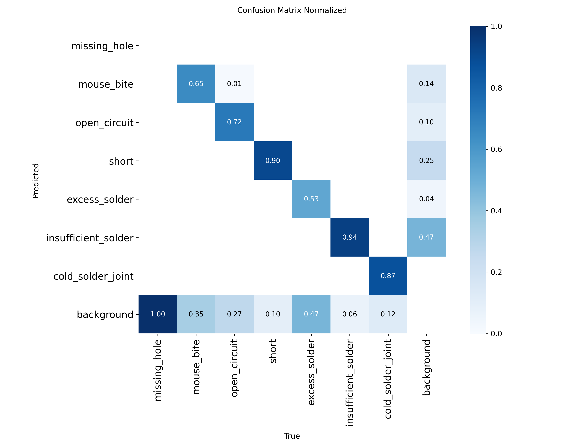
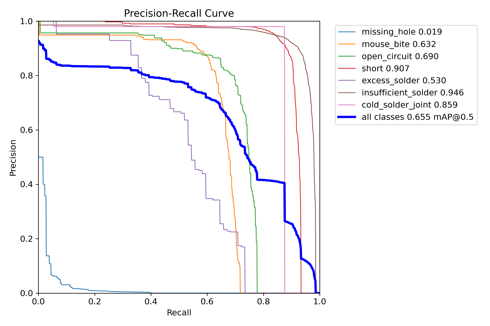
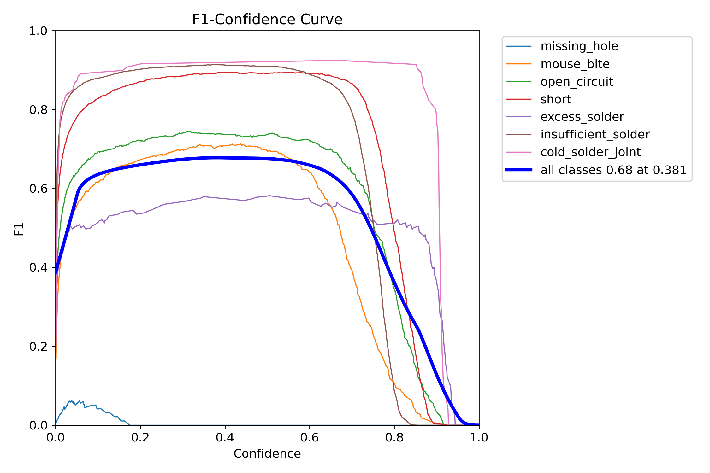
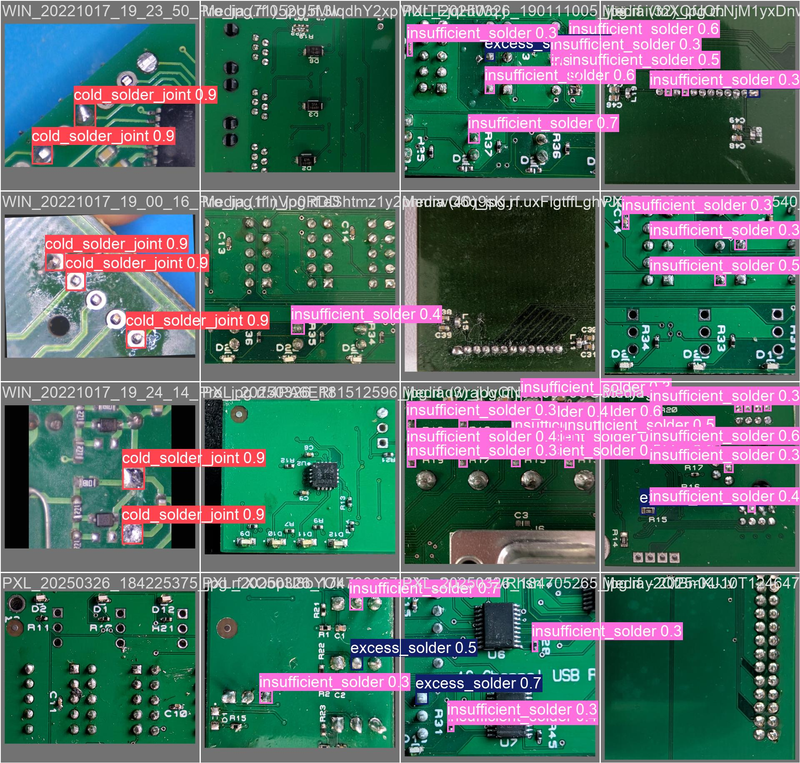

# CIRCA Phase 7 — Final Test-Set Evaluation

> Auto-generated by `scripts/test_evaluate.py`  
> **Model:** YOLOv12-N (Nano) FP16  
> **Split:** `test` (frozen, evaluated once)  
> **imgsz:** 640 | **IoU:** 0.6 | **Seed:** 42

---

## Overall Test Metrics

**Table: Overall mAP, Precision, Recall, F1 on Test Split**

| Metric | Value |
|:--|--:|
| mAP@0.5 | **65.47%** |
| mAP@0.5:0.95 | **41.52%** |
| Precision | 86.61% |
| Recall | 64.12% |
| F1-Score | 73.69% |
| Acceptance Criterion (mAP@0.5 > 90%) | ❌ FAIL |

## Per-Class Precision, Recall, F1, AP@0.5 on Test Split

**Table: Per-Class Performance Breakdown**

| Class | IPC Reference | Precision (%) | Recall (%) | F1 (%) | AP@0.5 (%) |
|:--|:--|--:|--:|--:|--:|
| `missing_hole` | IPC-A-600 | 100.00 | 0.00 | 0.00 | 0.70 |
| `mouse_bite` | IPC-A-600 | 82.87 | 61.41 | 70.54 | 29.30 |
| `open_circuit` | IPC-A-600 | 81.58 | 67.42 | 73.82 | 39.08 |
| `short` | IPC-A-600 | 90.81 | 87.84 | 89.30 | 56.70 |
| `excess_solder` | IPC-A-610H | 63.45 | 52.74 | 57.60 | 38.20 |
| `insufficient_solder` | IPC-A-610H | 90.73 | 91.96 | 91.34 | 52.63 |
| `cold_solder_joint` | IPC-A-610H | 96.82 | 87.50 | 91.92 | 74.06 |

**Table: IPC Group Averages**

| IPC Group | Avg Precision (%) | Avg Recall (%) | Avg F1 (%) |
|:--|--:|--:|--:|
| IPC-A-600 (Bare-board) | 88.81 | 54.17 | 58.42 |
| IPC-A-610H (Solder) | 83.67 | 77.40 | 80.29 |

---

## Confusion Matrix

*Figure 4.6: Normalised 7×7 confusion matrix for YOLOv12-N (Nano) FP16 on the frozen test split.*

## Precision-Recall and F1 Curves

*Figure 4.7a: Box Precision-Recall curve for all seven classes — YOLOv12-N (Nano) FP16, test split.*

*Figure 4.7b: Box F1-Confidence curve for all seven classes — YOLOv12-N (Nano) FP16, test split.*

## Failure-Case Gallery

*Figure 4.8: Representative prediction batches from the test split. Ground-truth labels (left) vs model predictions with confidence scores (right). Failure cases include small defects under glare and motion-blurred frames.*

---
*Source: `scripts/test_evaluate.py`*
